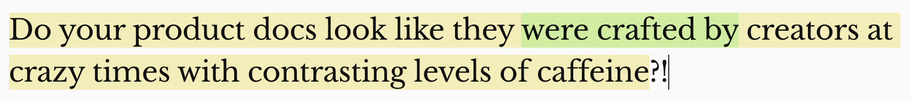

The [Hemingway Editor](https://hemingwayapp.com/) says that sentence is:

1. hard to read (yellow highlight), and;
1. uses passive voice (green highlight).

As an noob writer, I frequently make those mistakes, so that kind of feedback really helps me.

Its hard to read because its quite a long sentence. The passive voice makes the action seem distant. Like, in the past, "creators" did bad things to the product docs.

It also uses alliteration on the letter C. Does that help capture attention? Is it playful? Who's the reader? What's the intent..?

I sometimes find it hard to get into a writing flow due to grammar, style, composition, rhetoric, formatting, links, images, captions and a load of other considerations.

You can make it easier to get into a writing flow by reducing extraneous cognitive load. That means removing all those extra details that overwhelm your short term memory.

Instead, focus on your expressing your meaning. Evolve a docs as code pipeline to do the rest.

The product docs can get progressively better by using a Docs as Code build pipeline.

You wanna amplify your ability to help others?

You might believe investing in docs can work. Or maybe history in your org has shown that writing docs is tedious and sharing them rarely has the desired effect.

It's true. You *can* amplify your ability to help others by writing and sharing good product docs!

This [explainer](../../explainer/docs-as-code-build-pipeline-explained/) shows some tools, techniques and trade offs when considering a docs as code build/CI pipeline.

Alternatively, if you wanna get hands on keyboard, follow the steps in this [How To Create A Docs As Code Build Pipeline](../../how-to/create-a-docs-as-code-build-pipeline) guide.
