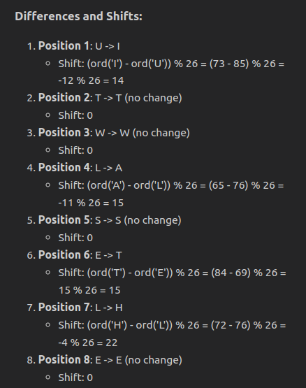

Let's see if we can apply what we learned in the [previous article](../playing-ctf-challenges-coop-with-copilot/) to greater effect...

## Krypton5: Crack The Vigenère Cipher From 3 Intercepted Ciphertexts 

Let's play krypton5. We'll give Copilot the context of the challenge, excluding the solution from krypton4.Let us see where it leads...

> Note: This article masks the true key under [OverTheWire's rules](https://overthewire.org/rules).

After logging in, we see the following files:

```sh
krypton5@bandit:/krypton/krypton5$ l
```

```sh
found1  found2  found3  krypton6  README
```

## Share The Problem Statement With Copilot

First, let's share the context with Copilot.

Copy all the files from the krypton5 directory and open them in the editor so that copilot has the context.

Here's what the README says:


## Attach The README To The Prompt And Ask Copilot To Solve The Challenge

Let's write a prompt to set the context and highlight the information given:

> solve the challenge described in #file:README. #file:found1, #file:found2, #file:found3 and #file:krypton6 are vigenere ciphertexts encrypted with the same key.
>
> create a plan to solve it. Share the steps to be executed on the terminal.

Copilot shared this plan:


Seems viable. But let's look at the plan in more detail...
We have to apply some knowledge about the problem domain.

## Apply The Context You Know To The Responses 

First, we can't concatenate the ciphertexts!

We assume the ciphertexts were encrypted separately and both start with the same key. If we concatenate them, the key will be skewed, and the frequency analysis will be skewed.

To understand more, let's look at this example where we can see both the ciphertext and plaintext:

```t
------------|------
plaintext1  | TODAY
key         | GOLDG
ciphertext1 | ZCODE
```

```t
------------|---------
plaintext2  | TOMORROW
key         | GOLDGOLD
ciphertext2 | ZCXRXFZZ
```

If we concatenate `ciphertext1` and `ciphertext2`, watch what happens when we decrypt with the correct repeated key:

```t
-------------|--------------
ciphertext   | ZCODEZCXRXFZZ
key          | GOLDGOLDGOLDG
plaintext    | TODAYLRULJUWT
```

`plaintext1` is the correct, but `plaintext2` is incorrect. This is because the key is skewed. `plaintext2` has been decrypted starting with 'O', the 2nd character of the key. That differs from how it was encrypted, where the key started with 'G'.

So we can only concatenate the ciphertexts if we pad the plaintext to exact multiple of the key length.
Since we don't know the key length, we cant do that.

Let's feed back to Copilot:

> we can only concatenate the ciphertexts if we pad the plaintext to exact multiple of the key length.
since we dont know the key length, we cant do that.
>
> the ciphertexts were encrypted separately and both start with the same key. If we concatenate them, the key will be skewed, and the frequency analysis will be skewed.

Copilot made some small iterations on the plan. In particular, it removed the step to concatenate the ciphertexts. It also stripped newlines and spaces from the ciphertexts.

## Ask Again If It Missed Something

Copilot omitted the `find_key_length` function. Let's ask to include it the generated code.

> implement the find_key_length method. state any more assumptions on the plan.

Copilot responded with code we can test.
I love that it stated the assumptions it made.


```python
from collections import Counter

def calculate_ic(text):
    n = len(text)
    frequency = Counter(text)
    ic = sum(f * (f - 1) for f in frequency.values()) / (n * (n - 1))
    return ic

def find_key_length(ciphertext):
    # Use Index of Coincidence to find key length
    possible_key_lengths = range(1, 21)
    average_ics = []

    for key_length in possible_key_lengths:
        ics = []
        for i in range(key_length):
            nth_letters = ciphertext[i::key_length]
            ics.append(calculate_ic(nth_letters))
        average_ics.append(sum(ics) / len(ics))

    # The key length with the highest average IC is likely the correct one
    likely_key_length = possible_key_lengths[average_ics.index(max(average_ics))]
    return likely_key_length
```

## Iterate On The Script In The Editor, Not In The Chat

Let's move to the editor and get something executing...

It failed on the first run. But it just needed the input filenames to be lowercase.

```python
if __name__ == "__main__":
    files = ['found1', 'found2', 'found3', 'krypton6']
    for file in files:
        process_file(file)
```

Wowza! it executed fast!

```sh
❯ python3 vigenere_decrypt.py
```

```sh
Determined Key for found1: YEYAECCTRKEYLEJGTH
Decrypted Text for found1: UTWLSELERESTOFXIMEEITHADXHUWORSTSFTIYESTTHESJHEAGESFWIEDOXIEAAITHEAGIOFFAOLTSSREISITWAWTHEQPONHZJBULIEFIXWASFHEPPZGHEFINCRIDULUTYTTHESJHESEAWONORLIRHEMTMASTHEWEASANOQDLVKDESSITAASTTESARTRGEFHOPEMTWAETHPWTRTUROFDEWPAIDWESAOIVURYTHIRGBERORPUDAEXADNOTLINGNEFZRPYSMEWEREELLGAINRDTVESTTOHEEVENIEWPRPELBGOINGHIREOTTSEZXHURWAYIRSHODTTSEAIRYODWASWOFADLIVEELEFRESENXPERUODEHLXSEMEOFIXSNOUSIPSEEUJHORITMESIZSIDTPHODITSBEMNGRQCETVPHFERGOODSRFODEVTLTRTXESUPEVLATUVEOERVEUOFCOMTARIEONZNWCTXEREWEVEAKUNGHIELABARGEJEWANPAQFEPRWYTHAPLEINFMCEZNELEJHRONESFENSLAYDELEHEWEREEKINSWIEHLPAHGEJAWENDACUEPNHMTXAFAIRJACEANTSEELRENEOFFVANCQINMOELCEUNTRIISITIASNLPERURTHANGRYSFALEOELEBORDSOJTHEETAEEAVEIERVESSFLOMVEDAYHFYSHESTLATTTINRSTRGUNERALAEREEETELPHFEREVERMTWAETHPYPEREFOURLSRDOZETSOFWADDSEVERHUNPREOAYHSUVENTYJIVEEPICIEYABREVELETIOZSWPRPGODCEDEDXOENSLAYDLXTXATFAVSUREPPECIZHAIATTHIWMRSEOUEHNSTJHADREGENTXYAETLMNUDHERFMVEAZDTHEYXIUTHBLEWSEDNIREHOEYEFWHOMEPROBHEEINTRYVATEIRTHEXIFPGFERTSHADHIRALPEDEHPWURLIMEATPEADANNEMCADNOUNCMNGTTATLRCENWEMENTWWERQMAOEQSRJHESWAPLOWUNGFPZJLENDONARDWEETMTNDXEHEVENTLECOOKLLNPKHESTHADFEENXAIOOYPYQROUNDHOZEZOFJELVSQFTERREPPIZGOFTTXSCESSAGISASFHEDPTVIJSOFTHMSVEDYYPACPAITPASTWUPEDNAEUCELBYDEFIGIENFINZRTKIDALITYVAPPQDOFTELEYRSMERIMESEAGPSTRTXEEARTLLYODDECOQIVUNTSHAHLATQLYNOXITETHEENKLISTCRZWYENTPEOPLIFROYACZNRVEISOFBRMTISTSUMJPGTIINAMEVICAIHINHDXRQNGETOVELAFEHLVPTREVEDMOVEIMBOREAYXTETHEHUQANRMCEEHLRADYCOMMYNICMTIZNDCEJRECEIZEDTTROFGSENOOFTHEGHICWENDOQXHUCOCKLENEBDOOO
Determined Key for found2: KOYLENVTQ
Decrypted Text for found2: WXENTHPMRIBGOTSFCTEISFULWYKOTOVERTNKHUCOURDEFFJHEFOCEEOENTHESERDTRAWECAKTXEROYLLXEERGEHZTVLEPENEOTYESOACHOOFRQSHISNUJTEMWASSEUITITWIEHJOCEFLOFRZSXOFCECEDODYFORLMRIBJOURYEPFHOMLOYDFNYNWINEEIWQSANANHZELEMENETFCENGRAEUCAJEANAOVVNJUROUDTIALELLECUGODBYTHLTKICETHECENAIONLYZNVATVENTFRFUITRAVPLCEHLEFTMETODGRATFLRTUDFOREHVTMOOTHPRJHQDBEEYSVTTOWNAETYEYRRESAETTYVEROLDJITEDESEIEAJIONSEHVMYLDEWJIESYDEOFEHVCEACHWTTYIJSDAMAAEDTIRTYDTIAMITSDTSRGUEABLPSDEBLANDTTJORSCURTTPWQSRATSEILYKEALLRXEHDOGKPNEEBMRLOCRPTXEPASDEEGURSHAVIEGXIMSEWFFUJOFITTNTHQINSOQSKRQWATAYGCEEFSHARGPWHAPPECFCAFPINGSAKADDMUDOYCEWSWASCAKHURLIKPACAHGERSZRKOVDOGTSEIEMILLBPAGASKETTZCRLQISTOXOIREWDRAHEIYUSSIRTFKHUWEATSEIHELDSAYDKHUWINDDEKSJOLERLBCEVAIRTSEKITEWILWSVRLEPREETPNYCELYLTRBEUTTWZIETXEAFTPREOENSIRMEUSYRISHLLCNETGOTZBVDJILLNTGYTRUTIWLNKAREDROZMRNTABARMEIADDTHEYBIEQKFASESZROESSICTYAJWAYSTRZFOOUPLPAJEIHOWCZNTOHDGENELVMQNSVAWIJEQNDHOEWRTURTOCZNTOHDPULWOWFWENTLPMRNIBOOTDIECENCOROYFUMILLFTNUAVINESPATOQLFIRPSZRVETCHMAIBURTOCZNTOHDSTICASOKTTHECEEOMFORCZNTOHDTHENOECERDBEOCYACBERBPIEGQLWAYDAJSYGNEDEORPQSSENREIBOTHEMLICADDPASDEEGURSBYEHVMQILBETNXABWAYSSERVYLYWRLPGETUPFRZMYEQDTOFZOKTXEROOXHRDJHEODOIETURESTQOITXEESTLBCIIHMENEOWTXEROYLLXEERGETSAKABTHOURHSUJONEKTNUOVMANWLSJEUNTOGZIETEITALWKZNTSANDGAIIUTIESZFDEDCAMEZUKOVITCOYSVQKENTLJAEOJHERDCANEHANDTHOGOHTERSLNUSUVERAWMRITSANDEHVLQNDLAOYNEHEALLWOZTURINGMYRCSIDENEAKVQRIOUDPFIDTSOFEHVREADBEEWVEDTHECZNTOHDANDEHVCEFFEECOFMMHENAREETBEMANZFJINTYFOCMRLBYDREDSVDYNABRZWESKITOFNLFTXESPRPTKYMELLWZREBKTVERJWVLBKEPTHIKHBARGEDQLAHECUFQSRNTLARGPFCAFSTOTSEGOSKETSAAJSUDALOYGFNXISWAJTFHYSBRELKWAIT
Determined Key for found3: YEULDXGTQKENLECGXH
Decrypted Text for found3: HEVYPHDEILYLNDXEPHADMCBBHECOOVEDHIPHMHENEENERCHVNEPAJDMLSUEMATTHTTCKTNCAEOROSEUSJERXONFNZEDHMSGBAPGEDHAIDTYOMTESUXOUXHIEPIETADUTWGSQVIKYAYDLZNCEHIXYBWAIESTEHEWERIFYENEUVAEESNENNEKFFHIBSYSKWIRPHESAZASOSDMUGAEDWLSAWIPTXEZAJDOFZTFZRHTSXRAWRSUECKZNGDFIETADELIELQNDTLODEAYDSEDESFBVINVTEITUCEDIESLOFIANUBUNKLPSPOATLOVWHPCAIYWECEPRUMLEXERERNOODLTTPLQSPEFACRZSPQLAIEJWUGWEUJINXVECYCWOOEFOLITXEAUWHTCHHICIFIWTPREPIESFMEOWWSYAHEPVHAZRBFTWSIYHXOSKFTFAIMOCEADTDOGGLIUMERVSPFNFCOIFULEMFDTSFFSTLKZRCLMSWHJILIEENEHOFGDNATSFBVINVNEDSIYAYCARHAOSEWZTHSISDTKCWIRGTMASRSWSITPAOTTEXOQIOFKHEHAVPSPHMTFRPAEUGONEHEYEEGTBSUSYNGSEANHOCTDEEPICLIOFJAIWTHLTCLUNXEEYNTYESFNLTGDTRAVAUIEARFANEHLBETGAPLZIUPGREDSEOAJDCUMEUUDWRSSEILWLEGTTIDVFUNUEREHEBUWIZTAIHRYAGAICOFXOESFBVIHXTEPESEHAEIPMGSXHBLECFSTEHETRKWZEVIOOEAISGZNEMYOOYETAJDSTFDRTLLEOPHQCSMQESEUANOREDENVQDIXQHESJIOYOFEEHLEORSCQNKYEHLDASEWLFHCCPBOUIINSISNHAEWSENEXISWACPTHZUCHXIREERORVFEHTRLCASAFENYYETPBUEPECHWPETLEDENFZDEYTILLXAOHILPHCLVRKDINEEHLEORSCQNKNERPPRTNYIBAPLZECCLPIPDWTTDTTEGASUSOWOTSERAEKPXEENEFERYAPDSENOJDTARDDQREJLIVESPCKNPHENESLOKHEDCOXEAAEIPYPVFAEDOYCOXPHEFIRGIYSRVSEXBLLNYEFOEMBDWHFWADSIETENSFSRIYSPFRTCAIEMNLARVYEHOPGEDZFFEOOLQETTIUARIIVLLOQHESNRIALVASKROFSEOHEMMNHHFIAIUTOEHEORWWQRESIUMOMEDSISNHWIDTSIUYWIJHANCOXMKDMTMOOFREGARPDFZRWYAURGMQDYNHOXAYNOIETEVEBJANPTIXETZDWYEHIMBOASBFOCMRUANVUSPOSHYOISHPMAJOJLKAWKGERAXENELEXAJFDOQTFBLSFNSMANVPHEMSITPBETDEKYOWJEOSURXEMBSOESBLNKTNHOZDSNTYRYVSYPSSTRSETAZEPVTEETIXESEHAHANSUSJOEETECTATNUOGRKEOJLEDENTNTSEERFREVFBLIEGBLCKHANDEARDGERWRRDDBEEWEXFLSNEENAEDPLRIDSERMVESUTEACOFERAGEHLUNKSJHINKELWSOYAJDOOQPBDYSYOUDEYPSSEMRIQVYTERFRPNCSHKUEEESXULLRSAYENRLESTOREZUSSZRNZTMFCDIZTLEIQBIKOFDUCSTNAHEPLJDGYFURDELQIPHUNOSJHNOKOFWATPYAADSMTJIFIWTEPNYPANSEIRCFMESZNCPICLMALMSXFSEMFIANNE
```

Looking at the output, there are some insights!
Especially looking at the keys it determined!

Where do we go from here..?

## Play To Copilot's Strengths

The resulting plaintexts don't make much sense to me.
But we have a language model that's great at cryptanalysis! Let's ask Copilot to guess what the plaintext might be...


Copilot used its strength to generate the most likely plaintexts.


Great!

So let's ask it to adjust the key in correlation with the predicted plaintext.


Ha! Responsible AI filter!

## Play To Copilot's Weaknesses

So we can't blantantly ask for the key. Instead, we can ask for the difference between the partially decrypted plaintext and the target plaintext.


Copilot's response wasn't what I expected, but it does help towards the desired outcome.


It compared the two plaintexts and stated the shifts between them, character by character.


This enables us to see how many shift places the key is off by and adjust the key accordingly. It decided to compare the first 100 characters, which I felt was a bit noisy. I followed up with this prompt:

> state the first 20 differences again. quantify the shift, modulo 26.



Next, I asked it to apply those shifts to 'AAAAAAAAAAAAAAAAAA'. When the response came back, I realized that was a mistake. I should have asked it to apply the shifts to the key instead. 

> apply the same shifts to "YEYAECCTRKEYLEJGTH"


hmmm, now part of the key looks like an english word.

Let's ask Copilot to "guess the english sentence" (we wont mention its a key!).


Now we can apply the key directly to our script:

```python
def process_file(filename):
    with open(filename, 'r') as file:
        ciphertext = file.read().replace('\n', '').replace(' ', '')
    # key_length = find_key_length(ciphertext)
    key = "<REDACTED>" #find_key(ciphertext, key_length)
    print(f"Determined Key for {filename}: {key}")
    decrypted_text = decrypt_vigenere(ciphertext, key)
    print(f"Decrypted Text for {filename}: {decrypted_text}")
```

...and run it:

```sh
➜ python3 vigenere_decrypt.py 
```

```sh
Determined Key for found1: MEYPEYRBTKEYLEFGTH
Decrypted Text for found1: GTWWSIWWPESTOFBIME
```

hmmm, look at the resulting plaintext aligned below the applied key. The 2nd part corresponds to the target plaintext from Charles Dickens. The first part is gibberish.

What if the key length is wrong?

The code assumes the key length is up to 20 characters. But its a cryptography puzzle. Perhaps its shorter..?

Let's try `<REDACTED>` as the key:

```sh
➜ python3 vigenere_decrypt.py
```

```sh
Determined Key for found1: <REDACTED>
Decrypted Text for found1: ITWASTHEBESTOFTIMESITWASTHEWORSTOFTIMESITWASTHEAGEOFWISDOMITWASTHEAGEOFFOOLISHNESSITW
```

Finally, lets apply the key to `krypton6`:

```sh
Determined Key for krypton6: <REDACTED>
Decrypted Text for krypton6: <REDACTED>
```
