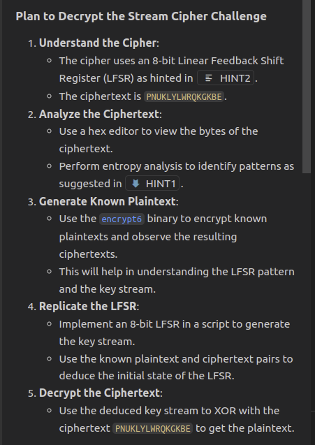
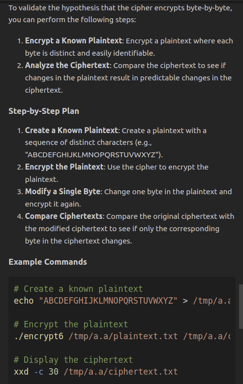
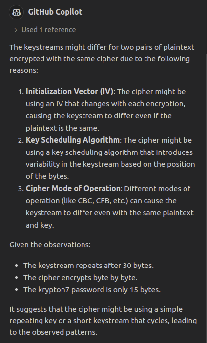
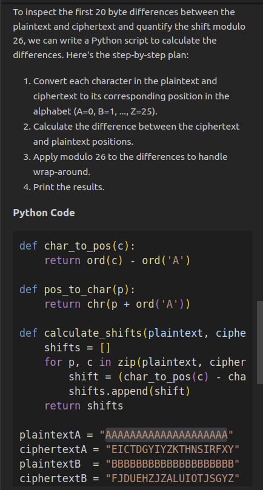

Let's see if we can apply what we learned in [Part 1](../playing-ctf-challenges-coop-with-copilot/) and [Part 2](../playing-ctf-challenges-coop-with-copilot-part-2/) to the next level...

## Krypton6: Crack A Stream Cipher With A Weak Random Number Generator

Let's play krypton6.

> Note: This article masks the true key under [OverTheWire's rules](https://overthewire.org/rules).

After logging in, we see the following files:

```sh
krypton6@bandit:/krypton/krypton6$ l
```

```sh
encrypt6*  HINT1  HINT2  keyfile.dat  krypton7  onetime/  README
```

Let's give Copilot the context of the challenge and see where it leads...

This time I had to level up. There's an executable `encrypt6` that's 17KB. Its too big to just copy-paste the contents.
Instead I decided to use `sftp` to download the files to my local machine.

```sh
➜ sftp -o PubkeyAuthentication=no -P 2231 krypton6@krypton.labs.overthewire.org
```

```sh
Connected to krypton.labs.overthewire.org.
sftp> cd /krypton/krypton6
sftp> ls
```

```sh
HINT1        HINT2        README       encrypt6     keyfile.dat  krypton7     onetime
```

```sh
sftp> get *
```

```sh
Fetching /krypton/krypton6/HINT1 to HINT1
HINT1                                                                                               100%  164     0.4KB/s   00:00    
Fetching /krypton/krypton6/HINT2 to HINT2
HINT2                                                                                               100%   11     0.0KB/s   00:00    
Fetching /krypton/krypton6/README to README
README                                                                                              100% 4342     8.0KB/s   00:00    
Fetching /krypton/krypton6/encrypt6 to encrypt6
encrypt6                                                                                            100%   16KB  17.5KB/s   00:00    
Fetching /krypton/krypton6/keyfile.dat to keyfile.dat
remote open "/krypton/krypton6/keyfile.dat": Permission denied
```

Here, we observe another problem. The `keyfile.dat` is owned by krypton7. We can't read it. We cant download it. We can't share it with Copilot.

`encrypt6` runs with setuid to read `keyfile.dat`. We can't run it on our local machine. To execute, we need to run it on the krypton server!

> 🤔 Q: What are some ways to bring the context of a remote environment to Copilot so that you don't need to apply a translation yourself?

## Attach The README To The Prompt And Ask Copilot To Solve The Challenge
The README for this challenge is quite long. For the krypton6 challenge part, it says:

```text
Its time to employ a stream cipher.  A stream cipher attempts to create
an on-the-fly 'random' keystream to encrypt the incoming plaintext one
byte at a time.  Typically, the 'random' key byte is xor'd with the 
plaintext to produce the ciphertext.  If the random keystream can be
replicated at the recieving end, then a further xor will produce the
plaintext once again.

In this example, the keyfile is in your directory, however it is 
not readable by you.  The binary 'encrypt6' is also available.
It will read the keyfile and encrypt any message you desire, using
the key AND a 'random' number.  You get to perform a 'known ciphertext'
attack by introducing plaintext of your choice.  The challenge here is 
not simple, but the 'random' number generator is weak.

The password for level 7 (krypton7) is encrypted with 'encrypt6'.
```

Let's write a prompt to set the context and highlight the information given:

> solve the stream cipher challenge described in #file:README. use hints from #file:HINT1 and #file:HINT2.
>
> Create a plan to decrypt #file:krypton7. Share the steps to execute in the terminal.

Copilot shared this plan:



Seems like a reasonable plan. I don't have preconceived idea of problem or solution here, so let's follow Copilot's plan and iterate on it.

## Encrypt A Chosen Plaintext

In Step 3 of the plan, Copilot suggests:
"Use the encrypt6 binary to encrypt known plaintexts and observe the resulting ciphertexts."

With access to execute the `encrypt6` binary, we can encrypt any plaintext of our choosing using the secret `keyfile.dat`. We can't read the secret directly , but we can use it to encrypt. In cryptography terms, we have access to an "Encryption Oracle".

To use it, we also need to apply some context of the krypton server environment.

In particular, we need to make a temp directory and put our chosen plaintext there:

```sh
$ mkdir /tmp/a.a
python3 -c 'print("A"*50)' > /tmp/a.a/plaintext.txt
$ cat /tmp/a.a/plaintext.txt
```

```sh
AAAAAAAAAAAAAAAAAAAAAAAAAAAAAAAAAAAAAAAAAAAAAAAAAA
```

Encrypt the plaintext:

```sh
$ ./encrypt6 /tmp/a.a/plaintext.txt /tmp/a.a/ciphertext.txt 
```

Inspect it as hex:
```sh
$ xxd /tmp/a.a/ciphertext.txt 
```

```sh
00000000: 4549 4354 4447 5949 595a 4b54 484e 5349  EICTDGYIYZKTHNSI
00000010: 5246 5859 4350 4655 454f 434b 524e 4549  RFXYCPFUEOCKRNEI
00000020: 4354 4447 5949 595a 4b54 484e 5349 5246  CTDGYIYZKTHNSIRF
00000030: 5859                                     XY
```

hmmm looks like a repeating pattern.

If we align on 30 bytes, we can see more clearly:

```sh
$ xxd -c 30 /tmp/a.a/ciphertext.txt
```

```sh
00000000: 4549 4354 4447 5949 595a 4b54 484e 5349 5246 5859 4350 4655 454f 434b 524e  EICTDGYIYZKTHNSIRFXYCPFUEOCKRN
0000001e: 4549 4354 4447 5949 595a 4b54 484e 5349 5246 5859                           EICTDGYIYZKTHNSIRFXY
```

The ciphertext repeats after 30 bytes. Since the plaintext is 50 A's, we can infer the keystream also repeats after 30 bytes.

## Same Input, Same Output

What if we repeat the encryption of the same plaintext?

```sh
$ ./encrypt6 /tmp/a.a/plaintext.txt /tmp/a.a/ciphertext2.txt
$ diff /tmp/a.a/ciphertext.txt /tmp/a.a/ciphertext2.txt --report-identical-files
```

```sh
Files /tmp/a.a/ciphertext.txt and /tmp/a.a/ciphertext2.txt are identical
```

Its also not random if we repeat encrypting the same plaintext. `keyfile.dat` is 11 bytes. We can assume that's the seed for the pseudorandom keystream.

The seed or initialisation vector (IV) must be pre-shared so that sender and recipient can generate the same keystream.

What if we encrypt a different plaintext?

```sh
$ python3 -c 'print("B"*50)' > /tmp/a.a/plaintext.txt
$ cat /tmp/a.a/plaintext.txt
BBBBBBBBBBBBBBBBBBBBBBBBBBBBBBBBBBBBBBBBBBBBBBBBBB
```

```sh
$ ./encrypt6 /tmp/a.a/plaintext.txt /tmp/a.a/ciphertext.txt
```

```sh
$ xxd -c 30 /tmp/a.a/ciphertext.txt
00000000: 464a 4455 4548 5a4a 5a41 4c55 494f 544a 5347 595a 4451 4756 4650 444c 534f  FJDUEHZJZALUIOTJSGYZDQGVFPDLSO
0000001e: 464a 4455 4548 5a4a 5a41 4c55 494f 544a 5347 595a                           FJDUEHZJZALUIOTJSGYZ
```

Encrypting "B"s also results in a pattern that repeats after 30 bytes.

## The Cipher Encrypts Byte-By-Byte

Let's validate this hypothesis:

> given a chosen plaintext, how can we validate this hypothesis:
>
> The Cipher Encrypts Byte-By-Byte
> 
> ?



Encrypt a chosen plaintext
```sh
krypton6@bandit:~$ cd /krypton/krypton6
$ echo "ABCDEFGHIJKLMNOPQRSTUVWXYZ" > /tmp/a.a/plaintext.txt
$ ./encrypt6 /tmp/a.a/plaintext.txt /tmp/a.a/ciphertext.txt
```

Display the ciphertext
```sh
$ xxd -c 30 /tmp/a.a/ciphertext.txt
```

```sh
00000000: 454a 4557 484c 4550 4749 5545 5441 4758 4857 5052 574b 4252 434e            EJEWHLEPGIUETAGXHWPRWKBRCN
```

Modify a single byte in the plaintext and encrypt it
```sh
$ echo "AACDEFGHIJKLMNOPQRSTUVWXYZ" > /tmp/a.a/modified_plaintext.txt
$ ./encrypt6 /tmp/a.a/modified_plaintext.txt /tmp/a.a/modified_ciphertext.txt
```

Display the modified ciphertext
```sh
$ xxd -c 30 /tmp/a.a/modified_ciphertext.txt
```

```sh
00000000: 4549 4557 484c 4550 4749 5545 5441 4758 4857 5052 574b 4252 434e            EIEWHLEPGIUETAGXHWPRWKBRCN
```

Compare the original and modified ciphertexts
```sh
$ cmp -b /tmp/a.a/ciphertext.txt /tmp/a.a/modified_ciphertext.txt
```

```sh
/tmp/a.a/ciphertext.txt /tmp/a.a/modified_ciphertext.txt differ: byte 2, line 1 is 112 J 111 I
```

When we change byte 2 in the input plaintext, the corresponding byte 2 in the ciphertext changes.

Each byte is independent of the others.

## Red Herring: Derive The Keystreams From The Plaintext-Ciphertext Pairs

We know (from the README) the cipher produces ciphertext by XORing the plaintext with the keystream. Since XOR is commutative, we can get the keystream by XORing the plaintext with the ciphertext.

```python
plaintextA = "AAAAAAAAAAAAAAAAAAAAAAAAAAAAAA"
ciphertextA = "EICTDGYIYZKTHNSIRFXYCPFUEOCKRN"
plaintextB  = "BBBBBBBBBBBBBBBBBBBBBBBBBBBBBB"
ciphertextB = "FJDUEHZJZALUIOTJSGYZDQGVFPDLSO"

# convert plaintext and ciphertext to bytestream
plaintext_bytes = plaintextA.encode()
ciphertext_bytes = ciphertextA.encode()

# XOR plaintext with ciphertext byte by byte
key_stream = [hex(p ^ c) for p, c in zip(plaintext_bytes, ciphertext_bytes)]

print("Key Stream:", key_stream)
print("Key Stream Length:", len(key_stream))
```

Output
```sh
Key Stream: ['0x4', '0x8', '0x2', '0x15', '0x5', '0x6', '0x18', '0x8', '0x18', '0x1b', '0xa', '0x15', '0x9', '0xf', '0x12', '0x8', '0x13', '0x7', '0x19', '0x18', '0x2', '0x11', '0x7', '0x14', '0x4', '0xe', '0x2', '0xa', '0x13', '0xf']
Key Stream Length: 30
```

And the keystream for B's:

```sh
Key Stream: ['0x4', '0x8', '0x6', '0x17', '0x7', '0xa', '0x18', '0x8', '0x18', '0x3', '0xe', '0x17', '0xb', '0xd', '0x16', '0x8', '0x11', '0x5', '0x1b', '0x18', '0x6', '0x13', '0x5', '0x14', '0x4', '0x12', '0x6', '0xe', '0x11', '0xd']
Key Stream Length: 30
```

Notice the keystreams differ.
This had me puzzled.
I stated my observations in this write up.

Then prompted Copilot with the question:
> yes, the keystreams do differ from byte 3. see #selection. If we repeat encryption of the same plaintext, we get the same ciphertext, so there's no randomness in the algorithm.
>
> Then why might keystreams differ for two pairs of plaintext encrypted with the same cipher?



I like that Copilot used the written observations as context in this response!

## Ask Copilot To Compare The Differences

We can also compare the differences between the plaintext and ciphertext.

The ciphertexts of A's and B's are offset by one. That's the same offset as the plaintext input!

> inspect the first 20 byte differences between plaintext and ciphertext. quantify the shift, modulo 26.

Copilot responded with a plan and python script to calculate the shift:



script:

```python
def char_to_pos(c):
    return ord(c) - ord('A')

def pos_to_char(p):
    return chr(p + ord('A'))

def calculate_shifts(plaintext, ciphertext):
    shifts = []
    for p, c in zip(plaintext, ciphertext):
        shift = (char_to_pos(c) - char_to_pos(p)) % 26
        shifts.append(shift)
    return shifts

plaintextA = "AAAAAAAAAAAAAAAAAAAA"
ciphertextA = "EICTDGYIYZKTHNSIRFXY"
plaintextB  = "BBBBBBBBBBBBBBBBBBBB"
ciphertextB = "FJDUEHZJZALUIOTJSGYZ"

shiftsA = calculate_shifts(plaintextA, ciphertextA)
shiftsB = calculate_shifts(plaintextB, ciphertextB)

print("Shifts for plaintextA and ciphertextA:", shiftsA)
print("Shifts for plaintextB and ciphertextB:", shiftsB)
```

Running it shows the shifts (relative to the plaintext) for the first 20 bytes:

```sh
➜ python3 inspect-shifts.py
```

```sh
Shifts for plaintextA and ciphertextA: [4, 8, 2, 19, 3, 6, 24, 8, 24, 25, 10, 19, 7, 13, 18, 8, 17, 5, 23, 24]
Shifts for plaintextB and ciphertextB: [4, 8, 2, 19, 3, 6, 24, 8, 24, 25, 10, 19, 7, 13, 18, 8, 17, 5, 23, 24]
```

The shifts are the same for both plaintexts!

This is a key insight to solving the challenge. 
Regardless of any bitwise shifts and XORs in the cipher, the resulting shifts between the plaintext and ciphertext are the same. 
We don't need to try to reverse engineer the algorithm.

## Reverse The Shifts

The shifts are not printable, hence the instructions in the README to work with bytes.

If we apply the reverse of those shifts to the target ciphertext `krypton7`, what happens?

```python
ciphertextX = "PNUKLYLWRQKGKBE"

# apply shiftsA to ciphertextX
plaintextX = ''.join([pos_to_char((char_to_pos(c) - shift) % 26) for c, shift in zip(ciphertextX, shiftsA)])
print("PlaintextX:", plaintextX)
```

```sh
➜ python3 inspect-shifts.py
```

```sh
Shifts for plaintextA and ciphertextA: [4, 8, 2, 19, 3, 6, 24, 8, 24, 25, 10, 19, 7, 13, 18, 8, 17, 5, 23, 24]
PlaintextX: <REDACTED>
```

We got the password for `krypton7`!

## Takeaways

This time I struggled back and forth with Copilot over an extended period.

I decided to depend on copilot from the beginning. Intentionally go in without a deep understanding on the problem or solution.

Early on, I ran into a digression where `encrypt6` "failed to open plaintext" in the generated tmp directory. Asking Copilot for help had me trying to reverse the binary. Later, I Googled and realised the issue was with the tmp directory name!

Providing both HINTs up front turned out to be misleading. Copilot provided a plan and code for an LFSR algorithm and suggested reversing it.

Turns out, there's no need to apply the LFSR algorithm or any xor operations. There's no need to reverse the binary.

The solution was much simpler.
The relationship between the plaintext and ciphertext is the key to solving the challenge. Not the relationship between the keystream and the plaintext. Or the keystream and the ciphertext.

I also spend some time to test correctness of encrypt-decrypt round trip on the shift script.