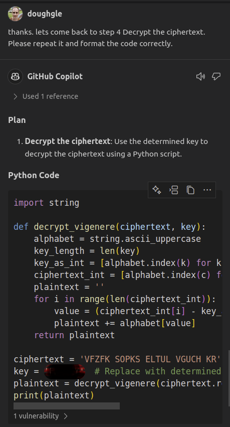
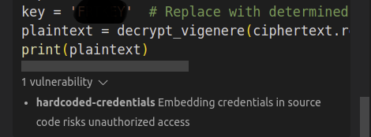
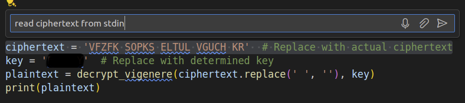

Github Copilot is at the "Peak of Inflated Expectations" for many, including me.

With all the Copilot hype, it's easy to imagine the people using it are assisted by unicorns!

Over the last few weekends, I sat down to deliberately pair with and learn about GitHub's AI pair programmer.

The exercise I had in mind was to play [OverTheWire.org](https://overthewire.org) - one player capture the flag (CTF) challenges you can play from the comfort of your own terminal. The challenges are designed to help you learn and practice security concepts. If you like escape rooms, you'll probably like these!

In this blog, I played the krypton wargame - a series of cryptography challenges. I wanted to see how Copilot could help solve the challenges.

I gave Copilot the problem statement, the given files, and asked it to propose the solution. Next, I asked it to share the steps. I requested a few changes on its generated code. Finally, we managed to reveal the encryption key, decrypt all the ciphertexts, and find the password to the next level!

You can apply learnings from this article to:

+ Work with Github Copilot in the Chat, Editor and Terminal. 
+ Have fun learning Linux and security concepts with OverTheWire!
+ Crack a Vigenère cipher knowing only the key length.

---

## Quick Orientation To OverTheWire

To show by example, let's play [Krypton Level 0](https://overthewire.org/wargames/krypton/krypton0.html). From the web page:

> Welcome to Krypton! The first level is easy. The following string encodes the password using Base64:
>
> "S1JZUFRPTklTR1JFQVQ="
>
> Use this password to log in to krypton.labs.overthewire.org with username krypton1 using SSH on port 2231. You can find the files for other levels in /krypton/

```sh
ssh -p 2231 krypton1@krypton.labs.overthewire.org
```

```sh
                      _                     _              
                     | | ___ __ _   _ _ __ | |_ ___  _ __  
                     | |/ / '__| | | | '_ \| __/ _ \| '_ \ 
                     |   <| |  | |_| | |_) | || (_) | | | |
                     |_|\_\_|   \__, | .__/ \__\___/|_| |_|
                                |___/|_|                   

                      This is an OverTheWire game server. 
            More information on http://www.overthewire.org/wargames

krypton1@krypton.labs.overthewire.org's password: 
```

We're greeted by krypton ASCII art and asked for the password. If we decode (not to be confused with decrypt) the base64-encoded string, we get the password.

The aim of the game is to find the password for the next level.

## Krypton4: Crack The Vigenère Cipher Given Only The Key Length

Let's skip a few levels and jump to krypton4. This level has enough complexity to show the value of Copilot.

> Note: The true key is masked throughout this article in accordance with [OverTheWire's rules](https://overthewire.org/rules).

After logging in, we see the following files:

```sh
krypton4@bandit:/krypton/krypton4$ l
```

```sh
found1  found2  HINT  krypton5  README
```

Here's what the README says:

```md
This level is a Vigenère Cipher.  You have intercepted two longer, english 
language messages.  You also have a key piece of information.  You know the 
key length!

For this exercise, the key length is 6.  The password to level five is in the usual
place, encrypted with the 6 letter key.

Have fun!
```

\* the "usual place" is the file `krypton5`.

## Share The Problem Statement With Copilot

First, let's share the context with copilot.

Copy all the krypton4 files from the krypton server and open them in the editor so that copilot has the context.


## Failed Attempt: Ask Copilot To Solve The Challenge Incrementally In The Editor

I started by trying to get copilot to write this article for me, using inline chat in markdown. That failed.

The main problem I observed is that it autocomplete the next step, but the suggested code wasn't correct.

Cycling through alternative suggestions didn't improve that much - it only had 2 suggestions!

I tried to improve the detail of prompt. For example 

> "Apply frequency analysis to column 1. Sort the output alphabetically. Show the frequency of each letter."

But results were equally frustrating.

Perhaps copilot was missing the bigger picture of the whole problem statement and a prompt asking to solve it..?

## Next Attempt: Attach The README To The Prompt And Ask Copilot To Solve The Challenge

Here's the prompt I gave chat:

> solve the challenge described in #file:README. show the steps to be executed on the terminal.

The result was encouraging. It responded with a plan and steps to execute in the terminal!


## Apply The Context You Know To The Responses 

Let's follow the steps it gives...
    
Immediately I found a need to adapt the filenames and paths for the krypton environment.

Somehow Copilot missed the filenames `found1`, `found2` and `krypton5`, even though those files were open in the editor.

Next I had to create temp directory on krypton (you can't write, except to `/tmp`).

```sh
mktemp -d
```

```sh
/tmp/tmp.qMFHnR41zp/
```

I gathered this context by reading krypton welcome message. Copilot is missing that context, but you can just apply it instead of trying to feed it every detail.

Besides those differences, step 1 and 2 went well.

## Ask Again If It Missed Something

In step 3 of its plan, Copilot asked me to calculate the shift for each column. However, it didn't show the terminal steps.


So I asked again: 

> please show the steps to calculate the shift for each column

I remembered bash doesn't handle numbers well. And the generated code was hard for me to understand. I asked for an alternative solution in python.

This time it came back with a script long enough that it belonged in a file.

Save the script to a file in the krypton server. I used a heredoc to get it into the terminal.
    
But on execution, it failed:

```sh
krypton4@bandit:/krypton/krypton4$ python3 /tmp/tmp.qMFHnR41zp/calculate-shifts.py 
```

```sh
Traceback (most recent call last):
File "/tmp/tmp.qMFHnR41zp/calculate-shifts.py", line 10, in <module>
with open(f'freq_analysis_{i}.txt', 'r') as file:
        ^^^^^^^^^^^^^^^^^^^^^^^^^^^^^^^^^^^
FileNotFoundError: [Errno 2] No such file or directory: 'freq_analysis_1.txt'
```

Again, I had to adjust the file paths to the context of the krypton target environment.

## Apply The Context You Know To The Responses Again

So we need to adjust the filepaths again. This time, I asked copilot inline in the editor to set the temp directory to find input files. 

> set to same as script dir by default.

Now need to replace the script in the target env again.


```sh
krypton4@bandit:/krypton/krypton4$ python3 /tmp/tmp.qMFHnR41zp/calculate-shifts.py
```

```sh
Column 1: Shift = 5
Column 2: Shift = 17
Column 3: Shift = 19
Column 4: Shift = 10
Column 5: Shift = 4
Column 6: Shift = 24
Determined key shifts: [5, 17, 19, 10, 4, 24]
```

It runs!
But the output is unintuitive to me. I wanna see the key letter, not so much the shifts.

I asked in chat


Now we got a script mod that ignored the path mods we just made - even though that script was open in the IDE.

## Iterate On The Script In The Editor, Not In The Chat

Let's ask the same change, but inline on the editor...


Ah, this time it got it. The result has better separation of concerns too. The code that formats the output is independent of the code that opens files and calculates shifts!

Since there's a disconnect between the code in our IDE and the target env, we need to go back to edit in the terminal.

Great! Now we have the key letters!

```sh
Corresponding letters: ['A', 'A', 'A', 'A', 'A', 'A']
```
> Note: Key redacted to play by https://overthewire.org/rules. It's not 'AAAAAA'!

That's the key according to frequency analysis. Let try using the key to decrypt the ciphertext... i.e. Step 4 of Copilot's master plan..!

## Iterate On The Plan In The Chat, Not The Editor

For step 4 of the plan, copilot chat had a bug in it's formatting:


I politely asked to repeat and fix the formatting:



This time we got a python script to decrypt a Vigenère cipher.

I also noticed copilot hinted (quite subtly) at a glaring vulnerability in the code - the key is hardcoded right next to the decrypt function!



> Feedback to [Github](https://github.com): The vulnerability hint is too subtle! What if Copilot enables people to configure the visibility and assertiveness of such hints?

Let's look at the script and, once again, apply the context of our target env. This time we'll request a few changes incrementally in the editor:

> read ciphertext from stdin



> take key as input arg to script


Now I realise, we don't need to copy to the target env! We already copied the ciphertexts locally to give Copilot the context. Why don't we just apply that and skip the env disconnect?!

Here's the result of decrypting `found1` with the key 'AAAAAA'

```sh
cat found1 | python3 decrypt-viginere-ciphertext.py AAAAAA
```

```sh
THPSOLDIPRWITHEHEGREPNWHISVERSLEOTHEMTSROUGHEHESTRPETSOFEHEEMECALDCIEYUNTIWTHEYRPACHEDEHEROOXWHEREEHEGUACDIANOQTHEGAEESLIVPDTHISZFFICECUNLOCVEDTHETRSPECEACLESEOPUTTSEMBACVINHISRREATBZXANDTSENHEPZLITELJOPENEOTHEGAEEFOROFRFRIEYDSWHINHROADWEADSTZTHEWINKEDWIECHOFTSEWESTLSKEDDZROTHYEHEREIDNOROAOANSWECEDTHERUARDILNOFTHPGATESYOONEEGERWISSESTOGZTHATWLYHOWTSENAREHETOFIYDHERIYQUIREOTHEGICLTHATHILLBEPASYREALIEDTSEMANFZRWHENDHEKNOHSYOUACEINTHPCOUNTCYOFTHPWINKIPSSHEWTLLFINOYOUANOMAKEYZUALLHPRSLAVPSPERHLPSNOTDAIDTHPSCARENROWFOCWEMEAYTODESEROYHECOHTHAEISDIFQERENTDAIDTHPGUARDTANOFTSEGATEDNOONESASEVECDESTRZYEDHECBEFORPSOINAEURALLJTHOUGSTSHEWZULDMAVESLAVPSOFYOFASSHESASOFTSERESTMUTTAKPCAREFZRSHEIDWICKEOANDFIPRCEANOMAYNOEALLOWJOUTODPSTROYSERKEEATOTHEHESTWHPRETHEDUNSETDANDYOFCANNOEFAILTZFINDHPRTHEYEHANKEOHIMANOBADEHTMGOODMYEANDEURNEDEOWARDEHEWESEWALKIYGOVERQIELDSZFSOFTRRASSDZTTEDHPREANDEHEREWTTHDAIDIESANOBUTTECCUPSDZROTHYDTILLWZRETHEARETTYDILKDRPSSSHESADPUTZNINTHPPALACPBUTNOHTOHERDURPRIDESHEFZUNDITHASNOLZNGERGCEENBUEPUREWSITETHPRIBBOYAROUNOTOTOSYECKHAOALSOLZSTITSRREENCZLORANOWASASHHITEADDOROTSYSDREDSTHEEXERALDNITYWADSOONLPFTFARMEHINDLSTHEYLDVANCPDTHEGCOUNDBPCAMERZUGHERLNDHILWIERFOCTHEREHERENOQARMSNZRHOUSPSINTHTSCOUNERYOFTSEWESTLNDTHERROUNDHASUNTTLLEDIYTHEAFEERNOOYTHESUYSHONESOTINTSEIRFANESFOREHEREWPRENOTCEESTOZFFERTSEMSHAOESOTHLTBEFOCENIGHEDOROTSYANDTZTOANDEHELIOYWERETTREDANOLAYDOHNUPONEHEGRADSANDFPLLASLPEPWITSTHEWOZDMANAYDTHESNARECRZWKEEPTNGWATNH
```

Hmmm this doesn't make sense. But I can see snippets of english in there. Actually its hard to read in all caps without punctuation.

One technique we can apply is to make the plaintext lowercase for the part of the key we're confident about. That way its easier to see the english words.

Copilot helped mod the script inline. Here's the result:

```sh
cat found1 | python3 decrypt-viginere-ciphertext.py AAAaaa
```

```sh
THPsolDIPrwiTHEhegREPnwhISVersLEOtheMTSrouGHEhesTRPetsOFEheeMECaldCIEyunTIWtheYRPachEDEherOOXwheREEhegUACdiaNOQtheGAEeslIVPdthISZffiCECunlOCVedtHETrspECEaclESEopuTTSembACVinhISRreaTBZxanDTSenhEPZlitELJopeNEOtheGAEefoROFrfrIEYdswHINhroADWeadSTZtheWINkedWIEchoFTSeweSTLskeDDZrotHYEherEIDnorOAOansWECedtHERuarDILnofTHPgatESYoonEEGerwISSestOGZthaTWLyhoWTSenaREHetoFIYdheRIYquiREOtheGIClthATHillBEPasyREAlieDTSemaNFZrwhENDhekNOHsyoUACeinTHPcouNTCyofTHPwinKIPsshEWTllfINOyouANOmakEYZualLHPrslAVPspeRHLpsnOTDaidTHPscaRENrowFOCwemEAYtodESEroyHECohtHAEisdIFQereNTDaidTHPguaRDTanoFTSegaTEDnooNESaseVECdesTRZyedHECbefORPsoiNAEuraLLJthoUGStshEWZuldMAVeslAVPsofYOFassHESasoFTSereSTMuttAKPcarEFZrshEIDwicKEOandFIPrceANOmayNOEallOWJoutODPstrOYSerkEEAtotHEHestWHPretHEDunsETDandYOFcanNOEfaiLTZfinDHPrthEYEhanKEOhimANObadEHTmgoODMyeaNDEurnEDEowaRDEhewESEwalKIYgovERQielDSZfsoFTRrasSDZtteDHPreaNDEherEWTthdAIDiesANObutTECcupSDZrotHYDtilLWZretHEAretTYDilkDRPsssHESadpUTZninTHPpalACPbutNOHtohERDurpRIDeshEFZundITHasnOLZngeRGCeenBUEpurEWSiteTHPribBOYaroUNOtotOSYeckHAOalsOLZstiTSRreeNCZlorANOwasASHhitEADdorOTSysdREDsthEEXeraLDNityWADsooNLPftfARMehiNDLsthEYLdvaNCPdthEGCounDBPcamERZughERLndhILWierFOCtheREHereNOQarmSNZrhoUSPsinTHTscoUNEryoFTSeweSTLndtHERrouNDHasuNTTlleDIYtheAFEernOOYtheSUYshoNESotiNTSeirFANesfOREherEWPrenOTCeesTOZffeRTSemsHAOesoTHLtbeFOCeniGHEdorOTSyanDTZtoaNDEhelIOYwerETTredANOlayDOHnupONEhegRADsanDFPllaSLPepwITStheWOZdmaNAYdthESNareCRZwkeEPTngwATNh
```

I can see a few 'the's in lowercase. That's the most common [trigram](https://en.wikipedia.org/wiki/Trigram) in english. But the rest is still hard to determine.

Let's try on the other found file

```sh
cat found2 | python3 decrypt-viginere-ciphertext.py AAAaaa
```

```sh
THPyweREZbliGEOtocAMAoutTHLtniGHEundERLlarGEEreeINEhefORPstfOREherEWPrenOHZuseSNPartHEEreeMAOeagOOOthiCKNoveRIYgtoPRZt
```

The beginning looks like "they were".

Wait, I just had an idea!

Why not ask Copilot to determine the english words?! Its trained to guess the next word - that's what it does!

## Play To Copilot's Strengths

We can highlight the partially decrypted ciphertext in the terminal and ask:

> "guess the sentence of plaintext in the terminal"


Insightful! Let's figure out the 3rd character of the key.

For that we need a reminder of the ciphertext character in column 3 of `found2`.

```sh
cat found2 | tr -d ' ' | fold -w 6 | head -1
```

```sh
YYIIAC
```

Column 3 is 'I'. Now we can apply the `calculate_shift` function in an interactive python interpreter on ciphertext 'I'. We'll assume its plaintext 'E' in plaintext "thEyweRE".

```sh
python3
```
    
```python
Python 3.10.12 (main, Sep 11 2024, 15:47:36) [GCC 11.4.0] on linux
Type "help", "copyright", "credits" or "license" for more information.
>>> import string
>>> def calculate_shift(most_frequent_letter, reference_letter='E'):
...     alphabet = string.ascii_uppercase
...     shift = (alphabet.index(most_frequent_letter) - alphabet.index(reference_letter)) % 26
...     return shift
... 
>>> calculate_shift('I', 'E')
```
    
```python
4
```

```python
>>> string.ascii_uppercase[4]
```

```python
'E'
``` 

So the shift for column 3 is 4. Starting from 'A' and counting 4, brings us to 'E'.

Let's apply that to key with the confidence boosting technique of lowercase letters!

```sh
cat found2 | python3 decrypt-viginere-ciphertext.py aaeaaa
```

```sh
theywereobligedtocampoutthatnightunderalargetreeintheforestfortherewerenohousesnearthetree
```

Yes! that makes sense - and Copilot was not far off in guessing the sentence - way better than me!

We'll decrypt `found1`

```sh
cat found1 | python3 decrypt-viginere-ciphertext.py aaeaaa
```

```sh
thesoldierwiththegreenwhiskersledthemthroughthestreetsoftheemeraldcityuntiltheyreachedtheroomwheretheguardianofthegateslivedthisofficerunlockedtheirspectaclestoputthembackinhisgreatboxandthenhepolitelyopenedthegateforourfriendswhichroadleadstothewickedwitchofthewestaskeddorothythereisnoroadansweredtheguardianofthegatesnooneeverwishestogothatwayhowthenarewetofindherinquiredthegirlthatwillbeeasyrepliedthemanforwhensheknowsyouareinthecountryofthewinkiesshewillfindyouandmakeyouallherslavesperhapsnotsaidthescarecrowforwemeantodestroyherohthatisdifferentsaidtheguardianofthegatesnoonehaseverdestroyedherbeforesoinaturallythoughtshewouldmakeslavesofyouasshehasoftherestbuttakecareforsheiswickedandfierceandmaynotallowyoutodestroyherkeeptothewestwherethesunsetsandyoucannotfailtofindhertheythankedhimandbadehimgoodbyeandturnedtowardthewestwalkingoverfieldsofsoftgrassdottedhereandtherewithdaisiesandbuttercupsdorothystillworetheprettysilkdressshehadputoninthepalacebutnowtohersurpriseshefounditwasnolongergreenbutpurewhitetheribbonaroundtotosneckhadalsolostitsgreencolorandwasaswhiteasdorothysdresstheemeraldcitywassoonleftfarbehindastheyadvancedthegroundbecamerougherandhillierfortherewerenofarmsnorhousesinthiscountryofthewestandthegroundwasuntilledintheafternoonthesunshonehotintheirfacesfortherewerenotreestoofferthemshadesothatbeforenightdorothyandtotoandthelionweretiredandlaydownuponthegrassandfellasleepwiththewoodmanandthescarecrowkeepingwatch
```

Finally, let's decrypt the password for the next level

```sh
cat krypton5 | python3 decrypt-viginere-ciphertext.py aaeaaa
```

```sh
<REDACTED>
```

Wowzas! That was fun! Thanks Copilot!

## Takeaways For Next Time...

1. If not already there, copy context into the IDE and open the files.
1. Reference the problem statement/question explicitly and chat with Copilot at a high level to get a plan.
1. Trade off feeding it all the context vs applying the context you know to the responses.
1. Iterate on the solution. Ask for small changes incrementally.
1. Ask for help with the parts you're stuck on. Copilot is a great Cryptanalyst - good at guessing the next word in a sentence.
1. Have fun!