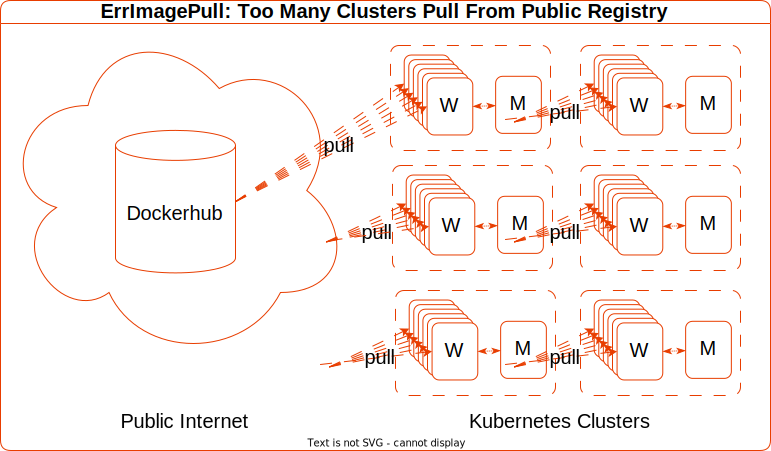

Let's begin with one of the most common use cases of a Container Registry:

## Pull A Public Container Image

Here's a simple kubernetes cluster.

It has access to pull images from the public internet.


Let's create a simple pod that runs `hello-world` to completion

```sh
➜ kubectl run hello \
  --image=hello-world \
  --restart=Never
```

```sh
pod/hello created
```

### Q: Where Does The Image Come From?

To find out, we can examine the logs of the high-level container runtime (sometimes called the container engine).
Our OCI Runtime is Containerd:

`containerd.log`
```json
{
  "msg": "PullImage \"hello-world:latest\""
}
{
  "msg": "PullImage using normalized image ref: \"docker.io/library/hello-world:latest\""
}
{
  "host": "registry-1.docker.io",
  "msg": "resolving"
}
{
  "host": "registry-1.docker.io",
  "msg": "do request",
  "request.header.accept": "application/vnd.docker.distribution.manifest.v2+json, application/vnd.docker.distribution.manifest.list.v2+json, application/vnd.oci.image.manifest.v1+json, application/vnd.oci.image.index.v1+json, */*",
  "request.method": "HEAD",
  "url": "https://registry-1.docker.io/v2/library/hello-world/manifests/latest"
}
```

In the Containerd logs, we can see the `hello-world` image is **normalised**.

Specifically, its:
1. prefixed with the default registry `docker.io`
1. prefixed with the default repository `library`
1. suffixed with the default tag `latest`


Containerd requests the image from `registry-1.docker.io`, better known as DockerHub.

### Q: How Did The Image Get From The Registry To The Container Runtime?

An OCI Image is composed of a **Manifest**, one or more **Filesystem Layers** and a **Container Configuration**.

When Containerd receives a request to run a container from an image, here's a model of what happens:



<details>
<summary>Steps describing CRI Containerd Pulling a public container image from Dockerhub OCI Registry</summary>

1. First, Containerd makes a `HEAD` request to DockerHub at `/v2/library/hello-world/manifests/latest?ns=docker.io` for `hello-world:latest`. We say it "fetches the **Manifest Digest**" for the `latest` tag. 

1. DockerHub responds with the sha256 digest of the **OCI Image Manifest**.

1. Is the Manifest already present on the Containerd host? Nope. No `hello-world:latest` manifest is stored locally.

1. Download the Image Manifest. Specifically, Containerd makes a `GET` request to Dockerhub at `/v2/library/hello-world/manifests/sha256:a8281ce42034b078dc7d88a5bfe6d25d75956aad9abba75150798b90fa3d1010?ns=docker.io`. Notice its the same `manifests` API but this time its a `GET` request for the manifest identified by its sha256 digest.

1. DockerHub responds with the actual **OCI Image Manifest** document.

1. Containerd verifies the Manifest's actual digest against the requested one. Has it been modified in transit? In particular, it computes the sha256sum of the manifest json content (`application/vnd.oci.image.manifest.v1+json`) received and compares it to the sha256 digest that identifies the manifest.

1. Next, for each **Filesystem Layer** in the manifest:

    1. Is the layer already present on the worker?

    1. Download. Specifically, Containerd makes a GET request to the `blobs` API endpoint e.g. `/v2/library/hello-world/blobs/sha256:2af0ea4a9556b049337d026dd7df7f9c20661203c634be4f9b976814c05e5c32?ns=docker.io` 

    1. Verify checksum against manifest.

    1. Extract.

> \* If more than one target platform (architecture and os) exists for the image, there's another layer of indirection. Containerd requests and processes an **OCI Image Index** (`application/vnd.oci.image.index.v1+json`), which itself returns the **Manifest Digest** for the requested target platform. (Omitted here for simplicity)
>
> \** In practice, downloads happen in parallel. Simplified here for illustration.

</details>
<p>


---

## More Clusters, More Image Pulls

Imagine an organisation has 6 application teams.

Each team has their own cluster so they can operate independently on their own cadence.

Again, each cluster has access to pull images from the public internet.


Actually, each team wants to run a job that tests a matrix of 3 image versions.

Additionally, it must run to completion exactly 6 times and must complete quickly.

Finally, these images have mutable tags and its important to test with the freshest.

Here's the job specification:

`hello-job.yaml`
```yaml
apiVersion: batch/v1
kind: Job
metadata:
  name: hello
spec:
  completions: 6
  parallelism: 6
  template:
    metadata:
      labels:
        app: hello
    spec:
      containers:
      - image: hello-world:linux
        name: hello-linux
        imagePullPolicy: Always
      - image: hello-world:nanoserver-ltsc2022
        name: hello-nanoserver
        imagePullPolicy: Always
      - image: hello-world:nanoserver-1809
        name: hello
        imagePullPolicy: Always
      restartPolicy: Never
      affinity:
        podAntiAffinity:
          requiredDuringSchedulingIgnoredDuringExecution:
          - labelSelector:
              matchExpressions:
              - key: app
                operator: In
                values:
                - hello
            topologyKey: kubernetes.io/hostname
```

Monday, first thing, the teams deploy the jobs. What happens next?

---

## Problem: `Errimagepull`, Hit The Limit

Two minutes later, we're seeing ErrImagePull errors...

```sh
$ kubectl get events
```

```sh
90s         Warning   Failed                    pod/hello-zhkp7               
Failed to pull image "hello-world:nanoserver": 
rpc error: code = Unknown desc = failed to pull and unpack image "docker.io/library/hello-world:nanoserver": 
failed to copy: httpReadSeeker: failed open: 
unexpected status code https://registry-1.docker.io/v2/library/hello-world/manifests/sha256:3cabdfb783cd2710153b3824ba5d94c8ebecc0bc48251e2e823f82a15dec660f: 
429 Too Many Requests - Server message: 
toomanyrequests: You have reached your pull rate limit. You may increase the limit by authenticating and upgrading: https://www.docker.com/increase-rate-limit
```

If we examine the events, we got a `429 Too Many Requests` response from DockerHub.

Docker Hub [limits the number of container image pulls](https://docs.docker.com/docker-hub/download-rate-limit/) based on the account type of the user pulling the image. Anonymous (i.e. unauthenticated) users are idenitifed by their source IP address.

To summarise:

|Account Type|Limit|
|---|---|
|anonymous users| 100 pulls per 6 hours per IP address.|
|authenticated users| 200 pulls per 6 hour period.|
|Users with a paid Docker subscription| 5000 pulls per day.|

We can visualise the remaining requests with the handy [Docker Hub Rate Limit Exporter for Prometheus](https://gitlab.com/gitlab-de/unmaintained/docker-hub-limit-exporter/?_gl=1%2ay0hdof%2a_ga%2aMTY2MTE5MTAxOC4xNjcxMzQ4ODM1%2a_ga_ENFH3X7M5Y%2aMTY4ODgyNTU4NS42LjAuMTY4ODgyNTYwNC4wLjAuMA..).


Yup, Remaining Requests is 0! We hit the DockerHub rate limit!

How did that happen?

1. we have 6 clusters
1. each cluster has 6 worker nodes
1. each team deployed a job that ran 6 `hello` pods to completion, in parallel - fancy stuff!
1. for freshness, each hello-world pod `Always` attempts to pull 3 versions of the `hello-world` image.

That's **6 clusters * 6 pods * 3 containers = 108 image pulls**



### What _is_ An Image Pull Request?

:bulb: An Image **Pull Request** is [defined by Docker Inc.](https://docs.docker.com/docker-hub/download-rate-limit/#definition-of-limits) as:

+ One or two `GET` requests on registry manifest URLs (`/v2/*/manifests/*`).
+ There'll be two requests if there's an Image Index.
+ `HEAD` requests aren’t counted.

### Q: What About The 6 Worker Nodes? Why Is That Significant?

Because the pods are scheduled across the 6 worker nodes, containers cannot be launched from node-local images. 
None of those images are cached on the worker node.

On container start, each worker must pull the image from DockerHub.

Its significant because Dockerhub receives many requests in a short time frame.

Given that Dockerhub identifies unauthenticated pullers by their IP address.
And each worker node has a different IP address on the network.
When each image pull request originates from a different worker node, then...

### Q: Why Are Workers Sharing The Dockerhub Limit?

Let's examine the response from DockerHub.

Again, from the Containerd logs, the response looks like this:

`containerd.log`
```json
{
  "host": "registry-1.docker.io",
  "msg": "fetch response received",
  "response.header.content-length": "2561",
  "response.header.content-type": "application/vnd.docker.distribution.manifest.list.v2+json",
  "response.header.docker-content-digest": "sha256:fc6cf906cbfa013e80938cdf0bb199fbdbb86d6e3e013783e5a766f50f5dbce0",
  "response.header.docker-distribution-api-version": "registry/2.0",
  "response.header.docker-ratelimit-source": "58.185.1.1",
  "response.header.etag": "\"sha256:fc6cf906cbfa013e80938cdf0bb199fbdbb86d6e3e013783e5a766f50f5dbce0\"",
  "response.header.ratelimit-limit": "100;w=21600",
  "response.header.ratelimit-remaining": "99;w=21600",
  "response.header.strict-transport-security": "max-age=31536000",
  "response.status": "200 OK",
  "url": "https://registry-1.docker.io/v2/library/hello-world/manifests/latest"
}
```

Notice the `response.header.docker-ratelimit-source`. Its `58.185.1.1`.

Thats the public IP address of the network's internet gateway. Its the source address that DockerHub sees.

This happens if Source Network Address Translation (SNAT) is configured for outbound internet requests.


The result is each request has the same IP address no matter which cluster originates the request.

If you're in an organisation with many clusters, and those clusters pull images from Dockerhub through a SNAT gateway, 
in the same way, you can hit the limit very quickly!

## Q: How Might We Work Around The Pull Limit?

There are a couple of alternatives to DockerHub here:

### 1. Pull From A Different Public Registry
> 
> If you're using AWS EKS, you can pull the majority of popular docker images from ECR Public Registry.
> 
> For example `docker pull public.ecr.aws/docker/library/hello-world:latest`
> 
> On AWS, its logically closer to your infrastructure and you wont encounter any rate limiting.

### 2. Operate Your Own Private OCI Registry

> If you already have a central binary repository in your org like a managed Artifactory, Nexus or the Harbor, you're likely already doing this.
> 
> For example `docker pull containers.your.org/library/hello-world:latest`
> 
> This solution becomes increasingly compelling as your container consumption grows.

We're gonna choose option #2, but we wont use a vendor product because we wanna learn with the simplest components that meet the OCI specifications!

## Create A Private Proxy Cache OCI Registry For Dockerhub

The simplest OCI Registry is a container running the `registry:2` image from [distribution/distribution](https://github.com/distribution/distribution/releases) :

```sh
➜ k3d registry create docker-io-mirror \
--image docker.io/library/registry:2
--port 0.0.0.0:5005 \
--proxy-remote-url https://registry-1.docker.io \
--volume /tmp/reg:/var/lib/registry \
--no-help
```

```sh
INFO[0000] Creating node 'k3d-docker-io-mirror'         
INFO[0000] Successfully created registry 'k3d-docker-io-mirror' 
INFO[0000] Starting Node 'k3d-docker-io-mirror'         
INFO[0000] Successfully created registry 'k3d-docker-io-mirror' 
```

Now we can pull the image from our private OCI Registry like:

```sh
$ docker pull k3d-docker-io-mirror.localhost:5005/library/hello-world
```

```sh
Using default tag: latest
latest: Pulling from library/hello-world
719385e32844: Pull complete 
Digest: sha256:a13ec89cdf897b3e551bd9f89d499db6ff3a7f44c5b9eb8bca40da20eb4ea1fa
Status: Downloaded newer image for k3d-docker-io-mirror.localhost:5005/library/hello-world:latest
k3d-docker-io-mirror.localhost:5005/library/hello-world:latest
```

Notice we need to specify both the **registry** and **repository** prefix explicitly in the image identifier.


Indeed, the normalisation to docker.io and library are historical hangovers from the era when Docker's official images on Dockerhub were the only game in town!

## Q: How Do We Use The Private Registry?

Imagine if you wanna experiment with a helm chart that has a bunch of container images whose default registry is Dockerhub.

One drawback here is that you need to change all the image refs you don't know about up front! Its hard to experiment!

Some images will be explicit in `values.yaml`. Others may be implied from subcharts, chart dependencies or custom resources.

You don't wanna re-configure each image to come from your private OCI registry just to try the chart! That's toil!

Alternatively, we can configure our private registry as a **Registry Mirror** in the container runtime.

## Configure The Container Runtime To Use A Registry Mirror

In Containerd, we can [Configure An OCI-Compliant Registry Mirror](https://github.com/containerd/containerd/blob/9b4ed8acc2a04a3f8df140e79052d18b750d757e/docs/hosts.md#setup-a-local-mirror-for-docker) in `/etc/containerd/certs.d/docker.io/hosts.toml`.

```toml
server = "https://docker.io"

[host."http://docker-io-mirror:5000"]
  capabilities = ["pull", "resolve"]
  skip_verify = true
```

Let's create a pod. As before, we'll specify the tag, but omit the registry and repository.

```sh
➜ kubectl run nginx \
  --image=nginx:stable
```

```sh
pod/nginx created
```

Describe the pod. We can see the image is expanded to the default registry `docker.io` and default repository `library`.

```sh
❯ kubectl describe pod nginx
```

```sh
Containers:
  nginx:
    Container ID:   containerd://a6f171d5af552b144cec25504f4fb661015509185d0c064568b23ee55a04cfaf
    Image:          nginx:stable
    Image ID:       docker.io/library/nginx@sha256:a8281ce42034b078dc7d88a5bfe6d25d75956aad9abba75150798b90fa3d1010
```

In the `Containers` sections of the output, we can see the image is expanded. Like before, the default registry is `docker.io` and default repository is `library`.

### Q: What Happens At The Container Runtime Layer Now?

`nginx:stable` appears to be pulled from Dockerhub. But what happened at the Container Runtime layer?

Analysing the containerd logs, we can see the image pull request:

```json
{
  "msg": "PullImage \"nginx:stable\""
}
{
  "msg": "PullImage using normalized image ref: \"docker.io/library/nginx:stable\""
}
{
  "host": "docker-io-mirror:5000",
  "msg": "resolving"
}
{
  "host": "docker-io-mirror:5000",
  "msg": "do request",
  "request.header.accept": "application/vnd.docker.distribution.manifest.v2+json, application/vnd.docker.distribution.manifest.list.v2+json, application/vnd.oci.image.manifest.v1+json, application/vnd.oci.image.index.v1+json, */*",
  "request.method": "HEAD",
  "url": "http://docker-io-mirror:5000/v2/library/nginx/manifests/stable?ns=docker.io"
}
```

Containerd pulls from `docker-io-mirror:5000`: the Registry Mirror!

Notice this time, we *didn't* need to specify the **registry** nor the **repository** explicitly. It did that transparently.

That's useful! Imagine if you wanna experiment with a helm chart that has a bunch of container images whose default registry is Dockerhub.

You don't wanna re-configure each image to come from your private OCI registry just to try the chart! That's toil!

If you configure a registry mirror, you don't have to!

Let's see if `nginx` is there in the docker-io-mirror...

```sh
docker exec k3d-use-reg-mirror-server-0 \
  wget k3d-docker-io-mirror:5000/v2/_catalog -qO - | \
  jq
```

```json
{
  "repositories": [
    "library/nginx",
    "rancher/klipper-helm",
    "rancher/klipper-lb",
    "rancher/local-path-provisioner",
    "rancher/mirrored-coredns-coredns",
    "rancher/mirrored-library-traefik",
    "rancher/mirrored-metrics-server",
    "rancher/mirrored-pause"
  ]
}
```

It is! Along with a bunch of other images we didn't think about - images our cluster pulled from Dockerhub!

They're cached in our private registry mirror.

> #### :bulb: Take Away: Improved Usability
> Registry Mirror enables a better Developer Experience. If we configure the Container Runtime to use a Registry Mirror, we don't have identify and change all the places where public images are referenced.

## Fast And Fresh

In the events, we see that it pulled the image in 17 seconds

```sh
➜ kubectl get events \
  --output=custom-columns=MESSAGE:.message,REASON:.reason
```

```sh
MESSAGE                                                                                         REASON
Successfully assigned default/nginx to k3d-use-reg-mirror-server-0                              Scheduled
Pulling image "nginx:stable"                                                                    Pulling  
Successfully pulled image "nginx:stable" in 17.229833041s (17.229838067s including waiting)     Pulled   
```

`--image-pull-policy=Always` insists Containerd to pull from the registry rather than use the image stored locally on the worker.

If we create another pod, this time with `--image-pull-policy=Always`, we can expect it to pull from our registry mirror again.

But is there any difference?

```sh
❯ kubectl run nginx2 \
  --image=nginx:stable \
  --image-pull-policy=Always
```

```sh
pod/nginx2 created
```

Let's examine the pod events again:

```sh
MESSAGE                                                                                    REASON
Successfully assigned default/nginx2 to k3d-use-reg-mirror-server-0                        Scheduled
Pulling image "nginx:stable"                                                               Pulling
Successfully pulled image "nginx:stable" in 1.959082241s (1.95908695s including waiting)   Pulled
```

Yup! This time its 2 seconds! What happened?

The container runtime pulled the image from the local registry mirror.


Here's what happened exactly:


1. Fetch the **OCI Image Manifest** digest. Containerd makes a HEAD request to the registry mirror at `/v2/library/nginx/manifests/stable?ns=docker.io` for `nginx:stable`.
1. Registry Mirror responds with the sha256 digest of the Image Manifest.
1. Is the image already present on the host? Containerd compares the sha256 digest in the response to the digest for `nginx:stable` stored locally. 
1. Yup, its already present. Job done!

Since `nginx:stable` already exists in the Registry Mirror and on the Worker Node, only one `HEAD` request to the Mirror was required to fetch the identity of the Manifest - its sha256 digest.

The manifest's sha256 digest is all that's needed to determine that nothing had changed. All of the required layers and configuration already exist on the Worker node.

The result is faster pulls. There are fewer requests to Dockerhub and we get lower latency on requests for manifest and layer downloads from the local Registry Mirror.

## Pros And Cons: Pulling Public Images Through Private OCI Registry

Here are some of the pros and cons of pulling public images through your own private OCI registry configured as a mirror:

|Pros | Cons |
|---  | --- |
| **Secure against Denial of Service, Spoofing and Repudiation.** Isolate container runtimes from the public internet and control which public registries are trusted. | **Stale images.** The mirror might not have the freshest versions of container images. |
| **Simple to use.** Use public images and charts without the need to override the registry prefix of the image ref. | **Increased Operational Complexity.** Manage registry capacity, availability, performance and cost. Can be hard to housekeep safely. |
| **Faster image pulls**. If you pull images from a mirror that is logically or physically closer to your compute, this can significantly improve performance. | 
| **Improved availability of container images.** Container runtimes can pull from an ordered list of registry mirrors. If the primary is unavailable, it will try to pull from the secondary. | **Escalating Costs.** If you're supplying images, egress costs for image pulls across cloud zones could grow big. It did for Dockerhub and for gcr.io! Storage costs for duplicated or triplicated images.
| **Optimized bandwidth usage.** Reduce requests for popular images by caching. |