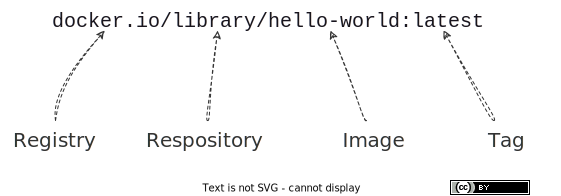
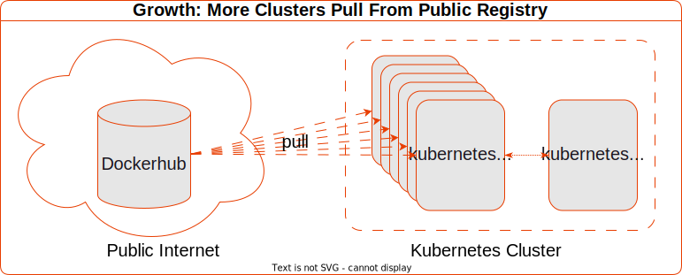

Let's begin with one of the most common use cases of a Container Registry:

## Pull A Public Container Image

...from the Wild Wild Web!

> Side Note: Container standards are evolving fast.
> In this series, we'll use terminology that embrace modern open standards.
> In particular, we'll use the Image, Runtime and Distribution Specifications from The OCI (Open Container Initiative).
> Where appropriate, we may mention other historical terms for the same thing.

Here's a simple kubernetes cluster.

It has access to pull images from the public internet.


Let's create a simple pod that runs `hello-world` to completion

```sh
➜ kubectl run hello \
  --image=hello-world \
  --restart=Never
```

```sh
pod/hello created
```

### Q: Where Does The Image Come From?

To find out, we can examine the logs of the high-level container runtime (sometimes called the container engine).
Our OCI Runtime is Containerd:

`containerd.log`
```json
{"level":"info","msg":"PullImage \"hello-world:latest\"","time":"2023-06-28T07:03:12.484906458Z"}
{"level":"debug","msg":"PullImage using normalized image ref: \"docker.io/library/hello-world:latest\"","time":"2023-06-28T07:03:12.484925856Z"}
{"host":"registry-1.docker.io","level":"debug","msg":"resolving","time":"2023-06-28T07:03:12.497681315Z"}
{"host":"registry-1.docker.io","level":"debug","msg":"do request","request.header.accept":"application/vnd.docker.distribution.manifest.v2+json, application/vnd.docker.distribution.manifest.list.v2+json, application/vnd.oci.image.manifest.v1+json, application/vnd.oci.image.index.v1+json, */*","request.header.user-agent":"containerd/v1.6.19-k3s1","request.method":"HEAD","time":"2023-06-28T07:03:12.497694862Z","url":"https://registry-1.docker.io/v2/library/hello-world/manifests/latest"}
```

In the Containerd logs, we can see the `hello-world` image is **normalised**.

Specifically, its:
1. prefixed with the default registry `docker.io`
1. prefixed with the default repository `library`
1. suffixed with the default tag `latest`



**A:** Containerd requests the image from `registry-1.docker.io`, better known as DockerHub.

### Q: How Did The Image Get From The Registry To The Container Runtime?

An OCI Image is composed of a **Manifest**, one or more **Filesystem Layers** and an **Image Configuration**.

When Containerd receives a request to run a container from an image, here's what happens:


1. Fetch the OCI Image Manifest Digest for the `stable` tag. Containerd makes a HEAD request to the registry mirror at `/v2/library/nginx/manifests/stable?ns=docker.io` for `nginx:stable`.
1. Mirror responds with the sha256 digest of the Image Manifest.
1. Is the image already present on the worker? Containerd compares the sha256 digest in the response to the digest for `nginx:stable` stored locally. `stable` here is a human readable tag that itself points to a manifest identified by its sha256 digest.
1. Get the Image Manifest. Specifically, Containerd makes a GET request to the `manifests` API endpoint of the `nginx` image e.g. `/v2/library/nginx/manifests/sha256:b07a5ab5292bd90c4271a55a44761899cc1b14814172cf7f186e3afb8bdbec28?ns=docker.io`.
1. Containerd verifies the digest. In particular, it computes the sha256sum of the manifest json content received and compares it to the sha256 digest that identifies the manifest.
1. Next, for each layer in the manifest:
    1. Is the layer already present on the worker?
    1. Download layer. Specifically, Containerd makes a GET request to the `blobs` API endpoint e.g. `/v2/library/nginx/blobs/sha256:2af0ea4a9556b049337d026dd7df7f9c20661203c634be4f9b976814c05e5c32?ns=docker.io` 
    1. Extracts layer
1. Verify checksums against those in the manifest 

\* The registry can respond with an OCI Image Index if there's more than one target platform (architecture and OS) for the image. Omitted here for simplicity.

> Historically, in Docker distribution spec these were called Manifest and Manifest List respectively.

> Note: here, DockerHub shares the Image Manifest in `application/vnd.docker.distribution.manifest.v2+json` format and the Configuration in `application/vnd.docker.container.image.v1+json` format.  

---

## More Clusters, More Image Pulls

Imagine an organisation has 6 application teams.

Each team has their own cluster so they can operate independently on their own cadence.


Again, each cluster has access to pull images from the public internet.



Actually, each team wants to run a job that tests a matrix of 3 image versions.

Additionally, it must run to completion exactly 6 times and must complete quickly.

Finally, these are mutable images and its important to test with the freshest.

Here's the job specification:

`hello-job.yaml`
```yaml
apiVersion: batch/v1
kind: Job
metadata:
  name: hello
spec:
  completions: 6
  parallelism: 6
  template:
    metadata:
      labels:
        app: hello
    spec:
      containers:
      - image: hello-world:latest
        name: hello
        imagePullPolicy: Always
      - image: hello-world:linux
        name: hello-linux
        imagePullPolicy: Always
      - image: hello-world:nanoserver
        name: hello-nanoserver
        imagePullPolicy: Always
      restartPolicy: Never
      affinity:
        podAntiAffinity:
          requiredDuringSchedulingIgnoredDuringExecution:
          - labelSelector:
              matchExpressions:
              - key: app
                operator: In
                values:
                - hello
            topologyKey: kubernetes.io/hostname
```

Monday, first thing, the teams deploy the jobs. What happens next?

---

## Problem: `Errimagepull`, Hit The Limit

Two minutes later, we're seeing ErrImagePull errors...

```sh
$ kubectl get events
```

```sh
90s         Warning   Failed                    pod/hello-zhkp7               
Failed to pull image "hello-world:nanoserver": 
rpc error: code = Unknown desc = failed to pull and unpack image "docker.io/library/hello-world:nanoserver": 
failed to copy: httpReadSeeker: failed open: 
unexpected status code https://registry-1.docker.io/v2/library/hello-world/manifests/sha256:3cabdfb783cd2710153b3824ba5d94c8ebecc0bc48251e2e823f82a15dec660f: 
429 Too Many Requests - Server message: 
toomanyrequests: You have reached your pull rate limit. You may increase the limit by authenticating and upgrading: https://www.docker.com/increase-rate-limit
```

If we examine the events, we got a `429 Too Many Requests` response from DockerHub.

Docker Hub [limits](https://docs.docker.com/docker-hub/download-rate-limit/) the number of container image pulls based on the account type of the user pulling the image. Anonymous (i.e. unauthenticated) users are idenitifed by their source IP address.

To summarise:

|Account Type|Limit|
|---|---|
|anonymous users| 100 pulls per 6 hours per IP address.|
|authenticated users| 200 pulls per 6 hour period.|
|Users with a paid Docker subscription| 5000 pulls per day.|

We can use the handy [Check Docker Hub Limit
](https://gitlab.com/gitlab-de/unmaintained/check-docker-hub-limit/?_gl=1%2a11geejw%2a_ga%2aMTY2MTE5MTAxOC4xNjcxMzQ4ODM1%2a_ga_ENFH3X7M5Y%2aMTY4NDI0MTAwMi4zLjEuMTY4NDI0NTk5NC4wLjAuMA..) python script to check docker pulls remaining

```sh
❯ python check_docker_hub_limit.py
```

```sh
CRITICAL - Docker Hub: Limit is 100 remaining 0|'limit'=100 'remaining'=0 'reset'=0
```

Yup, remaining pulls is 0! We hit the DockerHub rate limit!

How did that happen?

1. we have 6 clusters
1. each cluster has 6 worker nodes
1. each team deployed a job that ran 6 hello-worlds to completion, in parallel - fancy stuff!
1. for freshness, each hello-world pod `Always` attempts to pull 3* versions of the `hello-world` image. That's the `imagePullPolicy`.

> \* Two of `latest`, `linux`, `nanoserver` depends on your host Operating System!

That's **6 clusters * 6 pods * 3 containers = 108 image pulls**


### Q: What About The 6 Worker Nodes? Why Is That Significant?

Because the pods are scheduled across the 6 worker nodes, containers cannot be launched from node-local images. 
None of those images are cached on the worker node.

On container start, each worker must pull the image from DockerHub.

Its significant because Dockerhub receives many requests in a short time frame.

Given that Dockerhub identifies unauthenticated pullers by their IP address.
And each worker node has a different IP address on the network.
When each image pull request originates from a different worker node, then...

### Q: Why Are Workers Sharing The Dockerhub Limit?

Let's examine the response from DockerHub.

Again, from the Containerd logs*, the response looks like this:

`containerd.log`
```json
{
  "host": "registry-1.docker.io",
  "level": "debug",
  "msg": "fetch response received",
  "response.header.content-length": "2561",
  "response.header.content-type": "application/vnd.docker.distribution.manifest.list.v2+json",
  "response.header.date": "Sat, 10 Jun 2023 13:25:33 GMT",
  "response.header.docker-content-digest": "sha256:fc6cf906cbfa013e80938cdf0bb199fbdbb86d6e3e013783e5a766f50f5dbce0",
  "response.header.docker-distribution-api-version": "registry/2.0",
  "response.header.docker-ratelimit-source": "58.185.1.1",
  "response.header.etag": "\"sha256:fc6cf906cbfa013e80938cdf0bb199fbdbb86d6e3e013783e5a766f50f5dbce0\"",
  "response.header.ratelimit-limit": "100;w=21600",
  "response.header.ratelimit-remaining": "99;w=21600",
  "response.header.strict-transport-security": "max-age=31536000",
  "response.status": "200 OK",
  "time": "2023-06-10T13:25:33.501655728Z",
  "url": "https://registry-1.docker.io/v2/library/hello-world/manifests/latest"
}
```

Notice the `response.header.docker-ratelimit-source`. Its `58.185.1.1`.

Thats the public IP address of the network's internet gateway. Its the source address that DockerHub sees.

This happens if Source Network Address Translation is configured for outbound internet requests.


The result is each request has the same IP address no matter which cluster originates the request.

Now, that took a little bit of voodoo to make it run locally on one machine.

But if you're in an organisation with many clusters,
and those clusters pull images from Dockerhub through a SNAT gateway, 
in the same way,
you can hit the limit very quickly!

## Q: How Might We Work Around The Pull Limit?

There are a couple of alternatives to DockerHub here:

### 1. Pull From A Different Public Registry
> 
> If you're using AWS EKS, you can pull the majority of popular docker images from ECR Public Registry.
> 
> For example `docker pull public.ecr.aws/docker/library/hello-world:latest`
> 
> On AWS, its logically closer to your infrastructure and you wont encounter any rate limiting.

### 2. Operate Your Own Private OCI Registry

> If you already have a central binary repository in your org like a managed Artifactory, Nexus or the Harbor, you're likely already doing this.
> 
> For example `docker pull containers.your.org/library/hello-world:latest`
> 
> This solution becomes increasingly compelling as your container consumption grows.

We're gonna choose option #2, but we wont use a vendor product because we wanna learn with the simplest components that meet the OCI specifications!

The simplest OCI Registry is a container running the `registry:2` image from [distribution/distribution](https://github.com/distribution/distribution/releases) :

## Create A Private Proxy Cache OCI Registry For Dockerhub

```sh
➜ k3d registry create docker-io-mirror \
--port 0.0.0.0:5005 \
--proxy-remote-url https://registry-1.docker.io \
--volume /tmp/reg:/var/lib/registry \
--no-help
```

```sh
INFO[0000] Creating node 'k3d-docker-io-mirror'         
INFO[0000] Successfully created registry 'k3d-docker-io-mirror' 
INFO[0000] Starting Node 'k3d-docker-io-mirror'         
INFO[0000] Successfully created registry 'k3d-docker-io-mirror' 
```

Now we can pull the image from our private OCI Registry like:

```sh
$ docker pull k3d-docker-io-mirror.localhost:5005/library/hello-world
```

```sh
Using default tag: latest
latest: Pulling from library/hello-world
719385e32844: Pull complete 
Digest: sha256:a13ec89cdf897b3e551bd9f89d499db6ff3a7f44c5b9eb8bca40da20eb4ea1fa
Status: Downloaded newer image for k3d-docker-io-mirror.localhost:5005/library/hello-world:latest
k3d-docker-io-mirror.localhost:5005/library/hello-world:latest
```

Notice we need to specify both the **registry** and **repository** prefix explicitly in the image identifier.
It's not normalised for Dockerhub. That's for backwards compability.

Alternatively, we can configure our private registry as a **Registry Mirror** in the container runtime.

## Configure The Container Runtime To Use A Registry Mirror

In Containerd, we can [Configure An OCI-Compliant Registry Mirror](https://github.com/containerd/containerd/blob/9b4ed8acc2a04a3f8df140e79052d18b750d757e/docs/hosts.md#setup-a-local-mirror-for-docker) in `/etc/containerd/certs.d/docker.io/hosts.toml`.

```toml
server = "https://docker.io"

[host."http://docker-io-mirror:5000"]
  capabilities = ["pull", "resolve"]
  skip_verify = true
```

Let's create a pod. As before, we'll specify the tag, but omit the registry and repository.

```sh
➜ kubectl run nginx \
  --image=nginx:stable
```

```sh
pod/nginx created
```

Describe the pod. We can see the image is expanded to the default registry `docker.io` and default repository `library`.

```sh
❯ kubectl describe pod nginx
```

```sh
Containers:
  nginx:
    Container ID:   containerd://a6f171d5af552b144cec25504f4fb661015509185d0c064568b23ee55a04cfaf
    Image:          nginx:stable
    Image ID:       docker.io/library/nginx@sha256:a8281ce42034b078dc7d88a5bfe6d25d75956aad9abba75150798b90fa3d1010
```

In the `Containers` sections of the output, we can see the image is expanded. Like before, the default registry is `docker.io` and default repository is `library`.

### Q: It Appears To Be Pulled From Dockerhub, But What Happened At The Container Runtime Layer?

Analysing the containerd logs, we can see

request:

```json
{"level":"info","msg":"PullImage \"nginx:stable\"","time":"2023-07-02T04:08:17.771504540Z"}
{"level":"debug","msg":"PullImage using normalized image ref: \"docker.io/library/nginx:stable\"","time":"2023-07-02T04:08:17.771521636Z"}
{"host":"docker-io-mirror:5000","level":"debug","msg":"resolving","time":"2023-07-02T04:08:17.778859386Z"}
{"host":"docker-io-mirror:5000","level":"debug","msg":"do request","request.header.accept":"application/vnd.docker.distribution.manifest.v2+json, application/vnd.docker.distribution.manifest.list.v2+json, application/vnd.oci.image.manifest.v1+json, application/vnd.oci.image.index.v1+json, */*","request.header.user-agent":"containerd/v1.6.19-k3s1","request.method":"HEAD","time":"2023-07-02T04:08:17.778877611Z","url":"http://docker-io-mirror:5000/v2/library/nginx/manifests/stable?ns=docker.io"}
```

Containerd pulls from the Registry Mirror!

Notice this time, we *didn't* need to specify the **registry** nor the **repository** explicitly. It did that transparently.

That's useful! Imagine if you wanna experiment with a helm chart that has a bunch of container images whose default registry is Dockerhub.

You don't wanna re-configure each image to come from your private OCI registry just to try the chart! That's toil!

If you configure a registry mirror, you don't have to!

Let's see if `nginx` is there in the docker-io-mirror...

```sh
docker exec k3d-use-reg-mirror-server-0 \
  wget k3d-docker-io-mirror:5000/v2/_catalog -qO - | \
  jq
```

```json
{
  "repositories": [
    "library/nginx",
    "rancher/klipper-helm",
    "rancher/klipper-lb",
    "rancher/local-path-provisioner",
    "rancher/mirrored-coredns-coredns",
    "rancher/mirrored-library-traefik",
    "rancher/mirrored-metrics-server",
    "rancher/mirrored-pause"
  ]
}
```

It is! Not only is nginx there, but all of the k3d images are there too!

They're cached in our private registry mirror.

That should make it faster to spin up more k3d clusters :grin: !

In the events section, we see that it pulled the image in 17 seconds

```log
Events:
  Type    Reason     Age    From               Message
  ----    ------     ----   ----               -------
  Normal  Scheduled  3m40s  default-scheduler  Successfully assigned default/nginx to k3d-stg-server-0
  Normal  Pulling    3m40s  kubelet            Pulling image "nginx:stable"
  Normal  Pulled     3m23s  kubelet            Successfully pulled image "nginx:stable" in 17.229833041s (17.229838067s including waiting)
  Normal  Created    3m23s  kubelet            Created container nginx
  Normal  Started    3m22s  kubelet            Started container 
```

### ImagePullPolicy=Always

`--image-pull-policy=Always` insists Containerd to pull from the registry rather than use the image stored locally on the worker.

If we create another pod, this time with `--image-pull-policy=Always`, we can expect it to pull from our registry mirror again.

But is there any difference?

```sh
❯ kubectl run nginx2 \
  --image=nginx:stable \
  --image-pull-policy=Always
```

```sh
pod/nginx2 created
```

Describe the pod events

```log
Events:
  Type    Reason     Age   From               Message
  ----    ------     ----  ----               -------
  Normal  Scheduled  99s   default-scheduler  Successfully assigned default/nginx2 to k3d-use-reg-mirror-server-0
  Normal  Pulling    99s   kubelet            Pulling image "nginx:stable"
  Normal  Pulled     97s   kubelet            Successfully pulled image "nginx:stable" in 1.891618745s (1.891624164s including waiting)
  Normal  Created    97s   kubelet            Created container nginx2
  Normal  Started    97s   kubelet            Started container nginx2
```

Yup! This time its 2 seconds! What happened?

The container runtime pulled the image from the local registry mirror.


Here's what happened exactly:


1. Fetch the OCI Image Manifest. Containerd makes a HEAD request to the registry mirror at `/v2/library/nginx/manifests/stable?ns=docker.io` for `nginx:stable`.
1. Mirror responds with the sha256 digest of the Image Manifest.
1. Is the image already present on the host? Containerd compares the sha256 digest in the response to the digest for `nginx:stable` stored locally. 
1. Yup, its already present. Job done!

---

Since `nginx:stable` already exists in the Registry Mirror, only one HEAD request to Dockerhub was required to pull the manifest.

The manifest's sha256 digest is all that's needed to determine that nothing had changed. All of the required layers and configuration already exist in our local Registry Mirror.

The result is faster pulls. There are fewer requests to Dockerhub and we get lower latency on requests for manifest and layer downloads from the local Registry Mirror.

### Some Pros And Cons Of Pulling Public Images Through Your Own OCI Registry

Here are some of the pros and cons of pulling public images through your own private OCI registry configured as a mirror:

|Pros | Cons |
|---  | --- |
| Secure your kubernetes clusters. Isolate container runtimes from the public internet or control which public registries are trusted. By using a registry mirror, you can maintain a private, local mirror of container images that can be accessed without relying on external connectivity. | Stale images. The mirror might not always be up to date with the latest versions of container images. If the mirror doesn't sync frequently or experiences delays in updating images, you may encounter situations where the mirror contains older versions of images. This can lead to compatibility issues or missing out on important updates and security patches. |
| Simple to use. Use public images and charts without the need to override the registry prefix. Imagine if you wanna experiment with a helm chart that has a bunch of container images whose default registry is Dockerhub. | Increased operational complexity. Configuring and managing a registry mirror introduces additional complexity to your infrastructure. You need to set up and maintain the mirror, ensure synchronization with the public registry, and handle any potential issues that may arise. |
| Speed up image pulls and reduce request latency. If you pull images from a mirror that is logically or physically closer to your network, this can significantly improve performance. | Runaway Registry Storage. A registry mirror requires storage space to store container images locally. Depending on the number and size of the images, this can consume significant disk space. Can be hard to housekeep safely. |
| Improve availability of container images. Container runtimes can pull from an ordered list of registry mirrors. If the primary is unavailable, it will try to pull from the secondary. | Escalating Costs. Egress costs for image pulls across cloud zones. Storage costs for duplicated or triplicated images.
| Optimize bandwidth usage. If multiple containers or nodes in your infrastructure are pulling the same image, a registry mirror can serve as a local cache, reducing the need for each container or node to download the image separately. |