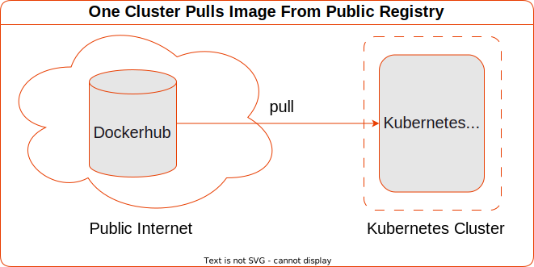

Let's begin with one of the most common use cases of a Container Registry:

### Pull A Public Container Image

...from the Wild Wild Web!

> Side Note: Container standards are evolving fast.
> In this series, we'll use terminology that embrace modern open standards.
> In particular, we'll use the Image, Runtime and Distribution Specifications from The OCI (Open Container Initiative).
> Where appropriate, we may mention other historical terms for the same thing.

Here's the specification for a simple kubernetes cluster.

`k3d-dev-public.yaml`
```yaml
---
apiVersion: k3d.io/v1alpha5
kind: Simple
metadata:
  name: dev-public
servers: 1
agents: 0
options:
  k3d:
    disableLoadbalancer: true
```

It has access to pull images from the public internet.



Let's create a simple pod that runs `hello-world` to completion

```sh
➜ kubectl run hello \
  --image=hello-world \
  --restart=Never
```

```sh
pod/hello created
```

### Q: Where Does The Image Come From?

To find out, we can examine the logs of the high-level container runtime (sometimes called the container engine).
Our OCI Runtime is Containerd:

`/var/lib/rancher/k3s/agent/containerd/containerd.log`
```json
msg="PullImage \"hello-world:latest\""
msg="PullImage using normalized image ref: \"docker.io/library/hello-world:latest\""
msg=resolving host=registry-1.docker.io
msg="do request" host=registry-1.docker.io request.header.accept="application/vnd.docker.distribution.manifest.v2+json, application/vnd.docker.distribution.manifest.list.v2+json, application/vnd.oci.image.manifest.v1+json, application/vnd.oci.image.index.v1+json, */*" request.header.user-agent=containerd/v1.6.19-k3s1 request.method=HEAD url="https://registry-1.docker.io/v2/library/hello-world/manifests/latest"
```

In the Containerd logs, we can see the `hello-world` image is **normalised**.

Specifically, its:
1. prefixed with the default registry `docker.io`
1. prefixed with the default repository `library`
1. suffixed with the default tag `latest`


**A:** Containerd requests the image from `registry-1.docker.io`, better known as DockerHub.

### Q: How Did The Image Get From The Registry To The Container Runtime?

An OCI image bundle is composed of an Image Manifest, one or more Image Layers and a Configuration.

When Containerd receives a request to run a container from an image, here's what happens:


1. is the image present on the host?
1. request the image manifest for the chosen image tag from the registry (this uses a HEAD request)
1. for each layer in the manifest:
    1. download layer
    1. extract layer
1. verify checksums against those in the manifest

We can also see that in the Containerd logs:

```json
{
  "desc.digest": "sha256:fc6cf906cbfa013e80938cdf0bb199fbdbb86d6e3e013783e5a766f50f5dbce0",
  "host": "registry-1.docker.io",
  "level": "debug",
  "msg": "resolved",
  "time": "2023-06-10T13:25:33.501807198Z"
}
{
  "digest": "sha256:fc6cf906cbfa013e80938cdf0bb199fbdbb86d6e3e013783e5a766f50f5dbce0",
  "level": "debug",
  "mediatype": "application/vnd.docker.distribution.manifest.list.v2+json",
  "msg": "fetch",
  "size": 2561,
  "time": "2023-06-10T13:25:33.502007442Z"
}
```

> Note: here, DockerHub shares the Image Manifest in `application/vnd.docker.distribution.manifest.v2+json` format and the Configuration in `application/vnd.docker.container.image.v1+json` format.  

## More Clusters, More Image Pulls

Imagine an organisation has 6 application teams.

Each team has their own cluster so they can operate independently on their own cadence.

This time the cluster specification look like:

`k3d-dev-public-scaled.yaml`
```yaml
apiVersion: k3d.io/v1alpha5
kind: Simple
metadata:
  name: dev-public
servers: 1
agents: 6
options:
  k3d:
    wait: false
    disableLoadbalancer: true
    disableRollback: true
  kubeconfig:
    updateDefaultKubeconfig: true
    switchCurrentContext: false
  runtime: # runtime (docker) specific options
    ulimits:
      - name: nofile
        soft: 26677
        hard: 26677
```

> TODO: test if docker nofile params are required.
> clearly host kernel inotify options were required

Again, each cluster has access to pull images from the public internet.


---

In fact, each team wants to run job a job that tests a matrix of 3 image versions.

Additionally, it must run to completion exactly 5 times and must complete quickly.

Finally, these are mutable images and its important to test with the freshest.

`hello-job.yaml`
```yaml
apiVersion: batch/v1
kind: Job
metadata:
  name: hello
spec:
  completions: 5
  parallelism: 5
  template:
    metadata:
      labels:
        app: hello
    spec:
      containers:
      - image: hello-world:latest
        name: hello
        imagePullPolicy: Always
      - image: hello-world:linux
        name: hello-linux
        imagePullPolicy: Always
      - image: hello-world:nanoserver
        name: hello-nanoserver
        imagePullPolicy: Always
      restartPolicy: Never
```

Monday, first thing, the teams deploy the jobs. What happens next?

---

## Problem: `Errimagepull`, Hit The Limit

Two minutes later, we're seeing ErrImagePull errors...

```sh
$ kubectl get events
```

```sh
90s         Warning   Failed                    pod/hello-zhkp7               
Failed to pull image "hello-world:nanoserver": 
rpc error: code = Unknown desc = failed to pull and unpack image "docker.io/library/hello-world:nanoserver": 
failed to copy: httpReadSeeker: failed open: 
unexpected status code https://registry-1.docker.io/v2/library/hello-world/manifests/sha256:3cabdfb783cd2710153b3824ba5d94c8ebecc0bc48251e2e823f82a15dec660f: 
429 Too Many Requests - Server message: 
toomanyrequests: You have reached your pull rate limit. You may increase the limit by authenticating and upgrading: https://www.docker.com/increase-rate-limit
```

If we examine the events, we got a `429 Too Many Requests` response from DockerHub.

For unathenticated users, Dockerhub permits 100 pulls in a 6 hour period.

We can use the handy [Check Docker Hub Limit
](https://gitlab.com/gitlab-de/unmaintained/check-docker-hub-limit/?_gl=1%2a11geejw%2a_ga%2aMTY2MTE5MTAxOC4xNjcxMzQ4ODM1%2a_ga_ENFH3X7M5Y%2aMTY4NDI0MTAwMi4zLjEuMTY4NDI0NTk5NC4wLjAuMA..) python script to check docker pulls remaining

```sh
❯ python check_docker_hub_limit.
```

```sh
CRITICAL - Docker Hub: Limit is 100 remaining 0|'limit'=100 'remaining'=0 'reset'=0
```

Yup, remaining pulls is 0! We hit the DockerHub rate limit!

How did that happen?

1. we have 7 clusters
1. each cluster has 6 worker nodes
1. each team deployed a job that ran 5 hello-worlds to completion, in parallel - fancy stuff!
1. for freshness, each of those hello-world jobs `Always` pulls 3 versions of `hello-world` image: `latest`, `linux` and `nanoserver`!

That's **7 clusters * 5 pods * 3 containers = 105 image pulls**


### Q: What About The 6 Worker Nodes? Why Is That Significant?

Because the pods are scheduled across the 6 worker nodes, containers cannot be launched from node-local images. 
None of those images are cached on the worker node. On container birth, each worker must pull the image from DockerHub.

Also, each image pull request originates from a different worker node. Each has a different ip address. 

### Q: Why Are Workers Sharing The Dockerhub Limit?

Let's examine the response from DockerHub.

Again, from the Containerd logs*, the response looks like this:

`/var/lib/rancher/k3s/agent/containerd/containerd.log`
```json
{
  "host": "registry-1.docker.io",
  "level": "debug",
  "msg": "fetch response received",
  "response.header.content-length": "2561",
  "response.header.content-type": "application/vnd.docker.distribution.manifest.list.v2+json",
  "response.header.date": "Sat, 10 Jun 2023 13:25:33 GMT",
  "response.header.docker-content-digest": "sha256:fc6cf906cbfa013e80938cdf0bb199fbdbb86d6e3e013783e5a766f50f5dbce0",
  "response.header.docker-distribution-api-version": "registry/2.0",
  "response.header.docker-ratelimit-source": "58.185.1.1",
  "response.header.etag": "\"sha256:fc6cf906cbfa013e80938cdf0bb199fbdbb86d6e3e013783e5a766f50f5dbce0\"",
  "response.header.ratelimit-limit": "100;w=21600",
  "response.header.ratelimit-remaining": "99;w=21600",
  "response.header.strict-transport-security": "max-age=31536000",
  "response.status": "200 OK",
  "time": "2023-06-10T13:25:33.501655728Z",
  "url": "https://registry-1.docker.io/v2/library/hello-world/manifests/latest"
}
```
>
> \* containerd configured with log level=debug and format=json

Notice the `response.header.docker-ratelimit-source`. Its `58.185.1.1`.

Thats the public IP address of the network's internet gateway. Its the source address that DockerHub sees.

This happens if Source Network Address Translation is configured for outbound internet requests.


The result is each request has the same IP address no matter which cluster originates the request.

Now, that took a little bit of voodoo to make it run locally on one machine.

But if you're in an organisation with many clusters,
and those clusters pull images from Dockerhub through a SNAT gateway, 
in the same way,
you can hit the limit very quickly.

### Q: How Might We Work Around The Pull Limit?

There are a couple of alternatives to DockerHub here:

1. Pull from a different public registry.

    > If you're using AWS EKS, you can pull the majority of popular docker images from ECR Public Registry.
    >
    > For example `docker pull public.ecr.aws/docker/library/busybox:stable-musl`
    >
    > On AWS, its logically closer to your infrastructure and you wont encounter any rate limiting.

1. Operate your own private OCI registry.

    > If you already have a central binary repository in your org like a managed Artifactory or Nexus, you're likely already doing this.
    >
    > For example `docker pull containers.your.org/library/busybox:stable-musl`
    >
    > This solution becomes increasingly compelling as your container consumption grows.

We're gonna choose option #2, but we wont use a vendor product because we wanna learn with the simplest components that meet the OCI specifications!

The simplest OCI Registry is a container running the `registry:2` image from [distribution/distribution](https://github.com/distribution/distribution/releases) :

```sh
➜ k3d registry create docker-io-mirror \
--port 0.0.0.0:5005 \
--proxy-remote-url https://registry-1.docker.io \
--volume /tmp/reg:/var/lib/registry \
--no-help
```

```sh
INFO[0000] Creating node 'k3d-docker-io-mirror'         
INFO[0000] Successfully created registry 'k3d-docker-io-mirror' 
INFO[0000] Starting Node 'k3d-docker-io-mirror'         
INFO[0000] Successfully created registry 'k3d-docker-io-mirror' 
```

Now we can pull the image from our private OCI Registry like:

```sh
$ docker pull k3d-docker-io-mirror.localhost:5005/library/hello-world
```

```sh
Using default tag: latest
latest: Pulling from library/hello-world
719385e32844: Pull complete 
Digest: sha256:a13ec89cdf897b3e551bd9f89d499db6ff3a7f44c5b9eb8bca40da20eb4ea1fa
Status: Downloaded newer image for k3d-docker-io-mirror.localhost:5005/library/hello-world:latest
k3d-docker-io-mirror.localhost:5005/library/hello-world:latest
```

Notice we need to specify both the **registry** and **repository** prefix explicitly - the full image ref.
It's not normalised for Dockerhub. That's for backwards compability.

Alternatively, we can configure our private registry as a **Registry Mirror** in the container runtime.

In Containerd, we can [Configure An OCI-Compliant Registry Mirror](https://github.com/containerd/containerd/blob/9b4ed8acc2a04a3f8df140e79052d18b750d757e/docs/hosts.md#setup-a-local-mirror-for-docker) in `/etc/containerd/certs.d/docker.io/hosts.toml`.

In k3d, we can use it in the clusters by configuring `registries.yaml` in the cluster spec:

```yaml
apiVersion: k3d.io/v1alpha5
kind: Simple
metadata:
  name: dev-public
servers: 1
agents: 6
options:
  k3d:
    wait: false
    disableLoadbalancer: true
    disableRollback: true
  kubeconfig:
    updateDefaultKubeconfig: true
    switchCurrentContext: false
  runtime: # runtime (docker) specific options
    ulimits:
      - name: nofile
        soft: 26677
        hard: 26677
registries:
  use:
    - docker-io-mirror:5000
  config: | # define contents of the `registries.yaml` file (or reference a file); same as `--registry-config /path/to/config.yaml`
    mirrors:
      "docker.io":
        endpoint:
          - http://docker-io-mirror:5000
```

```sh
➜ k3d cluster create dev \
--config registry-mirror.yaml
```

Let's create a pod. As before, we'll specify the tag, but omit the registry and repository.

```sh
➜ kubectl run nginx \
  --image=nginx:stable
```

```sh
pod/nginx created
```

Describe the pod. We can see the image is expanded to the default registry `docker.io` and default repository `library`.

```sh
❯ kubectl describe po nginx
```

```sh
Name:         nginx
Namespace:    default
Priority:     0
Node:         k3d-stg-server-0/172.21.0.4
Start Time:   Wed, 31 May 2023 22:56:10 +0800
Labels:       run=nginx
Annotations:  <none>
Status:       Running
IP:           10.42.0.9
IPs:
  IP:  10.42.0.9
Containers:
  nginx:
    Container ID:   containerd://fefc06631951201e50c82593eadb6b2cd91fc123150040f0d8592b92b96abb1a
    Image:          nginx:stable
    Image ID:       docker.io/library/nginx@sha256:f3a9f1641ace4691afed070aadd1115f0e0c4ab4b2c1c447bf938619176c3eec
```

### Q: It Appears To Be Pulled From Dockerhub, But What Happened At The Container Runtime Layer?

Analysing the containerd logs, we can see

request:

```log
time="2023-05-31T15:38:24.408285894Z" level=info msg="PullImage \"nginx:stable\""
time="2023-05-31T15:38:24.408305281Z" level=debug msg="PullImage using normalized image ref: \"docker.io/library/nginx:stable\""
time="2023-05-31T15:38:24.411885467Z" level=debug msg="do request" host="docker-io-mirror:5000" request.header.accept="application/vnd.docker.distribution.manifest.v2+json, application/vnd.docker.distribution.manifest.list.v2+json, application/vnd.oci.image.manifest.v1+json, application/vnd.oci.image.index.v1+json, */*" request.header.user-agent=containerd/v1.6.19-k3s1 request.method=HEAD url="http://docker-io-mirror:5000/v2/library/nginx/manifests/stable?ns=docker.io
```

Containerd pulls from the Registry Mirror!

Notice this time, we *didn't* need to specify the **registry** nor the **repository** explicitly. It did that transparently.

That's useful! Imagine if you wanna experiment with a helm chart that has a bunch of container images whose default registry is Dockerhub.

You don't wanna re-configure each image to come from your private OCI registry just to try the chart! That's toil!

If you configure a registry mirror, you don't have to!

response:

```log
time="2023-05-31T15:38:26.201099047Z" level=debug msg="fetch response received" host="docker-io-mirror:5000" response.header.content-length=1862 response.header.content-type=application/vnd.docker.distribution.manifest.list.v2+json response.header.date="Wed, 31 May 2023 15:38:26 GMT" response.header.docker-content-digest="sha256:f3a9f1641ace4691afed070aadd1115f0e0c4ab4b2c1c447bf938619176c3eec" response.header.docker-distribution-api-version=registry/2.0 response.header.etag="\"sha256:f3a9f1641ace4691afed070aadd1115f0e0c4ab4b2c1c447bf938619176c3eec\"" response.header.x-content-type-options=nosniff response.status="200 OK" url="http://docker-io-mirror:5000/v2/library/nginx/manifests/stable?ns=docker.io"
time="2023-05-31T15:38:26.238245747Z" level=debug msg="create image" name="docker.io/library/nginx:stable" target="sha256:f3a9f1641ace4691afed070aadd1115f0e0c4ab4b2c1c447bf938619176c3eec"
time="2023-05-31T15:38:26.242222206Z" level=info msg="ImageUpdate event &ImageUpdate{Name:docker.io/library/nginx:stable,Labels:map[string]string{io.cri-containerd.image: managed,},XXX_unrecognized:[],}"
time="2023-05-31T15:38:26.250486435Z" level=debug msg="create image" name="docker.io/library/nginx:stable" target="sha256:f3a9f1641ace4691afed070aadd1115f0e0c4ab4b2c1c447bf938619176c3eec"
time="2023-05-31T15:38:26.254337194Z" level=info msg="ImageUpdate event &ImageUpdate{Name:docker.io/library/nginx:stable,Labels:map[string]string{io.cri-containerd.image: managed,},XXX_unrecognized:[],}"
time="2023-05-31T15:38:26.255212409Z" level=debug msg="create image" name="docker.io/library/nginx@sha256:f3a9f1641ace4691afed070aadd1115f0e0c4ab4b2c1c447bf938619176c3eec" target="sha256:f3a9f1641ace4691afed070aadd1115f0e0c4ab4b2c1c447bf938619176c3eec"
time="2023-05-31T15:38:26.259040786Z" level=info msg="ImageUpdate event &ImageUpdate{Name:docker.io/library/nginx@sha256:f3a9f1641ace4691afed070aadd1115f0e0c4ab4b2c1c447bf938619176c3eec,Labels:map[string]string{io.cri-containerd.image: managed,},XXX_unrecognized:[],}"
time="2023-05-31T15:38:26.259996466Z" level=debug msg="Pulled image \"nginx:stable\" with image id \"sha256:1e96add5ea29fed5b25c2971895403f050ca1eaa5f614da0ee02106e97805f5f\", repo tag \"docker.io/library/nginx:stable\", repo digest \"docker.io/library/nginx@sha256:f3a9f1641ace4691afed070aadd1115f0e0c4ab4b2c1c447bf938619176c3eec\""
time="2023-05-31T15:38:26.260038937Z" level=info msg="PullImage \"nginx:stable\" returns image reference \"sha256:1e96add5ea29fed5b25c2971895403f050ca1eaa5f614da0ee02106e97805f5f\""
time="2023-05-31T15:38:26.262372294Z" level=info msg="CreateContainer within sandbox \"62bf68fc44fefc867bd75805cd9fa75e9bc414da1c3f7ab930df4c51d3d02cd8\" for container &ContainerMetadata{Name:nginx2,Attempt:1,}"
```

Let's see if `nginx` is there in the docker-io-mirror...

```sh
/ # wget docker-io-mirror:5000/v2/_catalog \
    -qO -
```

```json
{
  "repositories": [
    "library/nginx",
    "rancher/klipper-helm",
    "rancher/klipper-lb",
    "rancher/local-path-provisioner",
    "rancher/mirrored-coredns-coredns",
    "rancher/mirrored-library-traefik",
    "rancher/mirrored-metrics-server",
    "rancher/mirrored-pause"
  ]
}
```

It is! not only is nginx there, but all of the k3d images are there too!
They're cached.

In the events section, we see that it pulled the image in 17 seconds

```log
Events:
  Type    Reason     Age    From               Message
  ----    ------     ----   ----               -------
  Normal  Scheduled  3m40s  default-scheduler  Successfully assigned default/nginx to k3d-stg-server-0
  Normal  Pulling    3m40s  kubelet            Pulling image "nginx:stable"
  Normal  Pulled     3m23s  kubelet            Successfully pulled image "nginx:stable" in 17.229833041s (17.229838067s including waiting)
  Normal  Created    3m23s  kubelet            Created container nginx
  Normal  Started    3m22s  kubelet            Started container 
```

If we create another pod, this time with `--image-pull-policy=Always`, what happens?

```sh
❯ kubectl run nginx2 \
  --image=nginx:stable \
  --image-pull-policy=Always
```

```sh
pod/nginx2 created
```

describe the pod events

```log
Events:
  Type    Reason     Age   From               Message
  ----    ------     ----  ----               -------
  Normal  Scheduled  15s   default-scheduler  Successfully assigned default/nginx2 to k3d-stg-server-0
  Normal  Pulling    15s   kubelet            Pulling image "nginx:stable"
  Normal  Pulled     13s   kubelet            Successfully pulled image "nginx:stable" in 2.071247033s (2.071251882s including waiting)
  Normal  Created    13s   kubelet            Created container nginx2
  Normal  Started    13s   kubelet            Started container nginx2
```

This time its 2 seconds! What happened?

The container runtime pulled the image from the local registry mirror.


Since the image already exists in the Registry Mirror, only one HEAD request to Dockerhub was required to pull the manifest.

Containerd compared the manifest, layers and configuration against those it had by verifying the checksums.

It determined that nothing had changed. All of the required layers and configuration already exist in our local Registry Mirror.


The result is faster pulls. There are fewer requests to Dockerhub and we get lower latency on requests for manifest and layer downloads from the local Registry Mirror.
