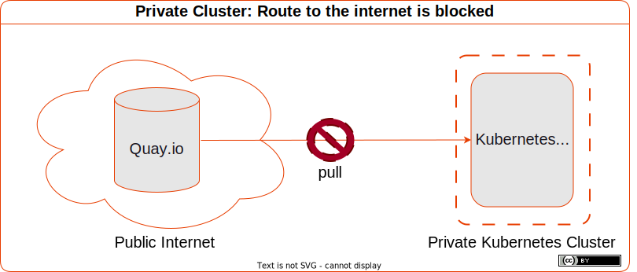
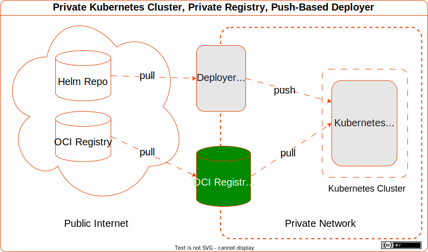

Aisha's a Platform Engineer.

As a platform engineer, every day, Aisha upgrades and rolls back helm charts.

That's an natural evolution from the time honoured IT tradition of turning it off and on again!

Often, Platform Engineers just wanna experiment with a public Helm Chart.

Today, Aisha's exploring a Kubernetes Network Plugin to enable teams to define network policies of their architecture within the kubernetes cluster. Each microservice should only access its own DB. It should stay on track, and not go "off the rails"!
There's a need to constrain connectivity and enforce a layered architecture.

Aisha likes to learn new tech by picking a use case and exploring things interactively.

Aisha understands that "Interactive" is the fastest feedback!

---

Let’s continue the journey into OCI registries with another common use case:

## Install A Public Helm Chart

Aisha picked the [Tigera Operator for Calico](https://artifacthub.io/packages/helm/projectcalico/tigera-operator) Helm Chart.

Let's install it...

```sh
helm repo add projectcalico https://docs.projectcalico.org/charts/
```

```sh
kubectl create namespace tigera-operator
```

```sh
helm install calico \
projectcalico/tigera-operator \
--version 3.26.1 \
--namespace tigera-operator
```

A moment later, the pod's reporting `ErrImagePull`

```sh
kubectl get po -n tigera-operator
```

```sh
NAME                              READY   STATUS         RESTARTS   AGE
tigera-operator-5f4668786-tzjkp   0/1     ErrImagePull   0          7s
```

## Oh Yeah, Forgot. Route To The Internet Is Blocked.



The Cluster can't pull from the public internet.

The Private registry can. 

The cluster must pull from the private registry.

The Push-based deployer has access to the public internet (for now).



## Better Update All The Image Refs To Pull From The Private Registry...

The default values file reveals images are coming from 2 different public registries: `quay.io` and `docker.io`.

Looks like `registry` can be overridden for the operator.

```yaml
tigeraOperator:
  image: tigera/operator
  version: v1.30.4
  registry: quay.io
```

For `calicoctl`, we prefix the registry in the `image` ref.

```yaml
calicoctl:
  image: docker.io/calico/ctl
  tag: v3.26.1
```

Let us update both to pull from our private registry proxies: `k3d-quay-io-mirror:5000` and `k3d-docker-io-mirror:5000` respectively.

```yaml
tigeraOperator:
  image: tigera/operator
  version: v1.30.4
  registry: k3d-quay-io-mirror:5000

calicoctl:
  image: k3d-docker-io-mirror:5000/calico/ctl
  tag: v3.26.1
```

There. That should fix it.

### Upgrade The Release With the Custom Values

Upgrade helm release with a new revision, specifying the custom values file.

```sh
helm upgrade calico \
projectcalico/tigera-operator \
--namespace tigera-operator \
--version v3.26.1 \
--install \
--values tigera-operator-values.yaml \
--debug
```

Now the Operator pod is `Running`:

```sh
kubectl get po -n tigera-operator
NAME                               READY   STATUS    RESTARTS   AGE
tigera-operator-85bc6fb7bf-58m2m   1/1     Running   0          26s
```

How about the calico pods?

```sh
kubectl get po -n calico-system
```

```sh
NAME                                       READY   STATUS                  RESTARTS   AGE
calico-typha-bfc4ccd59-cmgsf               0/1     ImagePullBackOff        0          23s
calico-kube-controllers-67b48b6f9c-5pgp9   0/1     ImagePullBackOff        0          23s
calico-node-9g7mg                          0/1     Init:ImagePullBackOff   0          23s
csi-node-driver-h2tnp                      0/2     ImagePullBackOff        0          23s
```

Ah. `ImagePullBackOff`.

There's at least 5* containers here that weren't visible in the default values file.

> \* (`calico-node-9g7mg` is a Init Container, stuck at pull. Once it completes, there may be more.)

Examining the events, we see a common problem preventing pull of all the container images - `dial tcp: lookup registry-1.docker.io`.

```sh
kubectl get events -n calico-system
LAST SEEN   TYPE      REASON              OBJECT                                          MESSAGE
51s         Warning   Failed              pod/csi-node-driver-h5wcv                       Error: ErrImagePull
40s         Normal    BackOff             pod/csi-node-driver-h5wcv                       Back-off pulling image "docker.io/calico/csi:v3.26.1"
40s         Warning   Failed              pod/csi-node-driver-h5wcv                       Error: ImagePullBackOff
40s         Normal    BackOff             pod/csi-node-driver-h5wcv                       Back-off pulling image "docker.io/calico/node-driver-registrar:v3.26.1"
40s         Warning   Failed              pod/csi-node-driver-h5wcv                       Error: ImagePullBackOff
36s         Normal    Pulling             pod/calico-kube-controllers-6488ff9f7b-2psct    Pulling image "docker.io/calico/kube-controllers:v3.26.1"
35s         Normal    Pulling             pod/calico-node-v9ms2                           Pulling image "docker.io/calico/pod2daemon-flexvol:v3.26.1"
32s         Normal    Pulling             pod/calico-typha-6db4d666b5-9ggp7               Pulling image "docker.io/calico/typha:v3.26.1"
31s         Warning   Failed              pod/calico-typha-6db4d666b5-9ggp7               Failed to pull image "docker.io/calico/typha:v3.26.1": rpc error: code = Unknown desc = failed to pull and unpack image "docker.io/calico/typha:v3.26.1": failed to resolve reference "docker.io/calico/typha:v3.26.1": failed to do request: Head "https://registry-1.docker.io/v2/calico/typha/manifests/v3.26.1": dial tcp: lookup registry-1.docker.io: Try again
31s         Warning   Failed              pod/calico-typha-6db4d666b5-9ggp7               Error: ErrImagePull
31s         Warning   Failed              pod/calico-kube-controllers-6488ff9f7b-2psct    Failed to pull image "docker.io/calico/kube-controllers:v3.26.1": rpc error: code = Unknown desc = failed to pull and unpack image "docker.io/calico/kube-controllers:v3.26.1": failed to resolve reference "docker.io/calico/kube-controllers:v3.26.1": failed to do request: Head "https://registry-1.docker.io/v2/calico/kube-controllers/manifests/v3.26.1": dial tcp: lookup registry-1.docker.io: Try again
31s         Warning   Failed              pod/calico-kube-controllers-6488ff9f7b-2psct    Error: ErrImagePull
31s         Warning   Failed              pod/calico-node-v9ms2                           Failed to pull image "docker.io/calico/pod2daemon-flexvol:v3.26.1": rpc error: code = Unknown desc = failed to pull and unpack image "docker.io/calico/pod2daemon-flexvol:v3.26.1": failed to resolve reference "docker.io/calico/pod2daemon-flexvol:v3.26.1": failed to do request: Head "https://registry-1.docker.io/v2/calico/pod2daemon-flexvol/manifests/v3.26.1": dial tcp: lookup registry-1.docker.io: Try again
31s         Warning   Failed              pod/calico-node-v9ms2                           Error: ErrImagePull
27s         Normal    Pulling             pod/csi-node-driver-h5wcv                       Pulling image "docker.io/calico/csi:v3.26.1"
22s         Warning   Failed              pod/csi-node-driver-h5wcv                       Failed to pull image "docker.io/calico/csi:v3.26.1": rpc error: code = Unknown desc = failed to pull and unpack image "docker.io/calico/csi:v3.26.1": failed to resolve reference "docker.io/calico/csi:v3.26.1": failed to do request: Head "https://registry-1.docker.io/v2/calico/csi/manifests/v3.26.1": dial tcp: lookup registry-1.docker.io: Try again
22s         Warning   Failed              pod/csi-node-driver-h5wcv                       Error: ErrImagePull
22s         Normal    Pulling             pod/csi-node-driver-h5wcv                       Pulling image "docker.io/calico/node-driver-registrar:v3.26.1"
17s         Warning   Failed              pod/csi-node-driver-h5wcv                       Failed to pull image "docker.io/calico/node-driver-registrar:v3.26.1": rpc error: code = Unknown desc = failed to pull and unpack image "docker.io/calico/node-driver-registrar:v3.26.1": failed to resolve reference "docker.io/calico/node-driver-registrar:v3.26.1": failed to do request: Head "https://registry-1.docker.io/v2/calico/node-driver-registrar/manifests/v3.26.1": dial tcp: lookup registry-1.docker.io: Try again
9s          Normal    BackOff             pod/calico-typha-6db4d666b5-9ggp7               Back-off pulling image "docker.io/calico/typha:v3.26.1"
9s          Warning   Failed              pod/calico-typha-6db4d666b5-9ggp7               Error: ImagePullBackOff
4s          Normal    BackOff             pod/calico-node-v9ms2                           Back-off pulling image "docker.io/calico/pod2daemon-flexvol:v3.26.1"
4s          Warning   Failed              pod/calico-node-v9ms2                           Error: ImagePullBackOff
2s          Normal    BackOff             pod/calico-kube-controllers-6488ff9f7b-2psct    Back-off pulling image "docker.io/calico/kube-controllers:v3.26.1"
2s          Warning   Failed              pod/calico-kube-controllers-6488ff9f7b-2psct    Error: ImagePullBackOff
```

No need to analyse further. We know there's no route to the public internet from the cluster.

Tigera Operator creates pods that pull images from DockerHub. Dockerhub is blocked. We wanna pull images from our private registry. How can we do that? :thinking:

### Update All Images Used By Subcharts

Are those images specified in the values of subcharts?

```sh
helm inspect chart projectcalico/tigera-operator
```

```yaml
apiVersion: v2
appVersion: v3.26.1
description: Installs the Tigera operator for Calico
home: https://projectcalico.docs.tigera.io/about/about-calico
icon: https://projectcalico.docs.tigera.io/images/felix_icon.png
name: tigera-operator
sources:
- https://github.com/projectcalico/calico/tree/master/calico/_includes/charts/tigera-operator
- https://github.com/tigera/operator
- https://github.com/projectcalico/calico
version: v3.26.1
```

Nope. No subcharts defined here.

## Oh Wait, There Are Still Some Images As Part Of Crd, Update Them Too

### Override the registry in the Installation CRD

Turns out the answer is in the [Installation CRD Specification](https://docs.tigera.io/calico/latest/reference/installation/api#operator.tigera.io/v1.InstallationSpec) as hinted in the comment of the default values.


Let's override the `registry` value for the default Installation and try it

```yaml
installation:
  enabled: true
  kubernetesProvider: ''
  registry: k3d-docker-io-mirror:5000
```

After a minute or two, the Calico pods are `Running`.

```sh
kubectl get po -n calico-system 
NAME                                      READY   STATUS                 RESTARTS   AGE
calico-typha-59d8dcf55d-jlz9p             1/1     Running                0          2m43s
calico-kube-controllers-d6b96cb6d-pntdg   1/1     Running                0          2m41s
calico-node-stzgr                         0/1     Running                0          2m41s
csi-node-driver-5cvj8                     1/2     CreateContainerError   0          2m42s

kubectl get po -n calico-apiserver 
NAME                                READY   STATUS    RESTARTS        AGE
calico-apiserver-75fb78b976-xhszq   1/1     Running   10 (123m ago)   2m41s
calico-apiserver-75fb78b976-chsfj   1/1     Running   10 (123m ago)   2m41s
```

---

## Problem Statement: You Need To Know All The Images Used By A Helm Chart Up Front

Now that's tedious and non-standard across Helm Charts and Kubernetes Operators.

Every time we use a public chart, we need to update all the image refs to point to our private registry.

Each chart may do it differently. If there are Custom Resource Definitions, there are *custom* ways to specify image registries.

What alternatives do we have? Is there a better way? 

Some options here:

1. We can use a mutating webhook to re-write the registry. For example, this [Kyverno Replace Image Registry ClusterPolicy](https://kyverno.io/policies/other/rec-req/replace-image-registry/replace-image-registry/).
1. We can configure our private registry as a **Registry Mirror** in the container runtime.


This can be solved at the OCI Registry and Runtime layer.

We're learning about OCI registries, so let's try that option...

## Configure The Container Runtime To Use A Registry Mirror

1. If you're using EKS, both Bottlerocket and AL2 use Conateinrd 1.6.19 https://docs.aws.amazon.com/eks/latest/userguide/kubernetes-versions.html#kubernetes-1.26. You can configure registry mirror like https://github.com/containerd/containerd/blob/v1.6.6/docs/hosts.md.
1. In Containerd, we can [Configure An OCI-Compliant Registry Mirror](https://github.com/containerd/containerd/blob/9b4ed8acc2a04a3f8df140e79052d18b750d757e/docs/hosts.md#setup-a-local-mirror-for-docker) in `/etc/containerd/certs.d/docker.io/hosts.toml`.
1. In k3d, we can use it in the clusters by configuring `registries.yaml` in the cluster spec:

`k3d-dev-private-use-registry-mirror.yaml`
```yaml
apiVersion: k3d.io/v1alpha5
kind: Simple
metadata:
  name: dev-private
servers: 1
agents: 0
options:
  k3d:
    disableLoadbalancer: true
registries:
  use:
    - k3d-quay-io-mirror:5000
  config: | # define contents of the `registries.yaml` file (or reference a file); same as `--registry-config /path/to/config.yaml`
    mirrors:
      "quay.io":
        endpoint:
          - http://k3d-quay-io-mirror:5000
```

```sh
k3d cluster create \
  --config k3d-dev-private-use-registry-mirror.yaml \
  --volume $(pwd)/containerd.config.toml.tmpl:/var/lib/rancher/k3s/agent/etc/containerd/config.toml.tmpl
```

```sh
INFO[0000] Using config file k3d-dev-private-use-registry-mirror.yaml (k3d.io/v1alpha5#simple) 
WARN[0000] No node filter specified                     
INFO[0000] Prep: Network                                
INFO[0000] Created network 'k3d-use-reg-mirror'         
INFO[0000] Created image volume k3d-use-reg-mirror-images 
INFO[0000] Starting new tools node...                   
INFO[0000] Starting Node 'k3d-use-reg-mirror-tools'     
INFO[0001] Creating node 'k3d-use-reg-mirror-server-0'  
INFO[0001] Using the k3d-tools node to gather environment information 
INFO[0001] HostIP: using network gateway 172.22.0.1 address 
INFO[0001] Starting cluster 'use-reg-mirror'            
INFO[0001] Starting servers...                          
INFO[0001] Starting Node 'k3d-use-reg-mirror-server-0'  
INFO[0004] All agents already running.                  
INFO[0004] All helpers already running.                 
INFO[0004] Injecting records for hostAliases (incl. host.k3d.internal) and for 2 network members into CoreDNS configmap... 
INFO[0007] Cluster 'use-reg-mirror' created successfully! 
INFO[0007] You can now use it like this:                
kubectl cluster-info
```

To test it, let's create a simple pod. We'll specify the tag, but omit the registry and repository.

```sh
kubectl run nginx \
  --image=nginx:stable
```

```sh
pod/nginx created
```

Describe the pod:

```sh
kubectl describe pod nginx
```

```sh
Containers:
  nginx:
    Container ID:   containerd://a6f171d5af552b144cec25504f4fb661015509185d0c064568b23ee55a04cfaf
    Image:          nginx:stable
    Image ID:       docker.io/library/nginx@sha256:a8281ce42034b078dc7d88a5bfe6d25d75956aad9abba75150798b90fa3d1010
```

We can see the `Image ID` normalises the given image ref. In particular, it prefixes with the default registry `docker.io` and default repository `library`.

### It Appears To Be Pulled From Dockerhub, But What Happened At The Container Runtime Layer?

Analyse the Containerd logs to find the request:

```sh
➜ docker cp k3d-dev-private-server-0:/var/lib/rancher/k3s/agent/containerd/containerd.log - | less
```

Use `/` to search for the pattern `nginx`:

```json
{"level":"info","msg":"PullImage \"nginx:stable\"","time":"2023-07-02T04:08:17.771504540Z"}
{"level":"debug","msg":"PullImage using normalized image ref: \"docker.io/library/nginx:stable\"","time":"2023-07-02T04:08:17.771521636Z"}
{"host":"docker-io-mirror:5000","level":"debug","msg":"resolving","time":"2023-07-02T04:08:17.778859386Z"}
{"host":"docker-io-mirror:5000","level":"debug","msg":"do request","request.header.accept":"application/vnd.docker.distribution.manifest.v2+json, application/vnd.docker.distribution.manifest.list.v2+json, application/vnd.oci.image.manifest.v1+json, application/vnd.oci.image.index.v1+json, */*","request.header.user-agent":"containerd/v1.6.19-k3s1","request.method":"HEAD","time":"2023-07-02T04:08:17.778877611Z","url":"http://docker-io-mirror:5000/v2/library/nginx/manifests/stable?ns=docker.io"}
```

Containerd pulls from the Registry Mirror!

Notice this time, we didn't need to specify the **registry** nor the **repository** explicitly. It did that transparently!

That's useful!

You don't wanna re-configure each image to come from your private OCI registry just to try the chart! That's toil!

If you configure a registry mirror, you don't have to!

Let's see if `nginx` is there in the docker-io-mirror...

```sh
docker exec k3d-dev-private-server-0 \
  wget k3d-docker-io-mirror:5000/v2/_catalog -qO - | \
  jq
```

```json
{
  "repositories": [
    "library/nginx",
    "rancher/klipper-helm",
    "rancher/klipper-lb",
    "rancher/local-path-provisioner",
    "rancher/mirrored-coredns-coredns",
    "rancher/mirrored-library-traefik",
    "rancher/mirrored-metrics-server",
    "rancher/mirrored-pause"
  ]
}
```

It is! Not only is nginx there, but all of the k3d images are there too!

They're cached in our private registry mirror.

That should make it faster to spin up more k3d clusters :grin: !

## Let's Try Out This Other Helm Chart

Now the container runtime uses our private resgitry proxies as a Registry Mirror for dockerhub and quayio.

If you're using helm charts, `cert-manager` is likely one of the leaves of your chart dependency tree.

Lets use `cert-manager` as an example...

### Set Up The Helm Repo

```sh
helm repo add cert-manager https://charts.jetstack.io
```

```sh
"cert-manager" has been added to your repositories
```

```sh
helm repo update cert-manager 
```
```sh
Hang tight while we grab the latest from your chart repositories...
...Successfully got an update from the "cert-manager" chart repository
Update Complete. ⎈Happy Helming!⎈
```

### Create The CRDs In The Cluster

```sh
$ kubectl apply -f https://github.com/cert-manager/cert-manager/releases/download/v1.12.3/cert-manager.crds.yaml
```

```sh
customresourcedefinition.apiextensions.k8s.io/certificaterequests.cert-manager.io created
customresourcedefinition.apiextensions.k8s.io/certificates.cert-manager.io created
customresourcedefinition.apiextensions.k8s.io/challenges.acme.cert-manager.io created
customresourcedefinition.apiextensions.k8s.io/clusterissuers.cert-manager.io created
customresourcedefinition.apiextensions.k8s.io/issuers.cert-manager.io created
customresourcedefinition.apiextensions.k8s.io/orders.acme.cert-manager.io created
```

### Install The Chart

```sh
helm install cert-manager \
cert-manager/cert-manager \
--version v1.12.3 \
--debug
```

No need custom values files.

A moment later, its up and running!

```sh
➜ kubectl get po
NAME                                       READY   STATUS    RESTARTS   AGE
cert-manager-cainjector-69b9bf685d-z8czg   1/1     Running   0          50s
cert-manager-697954868b-2p8bz              1/1     Running   0          50s
cert-manager-startupapicheck-nvcgz         1/1     Running   0          49s
cert-manager-webhook-59f46cd9c6-l585n      1/1     Running   0          50s
```

The images were mirrored.

Let's inspect all image refs in the chart's default values:

```sh
helm inspect values cert-manager/cert-manager | grep -i image: -A1
```

```yaml
image:
  repository: quay.io/jetstack/cert-manager-controller
--
  image:
    repository: quay.io/jetstack/cert-manager-webhook
--
  image:
    repository: quay.io/jetstack/cert-manager-cainjector
--
  image:
    repository: quay.io/jetstack/cert-manager-acmesolver
--
  image:
    repository: quay.io/jetstack/cert-manager-ctl
```

By default, cert-manager is pulling images from `quay.io`.

We didn't change anything. Helm just installed the Chart and pods started running exactly as you'd expect. Exactly the same as if the cluster could pull from the public Internet.

# Open For Experimentation

Charts often have more than one container image. They may have one or more subcharts. They may package CRDs, which themselves reference container images.

By configuring Registry Mirrors in Containerd, when we wanna experiment with a public helm chart on our cluster, Containerd automatically pulls public images from our private registry.

That's useful! An improvement in Usability.

Less friction for Aisha and platform engineers.

For Development and Test workflows, we wanna be open for quick and easy experimentation so that we can get fast feedback on our ideas.

We wanna be **open for experimentation**.

We can enable that, while still complying with standard registry policy, by configuring Registry Mirrors in the CRI.

---

# Uh Oh! The Private Registry Is Unavailable!
Detection: how do we distinguish between registry unavailable and image not found?

good job we prepared for this failure mode! we can mitigate with a failover.

But where do we make that switch? Options:

1. in the chart values. update all the image refs and redeploy the chart.
1. in the cluster. use a mutating webhook to change the registry part of the image ref URI.
1. in the container runtime. Configure a secondary mirror.

What's the MTRS for each?

## Mirror Mirror
Kubernetes is self healing. It runs control loops that retry with a backoff algorithm. When the problem is corrected, kubernetes will recover.

But this is not a cluster layer failure, its a container layer failure.

Let's work with Runtime and Registry.

configure a secondary mirror in the container runtime for auto-failover

---

# What If The Push-Based Deployer Also Cannot Pull Charts From The Public Internet?

Options:

1. fork and maintain? how to keep it fresh?
1. binary repository product that supports aggregated helm chart index-based repos
1. OCI Registry as Storage

    1. convert chart index to OCI transparently

1. proxy cache for public oci charts 

This time its a k8s-layer failure mode.

We wanna learn OCI, so let's choose the OCI Registry solution.
