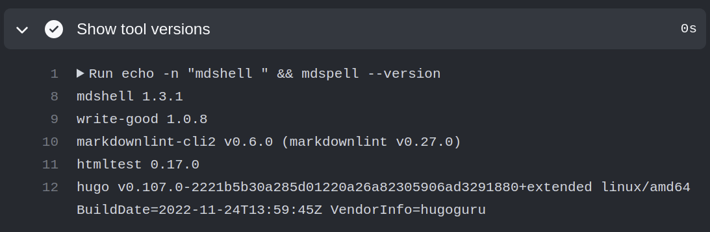
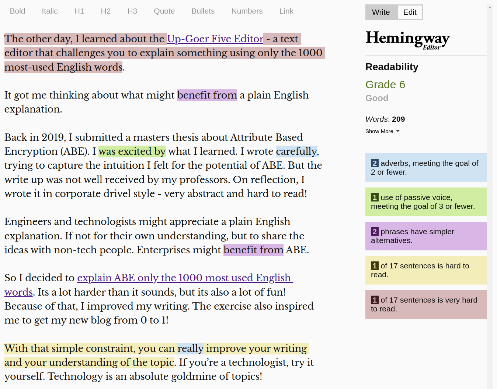

Here's an example docs-as-code build pipeline. It describes a process for checking and testing documentation written in markdown format. After committing and pushing markdown changes to Github, the pipeline will run. The output of the build pipeline is a complete static HTML site.

Let's examine some tools and techniques of the docs as code build pipeline...

## 1. Show Tool Versions

The first stage of the pipeline prints a complete list of tool versions. You can apply this on any pipeline. Keep it short and consistent - one tool and version per line. If your build tool has a bunch of plugins, show their versions too. Like this:



If your build and deployment pipelines don't have that, do it! I learnt this technique from Elton Stoneman in the [Using Declarative Jenkins Pipelines course](https://www.pluralsight.com/courses/using-declarative-jenkins-pipelines).

Besides a code-under-build bug or the CI server bonking, tool upgrades are a common reason for build failures. A Show Tool Versions stage enables you to see if a tool upgrade introduced a build failure. Simply find the builds before and after it started failing and compare the tool versions.

Its a useful technique because it reduces your anxiety about making that upgrade. It enables you to keep your build and deploy tools fresh. It enables you escape from making "chore: bump version to v0.1.977" commits and arrive at a place where a dependabot does that for you.

And, if you're using builder containers, you can simply rollback to a previous image version.

## 2 Check Spelling

This stage uses [`mdspell`](https://github.com/lukeapage/node-markdown-spellcheck) to check for spelling errors.
Interacting with it on the command line looks like this:

```sh
$ mdspell --report \
  --en-gb \
  --ignore-numbers \
  --ignore-acronyms \
  '**/*.md'
```

```sh
blog/creating-a-docs-as-code-pipeline/index.md
    15 | Inspired by the practical how tos on [docslikecode.com](https:/ 
    15 |  by the practical how tos on [docslikecode.com](https://www.docslikecode.com 
    17 | I had a conversation with chatgpt on this. The back and forth e 
```

Frankly there are too many false positives for technical writing.
I just spent over an hour on an interactive `mdspell` check, adding words to the dictionary and others to ignore. Its not hard to imagine the need to repeat that every time you mention the latest `foobar.io` tool. The dictionary will be the hottest file on the heatmap. In the age of AI, computers are laughing when humans do something like this!

My recommendation would be to use an in IDE spell checker, pre-commit and just eyeball the squigglies.
I'll be removing `mdspell` from the pipeline soon...

## 3 Check Prose

Tools like the [Hemingway Editor](https://hemingwayapp.com/) give feedback on your prose. The Hemingway editor is an online interactive editor that grades your prose by school reading age. It shows Readability as Grade 6 to 18, where lower is generally better. It follows simple rules, and highlights parts of the prose that make it hard to read or less impactful.

---


---

Inspired by [Writing With Confidence](https://www.udemy.com/course/writing-for-business/), I wanted to get this type of feedback integrated into a build pipeline.

One tool that can help with this is `write-good`.

[`write-good`](https://github.com/btford/write-good) helps with highlighting:

+ adverbs, which can weaken meaning. Prefer a forceful verb.
+ passive voice, which can make the writing distant and less engaging.
+ wordy phrases, which can make the sentence too complex to digest.

Interacting with it on the command line looks like this:

```sh
$ write-good \
  blog/explainer-using-the-1000-most-used-english-words/index.md
```

```sh
In blog/explainer-using-the-1000-most-used-english-words/index.md
=============
 explain something using only the 1000 most-used English words.
                         ^^^^
"only" can weaken meaning on line 10 at column 150
-------------
hinking about what might benefit from a plain English explanation.
                         ^^^^^^^^^^^^
"benefit from" is wordy or unneeded on line 12 at column 36
-------------
ased Encryption (ABE). I was excited by what I learned. I wrote carefully, trying
                         ^^^^^^^^^^^
"was excited" may be passive voice on line 14 at column 85
-------------
```

As an noob writer, I frequently make those mistakes, so those checks really help me.
One thing missing from `write-good` is the overall readability grade. Another is the coloured highlights for hard to read and very hard to read sentences.

You might consider bringing prose feedback to the IDE too, where you can eyeball the highlights.
For docs with multiple contributors though, you might wanna fail the CI build if the Readability (lower is better) goes above Grade 9.

## 4 Lint Markdown

`markdownlint` highlights the fluff in your markdown.
It can help with standardising the source markdown to make it easier for writing and editing. The whole docs codebase can look like its written by one person. The reduced variability reduces extraneous cognitive load. You can focus on the content while your brain sub-consciously parses the familiar structure.

[`markdownlint-cli2`](https://github.com/DavidAnson/markdownlint-cli2) is a CLI for markdown lint that doesn't follow standard posix options. Instead, its configured using a configuration file. It has a large set of rules that can be enabled/disabled and configured.
In particular, it has rules to check for multiple blank lines, line length, inline HTML and emphasis style.

It highlights the file and line number where rules are broken in a parsable format so you can Ctrl+click straight to the problem and fix it. Even better, `markdownlint-cli2-fix` auto-fixes most of them for you.

Interacting with  `markdownlint-cli2` on an example markdown article looks like this:

```sh
$ markdownlint-cli2 \
  index.md
```

```sh
markdownlint-cli2 v0.6.0 (markdownlint v0.27.0)
Finding: index.md
Linting: 1 file(s)
Summary: 16 error(s)
index.md:26 MD012/no-multiple-blanks Multiple consecutive blank lines [Expected: 1; Actual: 2]
index.md:31 MD012/no-multiple-blanks Multiple consecutive blank lines [Expected: 1; Actual: 2]
index.md:38 MD012/no-multiple-blanks Multiple consecutive blank lines [Expected: 1; Actual: 2]
index.md:39 MD012/no-multiple-blanks Multiple consecutive blank lines [Expected: 1; Actual: 3]
index.md:49 MD012/no-multiple-blanks Multiple consecutive blank lines [Expected: 1; Actual: 2]
index.md:64 MD012/no-multiple-blanks Multiple consecutive blank lines [Expected: 1; Actual: 2]
index.md:67:412 MD037/no-space-in-emphasis Spaces inside emphasis markers [Context: "** Cloud**"]
index.md:85 MD012/no-multiple-blanks Multiple consecutive blank lines [Expected: 1; Actual: 2]
index.md:107 MD035/hr-style Horizontal rule style [Expected: ***; Actual: ---]
index.md:108:3 MD033/no-inline-html Inline HTML [Element: a]
index.md:108:71 MD033/no-inline-html Inline HTML [Element: img]
index.md:108:191 MD033/no-inline-html Inline HTML [Element: br]
index.md:108:197 MD033/no-inline-html Inline HTML [Element: span]
index.md:108:365 MD033/no-inline-html Inline HTML [Element: a]
index.md:108:579 MD033/no-inline-html Inline HTML [Element: a]
index.md:108:705 MD047/single-trailing-newline Files should end with a single newline character
```

Unlike spelling and prose feedback, I believe this type of feedback should get out of the write/edit workflow. That editing is about clarity of expression and not about markdown formatting. One view is that whitespace formatting is a separate commit and can come at the point where multiple authors integrate. Alternatively, you could consider running `markdownlint-cli2-fix` on a pre-push git hook.

The drawback that stands out with `markdownlint-cli2` is the initial investment in configuring the rules. Besides that, it rules!

## 5 Build Static Site

[Hugo](https://gohugo.io/) produces a complete static HTML site from markdown.

Its the build stage of the pipeline. The stage that converts input source to a deployable output.

There are 3 ways to build depending on the stage of the workflow:

1. Build and test interactively
1. Build a branch to get feedback
1. Build a Release Candidate

### 5.1. Build And Test Interactively

 If you use a docs-as-code builder image, you can run it interactively. **Interactive is the fastest feedback!**
 See what you're creating as you edit. Especially useful for changes across multiple pages.
 Here's the command to launch a hugo server and jump to the page you're editing:

  ```sh
  $ docker run \
    -it --rm \
    --name docs \
    -v $(pwd):/src \
    -p 1313:1313 \
    ghcr.io/doughgle/docs-as-code:main \
    hugo server \
    --buildDrafts \
    --navigateToChanged
  ```
  
  From here, you click the link and you're looking at a fully rendered site that navigates to the page you've changed.

  

### 5.2. Build A Branch To Get Feedback

  In this case, the build makes draft and future-dated pages visible. Its important for feedback because post-build tests will run on the deployable output. If drafts and future-dated content isn't in the deployable output, it won't get tested!
  
  The `draft` and `publishDate` fields in Hugo frontmatter look like this:

  ```yaml
  ---
  publishdate: 2023-02-05T16:44:36+08:00
  draft: true
  ---
  ```

  They allow work in progress to be deployed without being published. Effectively a dark launch of the docs.

  ```sh
  $ hugo \
    --buildDrafts \
    --buildFuture
  ```

  ```sh
    shell: sh -e {0}
  Start building sites … 
  hugo v0.107.0-2221b5b30a285d01220a26a82305906ad3291880+extended linux/amd64 BuildDate=2022-11-24T13:59:45Z VendorInfo=hugoguru

                    | EN  
  -------------------+-----
    Pages            | 39  
    Paginator pages  |  1  
    Non-page files   | 12  
    Static files     |  4  
    Processed images |  0  
    Aliases          | 15  
    Sitemaps         |  1  
    Cleaned          |  0  

  Total in 111 ms
  ```

### 5.3. Build a Release Candidate

Finally, build a release candidate identifiable by commit metadata tagged in its source.

  ```sh
  hugo --minify
  ```

  ```sh
    shell: /usr/bin/bash -e {0}
  Start building sites … 
  hugo v0.110.0-e32a493b7826d02763c3b79623952e625402b168+extended linux/amd64 BuildDate=2023-01-17T12:16:09Z VendorInfo=gohugoio

                    | EN  
  -------------------+-----
    Pages            | 39  
    Paginator pages  |  1  
    Non-page files   | 12  
    Static files     |  4  
    Processed images |  0  
    Aliases          | 15  
    Sitemaps         |  1  
    Cleaned          |  0  

  Total in 127 ms
  ```

It wont include drafts. It can include future dated content if that is your strategy. Maybe you have a release train that leaves every Monday at 8pm?
For trunk-based development, this of build step will be done only from `master` branch.

## 6 Test HTML

[`htmltest`](https://github.com/wjdp/htmltest) tests the static HTML site for broken links, insecure (http) links, ensures images have alt descriptions and more.

An example:

```sh
$ htmltest 
htmltest started at 01:40:36 on public
========================================================================
how-to/create-a-docs-as-code-build-pipeline/index.html
  Non-OK status: 404 --- how-to/create-a-docs-as-code-build-pipeline/index.html --> https://www.garyprovost.com/404
how-to/setup-your-own-vpn-tunnel/index.html
  Non-OK status: 403 --- how-to/setup-your-own-vpn-tunnel/index.html --> https://community.openvpn.net/openvpn/wiki/OpenVPN3Linux
========================================================================
✘✘✘ failed in 23.375607068s
2 errors in 41 documents
```

In this example, htmltest has detected a (contrived) 404 error in one of the links: a broken link.

The other link is likely behind a Web Application Firewall and gets a 403 because  htmltest fails to prove its a browser. (see [this issue on htmltest])(this issue on htmltest)). To workaround 403 failures originating from a WAF or CAPTCHA, ignore them in the `.htmltest.yml` config file:

```yaml
IgnoreURLs:
- "douglashellinger.com"
- "https://linkedin.com/in/doughellinger"
- "https://videoapi-muybridge.vimeocdn.com/animated-thumbnails/image/"
- "^/misc/js/script.js$"
IgnoreAltMissing: true
IgnoreDirectoryMissingTrailingSlash: true
IgnoreCanonicalBrokenLinks: true
ExternalTimeout: 5
```

Overall, `htmltest` is great for catching errors and regressions in nightly builds.

---

## Take Away The Tao of Docs-as-code

Managing docs like code can bring many of the same benefits as managing *code* like code. For example, standardising language, formatting and style can reduce extraneous cognitive load to make reading and writing easier.

What Uncle Bob says about the primary value of software is also true about the docs-as-code. The primary value of docs-as-code is it makes documentation soft. Easy to change today and continue to change tomorrow as the volume and complexity grows. Just like code, you can start from hard-coded and soften aspects in response to user requests.

Treat docs as part of the software product. As the product grows, counter the growth in complexity by evolving a docs as code build pipeline to offload and standardise repetitive parts.

A build pipeline gives you confidence to restructure parts of the documentation without undetected broken links.

Its also easy to acknowledge and trace people's contributions. Cloudflare acknowledged that, saying "Having our documentation open to external contributions has helped us improve our documentation over time"

Finally, if you enjoy saying "shift left", you can enjoy saying it some more for docs! Run tests, review and approve through pull requests, right at the source. You wanna get to know about broken links before publishing. Or every day. Perhaps one of the public links broke? Get to know which site put a paywall, a CAPTCHA, or a WAF in front of your favourite link!

---

Thank you for reading this article right to the end.
If you enjoyed it and if you think others can benefit, please like and share.
Or if you foresee a problem, have an alternative solution, or you just wanna share some comments to improve the usefulness of this article, I'd appreciate your feedback. You can reach me on LinkedIn.
