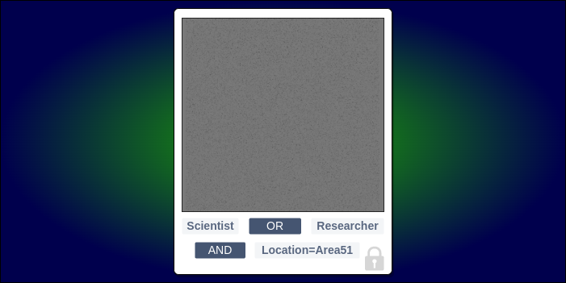
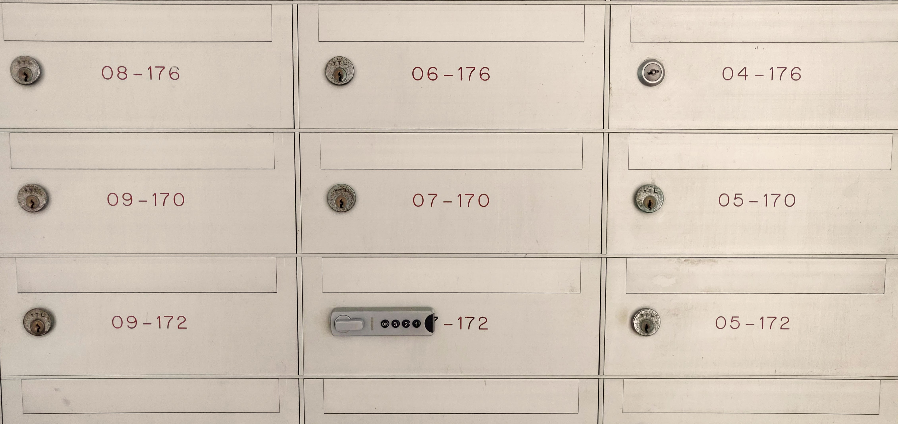

**Attribute-Based Encryption (ABE)** is a way to lock something away using “**key”-words**. Only people who have the keywords in their key can open the lock. The name of the approach comes from; ‘**Attributes**’, which are really keywords like those you enter into the search box; and, ‘**Encryption**’, which hides the thing. It's different from other ways to hide something, because when you pick the keywords, that’s also ‘**Access Control**’. That’s great, because with ABE, you can store all the things at some outsider place without the need for trusted guards!

---

## You can hide something with a “**key”-word** expression

Alice has a picture she wants to hide from most people, but share with a few. She knows a way to hide it. She can lock it in a box and share the same key with a few people.

But sharing the same key with even a few people raises the chance it will be lost or taken by others. What if those few people live all over the world? What if just heads of state need to see this picture?! And what if she doesn't know who those people actually are or how to reach them?!!



ABE is a different way to hide it. It uses a different kind of lock. The lock on this box allows you to set which keywords will open the lock. You might pick names of colours, jobs or places. You may use these to set the time or place that it can be opened. You can decide how many key-words you need, and it doesn't have to be all of them. Two out of three may be enough.

There's more. When you set the lock, you can join the keywords together with ANDs and ORs. Something like:

```python
    (Scientist or Researcher) and location=Area51
```

This simple expression allows only people with either the **Scientist** or **Researcher** keyword to see the picture when they’re at **Area51**.

Notice that, as the **picture owner**, you don’t need to know who each **key owner** actually is. You simply write an expression that controls which keywords will open the picture, on that picture alone. That's important because you can use what you know about the picture and the situation in which it may be seen.

So, the picture is hidden in a box with the lock set to open when you use:

1. Scientist and location=Area51 together; or
2. Researcher and location=Area51 together.

For people to see the hidden picture, they need keys. The key is something you have, rather than something you know. The keywords are not pass-words. They’re put in when making a key.

Making and sharing ABE keys is handled by a **Trusted Key Party**. The trusted key party keeps the **master key**, which is needed to create keys. Creating a key puts keywords about someone in their **user key.** The trusted key party must build trust with someone and check if their keywords are right before giving them a key.

So the trusted key party shares keys with people it learns to trust. Some of those keys contain the keywords **Scientist**, **Researcher** and **Location**. The party can make keys with more of the same keywords. That's okay. Now, people who’s keys contain the correct keywords can open the lock and see the hidden picture.

## The Key Escrow Problem

But there’s a known problem with the trusted key party idea. If a single party is able to make all the keys needed to open a hidden thing then the trust placed on that party is too high. This is **The Key Escrow Problem**. With a single trusted key party, the party could read the keyword expression on any box and have the power to make a key that passes it. Even if the single key party is trusted, there's a chance it may be attacked. In that case, an attacker may get the power to make a key that opens any box she wants.

One way to fix the key escrow problem is to have more parties make keywords and keys, and require one keyword from each in the lock expression. Another way is to split the decryption into stages and have each stage done by a different party.

---

## You don’t need wasteful copies or expensive guards

You've probably seen those mailboxes at the bottom of an apartment block. If you know the address, you can drop mail in a mailbox. But each resident only has the key to open the mailbox for their apartment. ABE is a bit like that. You need one key to lock, another key to open. Like the mailbox address, the key for locking can be widely shared and seen by all. The key for opening though, has one owner and must be kept safe. This way of using different keys for locking and opening is called **Asymmetric Encryption**. Asymmetric encryption isn’t specific to ABE - it's a whole class of ways to hide things.



What if you want to ask everyone in the apartment block to your party? With mailboxes, you might need to make many letters and drop one in each mailbox. That would be **one-to-one**: one letter, one receiver. Here’s where ABE's a little different. ABE lets you hide one thing to share with many. It's a **one-to-many** lock. What’s different is that you don’t need to make multiple copies to share with many. You can drop it in one place and those with a correct key can open and read it.

With ABE, there's no need for someone to stand guarding the boxes. There’s also no need for people to show who they are before they can see any locked boxes. The lock alone is enough. If someone’s key passes the lock expression, they can open it. If it doesn’t, they can't. ABE is ‘**Cryptographic Access Control**’ and it's one reason why it's said to be great for storing and sharing things outside (like in a **Cloud**) without paying trusted guards.

---

## The problem with RBAC

In the computer world, **Role Based Access Control (RBAC)** offers a way to control what stuff people can read and write. You can pick which people by some group they fit in or some matter they look after i.e. their **role**. You can do that without needing to mention their names.

With RBAC, roles and groups are usually set by the **System Administrator**. The owner of stuff (the **Data Owner**) usually only gets to set who's in or out of a group, or who has what role.

What if you want to allow a group of people for which no group or role is already present? Perhaps there are finer points that you need to control? RBAC offers no way to join groups and roles in new ways at will.

In an RBAC’ed system, a System Administrator may make a new role with finer read-write controls and use it for those people. But what if the Data Owner doesn’t know all of the people by name? And what if the number of people is both large and short-lived?

One problem with RBAC that follows from making more and more fine fitting roles is **Role Explosion**. It can become hard to manage when the number of roles gets near or greater than the number of users in the system.

ABE has often been suggested as an answer to these troubles, especially in **Cloud Computing**. ABE offers you fine control over any decided “group” of people reading and writing stuff.

## You can experiment with ABE for your use case

Give it a try yourself. Write an ABE policy expression using the popular [Charm Crypto library for Python](https://jhuisi.github.io/charm/developers.html).

```python
>>> from charm.toolbox.pairinggroup import PairingGroup,ZR,G1,G2,GT,pair
>>> group = PairingGroup('SS512')
>>> cpabe = CPabe_BSW07(group)
>>> msg = group.random(GT)
>>> attributes = ['ONE', 'TWO', 'THREE']
>>> access_policy = '((four or three) and (three or one))'
>>> (master_public_key, master_key) = cpabe.setup()
>>> secret_key = cpabe.keygen(master_public_key, master_key, attributes)
>>> cipher_text = cpabe.encrypt(master_public_key, msg, access_policy)
>>> decrypted_msg = cpabe.decrypt(master_public_key, secret_key, cipher_text)
>>> msg == decrypted_msg
True
```

This interactive example is from the original [Ciphertext-Policy Attribute-Based Encryption](https://github.com/JHUISI/charm/blob/dev/charm/schemes/abenc/abenc_bsw07.py) scheme by John Bethencourt and Brent Waters, 2007.

---
> <a rel="license" href="http://creativecommons.org/licenses/by/4.0/"></a><br /><span xmlns:dct="http://purl.org/dc/terms/" href="http://purl.org/dc/dcmitype/StillImage" property="dct:title" rel="dct:type">Attribute Based Encrypted Photo</span> by <a xmlns:cc="http://creativecommons.org/ns#" href="https://doughellinger.com/blog/what-is-attribute-based-encryption" property="cc:attributionName" rel="cc:attributionURL">Douglas Hellinger</a> is licensed under a <a rel="license" href="http://creativecommons.org/licenses/by/4.0/">Creative Commons Attribution 4.0 International License</a>.
