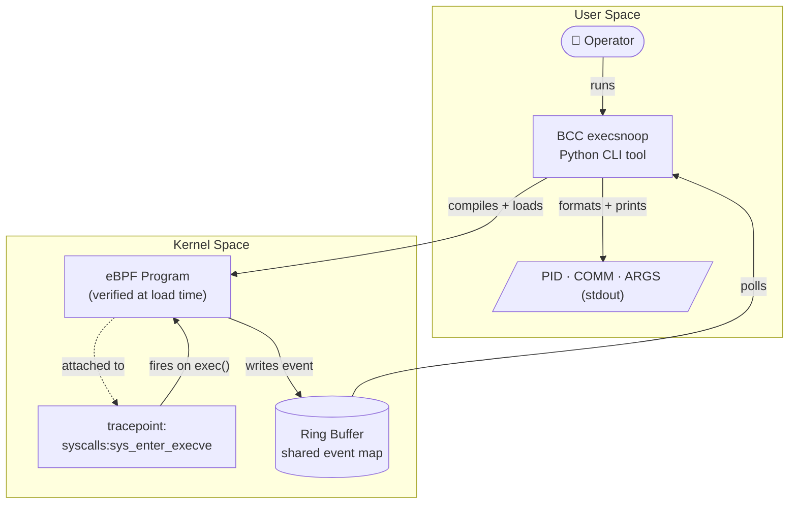
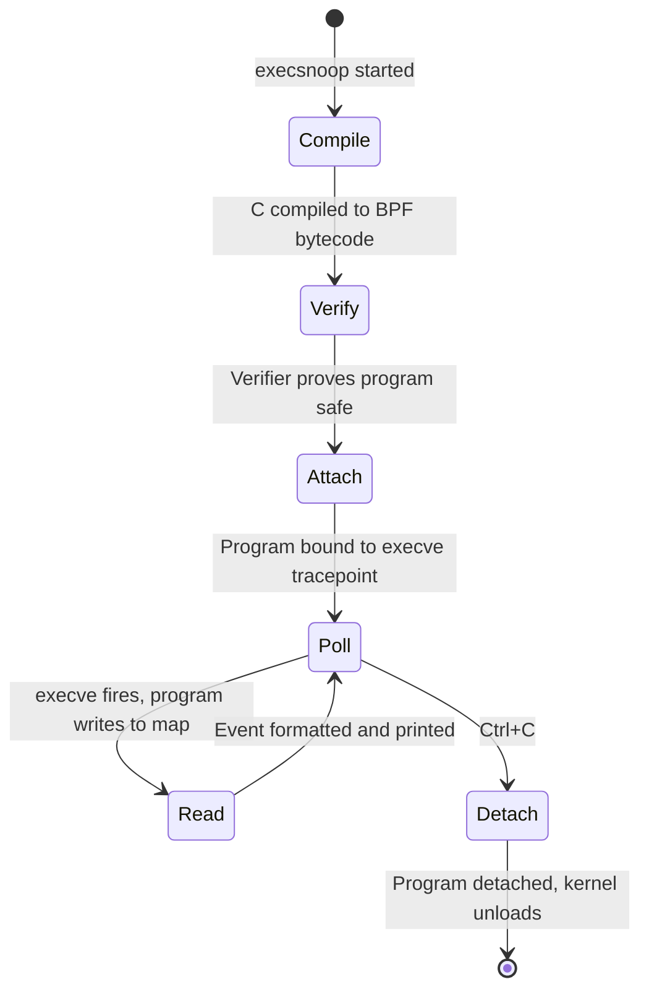

w
eBPF is a verify-compile-run technology built into the Linux kernel that enables you to attach small, specialised, safe eBPF programs to chosen system events. When a chosen event happens, the custom eBPF program runs to completion. It works at runtime, in production, in kernel-space. It can read, process, store, and output chosen event data back to user-space.

sw
It is how Netflix diagnoses noisy neighbours, how Meta profiles at scale, and how Cilium enforces Kubernetes network policy without iptables.
eBPF lets you ask very specific questions about your Linux system, specialised for your circumstances.
At the time of writing, there are 184583 event probes available on my 6.8 Linux kernel system. From that, you can surmise the possibilities to hook events and combine them are vast. You can ask questions about process execution, file access, network connections, CPU scheduling, and more — all without changing a line of application code.

You can use eBPF to observe system-wide events or focus on a chosen application. 
You can observe a running application without touching its application code, and without restarting it.

*Latency budget.* Agents complete tasks in seconds. Any observability overhead that
adds even low hundreds of milliseconds per call visibly degrades performance.
eBPF overhead at the hook level is typically sub-microsecond.

the event triggered execution model means you can see events that sampling tools and procfs easily miss.

eBPF powers the networking layer of most managed Kubernetes offerings. It drives production observability at Netflix, Meta, and LinkedIn. It is how Cilium enforces network policy without iptables. It is how bpftrace lets a site reliability engineer answer "which processes are making DNS calls right now?" in a single terminal command.

nw
Today there exist tools you can run on your Linux systems that use eBPF under the hood to give you new visibility into your infrastructure. Many BCC tools replace or enhance existing command line tools for querying and understanding the health of your Linux system. You can start using them today, without writing a line of eBPF code yourself. If you want to go deeper, you can write your own eBPF programs to ask custom questions about your system. In this article, we'll understand the concepts with an example so you can talk about it with others, decide where it fits, and take your first steps with eBPF today.

---

## What Is eBPF?
w
eBPF is a verify-compile-run technology built into the Linux kernel that enables you to attach small, specialised, safe eBPF programs to chosen system events. When a chosen event happens, the custom eBPF program runs to completion. It works at runtime, in production, in kernel-space. It can read, process, store, and output chosen event data back to user-space.

You can chain eBPF programs together and share state amongst them and with user-space through eBPF maps.

sw
Historically, if you wanna hook and handle kernel-level events, you had two options: patch the kernel source and compile a new kernel, or write a kernel module. eBPF is the third way: a safe, efficient, and relatively simple mechanism to run custom code in the kernel at runtime.

You can chain eBPF programs together and share state amongst them and with user-space through eBPF maps.

The key word is *safe*. Before any eBPF program executes a single instruction, the
kernel runs it through a verifier — a static analyser that checks the program cannot
loop forever, cannot access memory outside permitted bounds, cannot crash the kernel.
Consider it a proof: if the verifier accepts your program,
the kernel has proven it cannot cause certain classes of harm.

Meta's load balancer, [Katran](https://github.com/facebookincubator/katran), illustrates what the model enables. Deployed across
Meta's production fleet, Katran uses eBPF and XDP (eXpress Data Path) to process
packets at the NIC driver level, before the kernel networking stack even touches them.
The result: roughly 3x the throughput of the IPVS-based solution it replaced, at
approximately one-seventh the CPU cost. The underlying mechanism is the same as any
other eBPF program — attach a verified program to a kernel hook, process data there,
return a verdict. The scale is just Meta.

Three concepts carry you through everything else eBPF:

1. **Hooks** are the attachment points — the moments in kernel execution where your
program can fire. `tracepoints` are stable, versioned hook points the kernel exposes
for observability (`syscalls:sys_enter_execve`, `sched:sched_switch`). `kprobes` let
you attach to almost any kernel function dynamically. `uprobes` attach to user-space
functions in running processes. `fentry` and `fexit` hooks let you attach to kernel functions at entry and exit points. These have the advantage of fully typed arguments and less overhead. The choice of hook determines what your program can observe
and what actions it can take.

  |Hook|Description|Pros|Cons|
  |-|-|-|-|
  |tracepoint|Stable, versioned kernel events|Low overhead, stable API|Limited to predefined events|
  |kprobe|Dynamic attachment to kernel functions|Flexible, wide coverage|Higher overhead, less stable|
  |uprobes|Dynamic attachment to user-space functions|Observability into specific apps|Higher overhead, less stable|
  |fentry/fexit|Attach to kernel function entry/exit|BTF (BPF Type Format) Typed arguments, low overhead|Limited to kernel functions, requires newer kernels|

2. **Programs and the verifier** form a pair. The program is your kernel-side logic,
expressed in restricted C (no unbounded loops, no dynamic memory allocation, no
pointers you have not proven valid). The verifier is the kernel's gatekeeper: it
traces every possible execution path through your bytecode and rejects the program
if any path violates the rules. If your program is accepted, it is JIT-compiled to
native machine code and runs at hardware speed.

Often there's a userspace component that takes user input and applies it to pre-process the bpf program. It then compiles the source to BPF bytecode and issues the `bpf()` syscall to load it into the kernel. The component that calls bpf() to loads the bpf program must run with CAP_BPF capability, which is typically root. The verifier runs at load time, not runtime — there is zero overhead on the critical path of event processing. 

3. **Maps** are the communication channel between your kernel program and the rest of the
world. They are typed key-value stores that both the kernel program and user-space
processes can read and write. Your eBPF program accumulates data — counts, timestamps,
process records — into a map at machine speed. Your user-space tool reads from that map, processes, stores and serves it to an operator at human speed. The ring buffer is one common map type: the
kernel program writes events in, the user-space consumer reads them out.

---

## Snooping Executions with execsnoop

Let's walk through an example. `execsnoop` is ready made ebpf command line tool that Trace exec() syscalls. 
Its part of BCC — the BPF Compiler Collection, a toolkit of ready-made
eBPF-based tracing programs from the iovisor project. It answers one question: *which
processes are being spawned right now?*
By default, it prints the PID and command name of every process that calls `execve` on the system.

This is the component architecture:

The **hook** is `tracepoint:syscalls:sys_enter_execve` — a stable kernel tracepoint that
fires every time any process on the system calls `execve`, the system call at the
root of every process spawn. What makes this safe enough for production is not a
runtime guardrail — it is the lifecycle the tool follows before any event arrives:

Four states in this lifecycle correspond to the four concepts introduced earlier:

- **Compile → Verify** is the **Program** concept. The Python tool compiles the
  eBPF C source to bytecode and issues the `bpf()` syscall to load it into the
  kernel. At this point the program is just bytes — it has not run yet.
- **Verify → Attach** is the **Verifier** concept. The kernel's static analyser
  walks every possible execution path in the bytecode and proves the program
  terminates, accesses only permitted memory, and cannot crash the system. If the
  verifier rejects it, the program never runs — no event ever reaches it.
- **Attach → Poll** is the **Hook** concept. The program is attached to
  `tracepoint:syscalls:sys_enter_execve`. The kernel will invoke it on every
  `execve` across the entire host — but no event has been processed yet. The hook
  gating happens at kernel level, with zero overhead when idle.
- **Poll → Read → Poll** is the **Map** concept. The eBPF program writes compact
  event records to a ring buffer — a shared map type that both kernel and user
  space can access. The Python tool polls this buffer in a tight loop, reads
  events as they arrive, and prints a formatted line to stdout. Neither side owns
  the buffer exclusively; the kernel produces, the tool consumes.

The critical insight is the temporal ordering: the verifier runs *before* any
execve event is processed — not alongside it, not after it. By the time a shell,
build tool, container entrypoint, or AI agent subprocess calls `execve`, the
program is already verified, JIT-compiled to native code, and attached to its
hook. The per-event cost is a ring buffer write and nothing more.

---

## eBPF Observability - Query The System About Things You Did Not Anticipate At Build Time

Observability — in its operational sense — is the ability to ask arbitrary questions
about a system's behaviour without having predicted those questions at build time.

Not "did the error rate cross the threshold?" (a dashboard can answer that). Something
harder: "which processes opened a network connection in the last 30 seconds, and to
which IPs?" Or: "what syscalls did that AI agent make between receiving the task and
returning the result?"

eBPF changes what's possible for Linux infrastructure.

**Netflix and the noisy neighbour problem.** Multitenancy creates a class of latency
problems that are genuinely difficult to diagnose: one tenant's workload degrades
another's without any causal link visible in application metrics. Netflix instrumented
host-level run queue latency using eBPF — the time a task spends waiting to be
scheduled. Baseline P99 was 83 microseconds. During noisy-neighbour incidents, it
spiked to 131 milliseconds — a 1,500x increase, entirely invisible to application
traces. The eBPF measurement overhead was under 600 nanoseconds per hook invocation.
The tool paid for itself on first diagnosis.

**Meta and Strobelight.** Profiling at scale is expensive. Traditional CPU profilers
instrument processes individually, require restarts, or carry non-trivial overhead.
Meta built Strobelight on top of eBPF — a continuous profiling system that attaches to
every process on a host without per-process instrumentation. The system captures CPU
stack traces at low frequency across the entire fleet. The result, applied to 15,000
servers: a 20% reduction in CPU cycles for instrumented services. The profiler enabled the team to understand exactly where cycles were going and eliminate waste.
eBPF made it safe enough to run in production continuously, and cheap enough to justify
the measurement overhead.

Host-level, system-wide, always on
Both cases follow the same structural pattern: one host-level eBPF program observes
everything on that host, at syscall or scheduler granularity, without touching
application code. The insight comes from underneath, not from inside.

The payoff of the eBPF model for platform teams is architectural: one host-level eBPF
deployment sees every container, every process, every network flow on that host —
without sidecars, without per-pod configuration, without redeploying applications.

---

## Starting Today

Three tools your team can use without writing a line of eBPF themselves:

1. **BCC (BPF Compiler Collection)** is the toolkit from the iovisor project — over 100
ready-made tracing programs: `execsnoop` for process tracing, `tcplife` for TCP
connection lifetimes, `tcpconnect` for outbound connections, `biolatency` for block
I/O latency histograms. Zero eBPF programming required. Install the package, run the
tool, get the answer. Start with the [BCC tutorial](https://github.com/iovisor/bcc/blob/master/docs/tutorial.md).

2. **bpftrace** is the ad-hoc scripting layer — described accurately as "the awk of
eBPF." Its a domain specific language for tracing using eBPF.
The classic one-liner to trace all execve syscalls and : `bpftrace -e 'tracepoint:syscalls:sys_enter_execve
{ printf("%s\n", comm); }'`. [bpftrace Hands On Lab](http://bpftrace.org/hol/intro) is a great place to start with structured learning.
Once you've digested that, you can build up a one-liner to trace duration from one function entry point to another's exit, organised by pid, comm, retval and chosen elements of data structure in the execution path.

3. **Cilium** is the production-grade eBPF networking and security layer for Kubernetes.
It replaces kube-proxy and iptables with eBPF-based packet processing, and ships
Hubble — a network observability layer that gives you full flow visibility across your
cluster. Google Cloud chose Cilium as the default CNI for GKE Dataplane V2. If you
are running managed Kubernetes today, there is a reasonable chance eBPF is already
doing your networking.

---

## A Bigger Picture

eBPF reframes operating system observability.
The kernel becomes a programmable observability platform.
eBPF makes system-wide instrumentation soft. Not only can you instrument and troubleshoot current issues, but you can evolve instrumentation with the changing needs of the system.

Alexei Starovoitov, one of eBPF's original architects, expressed the scale of enablement: 

> "Before eBPF, Linux kernel development meant a community of roughly 100 active contributors.
>  After eBPF, the number of people writing and running BPF programs in production now exceeds
>  100,000."

The people writing those programs are not kernel developers. They're SREs debugging
latency spikes. They are security engineers tracing suspicious syscall patterns. They
are platform engineers building observability pipelines for AI workloads.

Return to the AI agent observability problem from the opening. The hard part is not
that agents misbehave — it is that you cannot easily see what they are doing at the
OS level from inside the application. what are they touching? where are they stepping on each other's toes?
eBPF solves that from underneath: one program, attached to the right set of hooks on a host, reconstructs the full behavioural trace
of every agent workflow running on that host.

That is the architectural promise: a platform team that deploys eBPF-based
observability can trust what their autonomous systems are doing — not because those
systems self-report, but because the kernel is watching from below.
