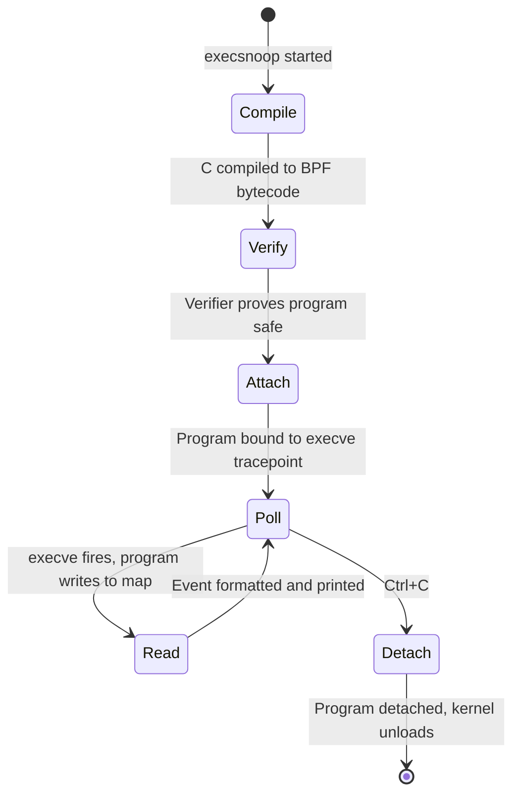

# What Is eBPF?

Your AI coding agents are making tool calls you cannot see. One spawns a subprocess to
run a shell command. Another opens a file it was never told about. A third makes an
outbound HTTP request in the middle of what looked like a pure in-memory computation.
You have logs — but they show you what the agent decided to tell you. You have traces
— but only for the code the agent was built to instrument. The things happening
*underneath*, at the OS level, are invisible. Until now.

eBPF — extended Berkeley Packet Filter — is a technology built into the Linux kernel
that lets you attach small, safe programs to system events: a process spawning, a
network packet arriving, a file being opened, a syscall being made. Those programs run
inside the kernel, observe everything that passes through, and report back — without
touching application code, without adding sidecars, without rebooting anything. The
kernel sees all. eBPF lets you ask it questions.

That makes it relevant far beyond AI agents. eBPF powers the networking layer of most
managed Kubernetes offerings. It drives production observability at Netflix, Meta, and
LinkedIn. It is how Cilium enforces network policy without iptables. It is how
bpftrace lets a site reliability engineer answer "which processes are making DNS
calls right now?" in a single terminal command.

If you lead a platform or infrastructure team and you have not looked at eBPF yet, you
are one tool away from a fundamentally different relationship with your production
systems. This article gives you the conceptual grounding to decide where it fits,
explain it to your team, and take a first step today.

---

## What Is eBPF?

Every Linux system runs a kernel — the program that sits between hardware and
applications, managing memory, scheduling processes, and mediating all I/O. For
decades, the kernel was a fixed black box. To change its behaviour, you either patched
the source and compiled a new kernel — a months-long process at most organisations —
or you loaded a kernel module, which ran with unrestricted privileges and could
destabilize the entire system.

eBPF changes that model. It is a sandboxed virtual machine inside the kernel that
executes programs you supply at runtime. You write a small program — typically in a
restricted subset of C — compile it to eBPF bytecode, and load it into a running
kernel. From that point forward, every time the kernel reaches the hook point you
specified, your program runs.

The key word is *safe*. Before any eBPF program executes a single instruction, the
kernel runs it through a verifier — a static analyser that checks the program cannot
loop forever, cannot access memory outside permitted bounds, cannot crash the kernel.
This is not a runtime guardrail. It is a proof: if the verifier accepts your program,
the kernel has proven it cannot cause certain classes of harm. Confidence is not the
goal. Proof is. That is what makes eBPF useful in production — not as an
experimental tracing tool, but as load-bearing infrastructure.

Meta's load balancer, Katran, illustrates what the model enables. Deployed across
Meta's production fleet, Katran uses eBPF and XDP (eXpress Data Path) to process
packets at the NIC driver level, before the kernel networking stack even touches them.
The result: roughly 3x the throughput of the IPVS-based solution it replaced, at
approximately one-seventh the CPU cost. The underlying mechanism is the same as any
other eBPF program — attach a verified program to a kernel hook, process data there,
return a verdict. The scale is just Meta.

Three concepts carry you through everything else eBPF:

**Hooks** are the attachment points — the moments in kernel execution where your
program can fire. `tracepoints` are stable, versioned hook points the kernel exposes
for observability (`syscalls:sys_enter_execve`, `sched:sched_switch`). `kprobes` let
you attach to almost any kernel function dynamically. `uprobes` attach to user-space
functions in running processes. XDP hooks fire on incoming packets before the kernel
allocates a socket buffer. The choice of hook determines what your program can observe
and what actions it can take.

**Programs and the verifier** form a pair. The program is your kernel-side logic,
expressed in restricted C (no unbounded loops, no dynamic memory allocation, no
pointers you have not proven valid). The verifier is the kernel's gatekeeper: it
traces every possible execution path through your bytecode and rejects the program
if any path violates the rules. If your program is accepted, it is JIT-compiled to
native machine code and runs at hardware speed.

**Maps** are the communication channel between your kernel program and the rest of the
world. They are typed key-value stores that both the kernel program and user-space
processes can read and write. Your eBPF program accumulates data — counts, timestamps,
process records — into a map. Your user-space tool reads from that map and surfaces
it to an operator or a metrics pipeline. The ring buffer is one common map type: the
kernel program writes events in, the user-space consumer reads them out.

---

## Snooping Executions with execsnoop

The best way to make the model concrete is to walk through a real tool.
`execsnoop` is part of BCC — the BPF Compiler Collection, a toolkit of ready-made
eBPF-based tracing programs from the iovisor project. It answers one question: *which
processes are being spawned right now, across the entire system?* No agent to install
per application. No prior configuration. You run it, and you see everything.

This is the component architecture:

The hook is `tracepoint:syscalls:sys_enter_execve` — a stable kernel tracepoint that
fires every time any process on the system calls `execve`, the system call at the
root of every process spawn. What makes this safe enough for production is not a
runtime guardrail — it is the lifecycle the tool follows before any event arrives:

Four states in this lifecycle correspond to the four concepts introduced earlier:

- **Compile → Verify** is the **Program** concept. The Python tool compiles the
  eBPF C source to bytecode and issues the `bpf()` syscall to load it into the
  kernel. At this point the program is just bytes — it has not run yet.
- **Verify → Attach** is the **Verifier** concept. The kernel's static analyser
  walks every possible execution path in the bytecode and proves the program
  terminates, accesses only permitted memory, and cannot crash the system. If the
  verifier rejects it, the program never runs — no event ever reaches it.
- **Attach → Poll** is the **Hook** concept. The program is bound to
  `tracepoint:syscalls:sys_enter_execve`. The kernel will invoke it on every
  `execve` across the entire host — but no event has been processed yet. The hook
  gating happens at kernel level, with zero overhead when idle.
- **Poll → Read → Poll** is the **Map** concept. The eBPF program writes compact
  event records to a ring buffer — a shared map type that both kernel and user
  space can access. The Python tool polls this buffer in a tight loop, reads
  events as they arrive, and prints a formatted line to stdout. Neither side owns
  the buffer exclusively; the kernel produces, the tool consumes.

The critical insight is the temporal ordering: the verifier runs *before* any
execve event is processed — not alongside it, not after it. By the time a shell,
build tool, container entrypoint, or AI agent subprocess calls `execve`, the
program is already verified, JIT-compiled to native code, and attached to its
hook. The per-event cost is a ring buffer write and nothing more.

The pattern is the whole point. A small, verified program. Zero application changes.
Zero restarts. Instant answer.

---

## The Observability Difference

Observability — in its operational sense — is the ability to ask arbitrary questions
about a system's behaviour without having predicted those questions at build time. Not
"did the error rate cross the threshold?" (a dashboard can answer that). Something
harder: "which processes opened a network connection in the last 30 seconds, and to
which IPs?" Or: "what syscalls did that AI agent make between receiving the task and
returning the result?"

eBPF changes what's possible for Linux infrastructure.

**Netflix and the noisy neighbour problem.** Multitenancy creates a class of latency
problems that are genuinely difficult to diagnose: one tenant's workload degrades
another's without any causal link visible in application metrics. Netflix instrumented
host-level run queue latency using eBPF — the time a task spends waiting to be
scheduled. Baseline P99 was 83 microseconds. During noisy-neighbour incidents, it
spiked to 131 milliseconds — a 1,500x increase, entirely invisible to application
traces. The eBPF measurement overhead was under 600 nanoseconds per hook invocation.
The tool paid for itself on first diagnosis.

**Meta and Strobelight.** Profiling at scale is expensive. Traditional CPU profilers
instrument processes individually, require restarts, or carry non-trivial overhead.
Meta built Strobelight on top of eBPF — a continuous profiling system that attaches to
every process on a host without per-process instrumentation. The system captures CPU
stack traces at low frequency across the entire fleet. The result, applied to 15,000
servers: a 20% reduction in CPU cycles for instrumented services. Not by writing less
code — by understanding exactly where cycles were going and eliminating waste. eBPF
made it safe enough to run in production continuously, and cheap enough to justify
the measurement overhead.

Both cases follow the same structural pattern: one host-level eBPF program observes
everything on that host, at syscall or scheduler granularity, without touching
application code. The insight comes from underneath, not from inside.

**AI agent observability is structurally harder than traditional observability.** Three
specific properties of agents break conventional approaches:

*Shifting behaviour.* An agent's execution path changes with each run — different
tool calls, different subprocess sequences, different files touched. Static
instrumentation assumes you know what to instrument in advance. You don't.

*Cross-boundary scope.* A single agent task may span file I/O, subprocess invocation,
network requests to external APIs, and reads from a local database — all in one
workflow. Application-level tracing captures what the agent's SDK reports. OS-level
tracing captures what the agent actually did.

*Latency budget.* Agents complete tasks in seconds. Any observability overhead that
adds even low hundreds of milliseconds per call visibly degrades performance.
eBPF overhead at the hook level is typically sub-microsecond.

AgentSight (github.com/eunomia-bpf/agentsight) is a recent concrete example — an
eBPF-based AI agent tracing system that captures process execution, file access, and
network activity for agent workflows with under 3% overhead. The mechanism is the
same execsnoop pattern generalised: eBPF programs attached to multiple hooks, writing
to maps, consumed by a user-space pipeline that reconstructs the agent's full
behavioural trace.

The payoff of the eBPF model for platform teams is architectural: one host-level eBPF
deployment sees every container, every process, every network flow on that host —
without sidecars, without per-pod configuration, without redeploying applications.

---

## Starting Today

Three tools your team can use without writing a line of eBPF themselves:

**Cilium** is the production-grade eBPF networking and security layer for Kubernetes.
It replaces kube-proxy and iptables with eBPF-based packet processing, and ships
Hubble — a network observability layer that gives you full flow visibility across your
cluster. Google Cloud chose Cilium as the default CNI for GKE Dataplane V2. If you
are running managed Kubernetes today, there is a reasonable chance eBPF is already
doing your networking.

**BCC (BPF Compiler Collection)** is the toolkit from the iovisor project — over 100
ready-made tracing programs: `execsnoop` for process tracing, `tcplife` for TCP
connection lifetimes, `tcpconnect` for outbound connections, `biolatency` for block
I/O latency histograms. Zero eBPF programming required. Install the package, run the
tool, get the answer. Start here: github.com/iovisor/bcc

**bpftrace** is the ad-hoc scripting layer — described accurately as "the awk of
eBPF." Single-line commands that attach eBPF programs on the fly. The classic
one-liner to trace all execve calls: `bpftrace -e 'tracepoint:syscalls:sys_enter_execve
{ printf("%s\n", comm); }'`. No compilation step, no program file, no setup. For
deeper investigation: bpftrace.org/hol/intro

Entry points:
- BCC tutorial: github.com/iovisor/bcc/blob/master/docs/tutorial.md
- bpftrace intro: bpftrace.org/hol/intro

---

## A Bigger Picture

Linus Torvalds once described the kernel as "the thing that manages your hardware."
That framing treated the kernel as fixed infrastructure — a stable base you built on
top of, not something you could extend at runtime.

eBPF inverts that framing. The kernel becomes a programmable substrate — a platform
with defined extension points where verified programs can run. Alexei Starovoitov,
one of eBPF's original architects, put the scale shift this way: before eBPF, Linux
kernel development meant a community of roughly 100 active contributors. After eBPF,
the number of people writing and running BPF programs in production now exceeds
100,000.

The people writing those programs are not kernel developers. They are SREs debugging
latency spikes. They are security engineers tracing suspicious syscall patterns. They
are platform engineers building observability pipelines for AI workloads.

Return to the AI agent observability problem from the opening. The hard part is not
that agents misbehave — it is that you cannot easily see what they are doing at the
OS level from inside the application. eBPF solves that from underneath: one program,
attached to the right set of hooks on a host, reconstructs the full behavioural trace
of every agent workflow running on that host. No agent SDK integration. No per-model
changes. No instrumentation PR to open.

That is the architectural promise: a platform team that deploys eBPF-based
observability can trust what their autonomous systems are doing — not because those
systems self-report, but because the kernel is watching from below.

Your teams can start today. No application changes required.
