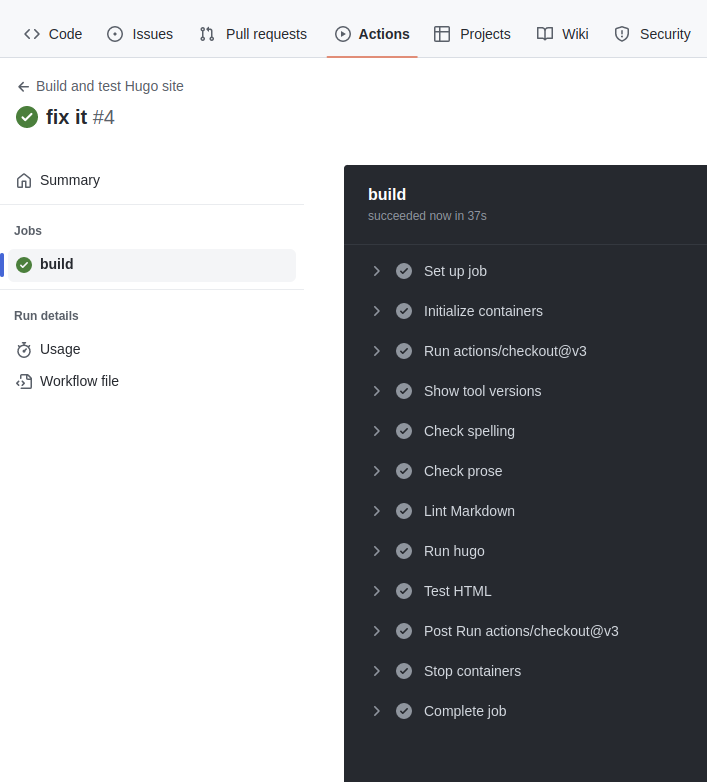

### **Before you publish written content, you wanna check spelling, lint markdown, improve prose, and fix broken links.**

This approach uses a builder image specialised for your docs-as-code workflow. Pre-install and configure your docs-as-code tools in the image. Finally, use them in synergy in a build and test pipeline.

### You'll need

1. some written content in markdown format
1. a free Github Account

That's it!

## 1 Create A Builder Image For Docs-As-Code

### 1.1 Create a Git repository for the builder image

Create a [new public repository](https://github.com/new) for the builder image.

### 1.2 Create a Containerfile (Dockerfile)

Create a new file called `Containerfile` in the root of the working directory. Paste this content:

```Dockerfile
FROM klakegg/hugo:ext-alpine-ci

# + link checker e.g. https://github.com/wjdp/htmltest
RUN wget https://htmltest.wjdp.uk -O - | bash -s -- -b /usr/local/bin

# + markdown linter (https://github.com/DavidAnson/markdownlint-cli2)
RUN npm install markdownlint-cli2 --global

# + spell checker (https://github.com/lukeapage/node-markdown-spellcheck)
RUN npm install markdown-spellcheck --global

# + hemingway scorer (https://github.com/btford/write-good)
RUN npm install write-good --global
```

Again, you can do this directly in Github in the new repo.

> This image is based on [klakegg/hugo:ext-alpine-ci](https://github.com/klakegg/docker-hugo). Its a minimal Hugo Extended Edition image for CI builds. [Hugo](https://gohugo.io/) is a fast static site generator which is equally great for building blogs or technial product docs like the [Kubernetes.io](https://kubernetes.io/) website.

### 1.3 Create an image build pipeline

Go to Actions -> New Workflow -> Skip this and set up a workflow yourself

Create a `build.yml` and paste the following Github workflow yaml:


<details>
<summary>build.yml</summary>

```yaml
name: Weekly build, publish and sign

on:
  schedule:
    - cron: '44 13 * * 1'
  push:
    branches: [ "main" ]
    tags: [ 'v*.*.*' ]
  pull_request:
    branches: [ "main" ]

env:
  REGISTRY: ghcr.io
  # github.repository as <account>/<repo>
  IMAGE_NAME: ${{ github.repository }}


jobs:
  build:

    runs-on: ubuntu-latest
    permissions:
      contents: read
      packages: write
      # This is used to complete the identity challenge
      # with sigstore/fulcio when running outside of PRs.
      id-token: write

    steps:
      - name: Checkout repository
        uses: actions/checkout@v3

      # Install the cosign tool except on PR
      # https://github.com/sigstore/cosign-installer
      - name: Install cosign
        if: github.event_name != 'pull_request'
        uses: sigstore/cosign-installer@main
        with:
          cosign-release: 'v1.13.1'

      - name: Show cosign version
        run: cosign version

      # Workaround: https://github.com/docker/build-push-action/issues/461
      - name: Setup Docker buildx
        uses: docker/setup-buildx-action@79abd3f86f79a9d68a23c75a09a9a85889262adf

      # Login against a Docker registry except on PR
      # https://github.com/docker/login-action
      - name: Log into registry ${{ env.REGISTRY }}
        if: github.event_name != 'pull_request'
        uses: docker/login-action@28218f9b04b4f3f62068d7b6ce6ca5b26e35336c
        with:
          registry: ${{ env.REGISTRY }}
          username: ${{ github.actor }}
          password: ${{ secrets.GITHUB_TOKEN }}

      # Extract metadata (tags, labels) for Docker
      # https://github.com/docker/metadata-action
      - name: Extract Docker metadata
        id: meta
        uses: docker/metadata-action@98669ae865ea3cffbcbaa878cf57c20bbf1c6c38
        with:
          images: ${{ env.REGISTRY }}/${{ env.IMAGE_NAME }}

      # Build and push Docker image with Buildx (don't push on PR)
      # https://github.com/docker/build-push-action
      - name: Build and push Docker image
        id: build-and-push
        uses: docker/build-push-action@ac9327eae2b366085ac7f6a2d02df8aa8ead720a
        with:
          context: .
          file: Containerfile
          push: ${{ github.event_name != 'pull_request' }}
          tags: ${{ steps.meta.outputs.tags }}
          labels: ${{ steps.meta.outputs.labels }}
          cache-from: type=gha
          cache-to: type=gha,mode=max


      # Sign the resulting Docker image digest except on PRs.
      # This will only write to the public Rekor transparency log when the Docker
      # repository is public to avoid leaking data.  If you would like to publish
      # transparency data even for private images, pass --force to cosign below.
      # https://github.com/sigstore/cosign
      - name: Sign the published Docker image
        if: ${{ github.event_name != 'pull_request' }}
        env:
          COSIGN_EXPERIMENTAL: "true"
        # This step uses the identity token to provision an ephemeral certificate
        # against the sigstore community Fulcio instance.
        run: echo "${{ steps.meta.outputs.tags }}" | xargs -I {} cosign sign {}@${{ steps.build-and-push.outputs.digest }}
```

</details>
<p>


This creates a template Github workflow to Build, sign and push the image.

> The workflow is actually Github's suggested workflow "*Publish Docker Container*" with a bugfix.
>
> Edit the workflow yaml to ensure the cosign version is `v1.13.1` or later like this:
>
>```yaml
>         uses: sigstore/cosign-installer@main
>         with:
>           cosign-release: 'v1.13.1'
>```
>
> This fixes "tuf: invalid key" on Sign the published Docker image step.
>
> Ref: [cosign-installer issue 100](https://github.com/sigstore/cosign-installer/issues/100)
>
> Another slight mod prints out the version of cosign.
>
> ```yaml
>       - name: Show cosign version
>         if: github.event_name != 'pull_request'
>         run: cosign version
> ```
>

### 1.4 Build and publish the image

The workflow will run upon saving the `build.yml` and committing to `main`. It will also run weekly on a schedule to build with the latest dependency versions. Add `workflow_dispatch:` to the `on:` triggers to enable manual a trigger for the workflow.

## 2 Create A Docs-As-Code Build Pipeline

Now all the tools we need are installed in our docs-as-code builder image. We can use the docs-as-code tools together, in synergy, in a build and test pipeline.

### 2.1 Create a new Hugo site

Initialise a new hugo site in the base of the repo:

```sh
$ hugo new site mysite
Congratulations! Your new Hugo site is created in /src/mysite.
```

> Checkout [Hugo's official docs](https://gohugo.io/) to learn more about Hugo themes, ways to structure your content and configuration options.

### 2.2 Put down some markdown

For the purpose of testing a docs-as-code pipeline, simply put your markdown in the `content` folder in `WRITEME.md`.

```sh
hugo:/src/mysite$ tree content
content
└── WRITEME.md

0 directories, 1 file
```

```sh
$ cat content/WRITEME.md
## A butiful peom
Lorem ipsum ip dolor.
```

### 2.3 Create a docs as code build pipeline

Create a new github workflow called `build.yml` in a `.github/workflows` folder. Paste the follow yaml and remember to read it:

```yaml
name: Build and test Hugo site

on: push

jobs:
  build:
    runs-on: ubuntu-latest

    container: ghcr.io/doughgle/docs-as-code:main

    steps:
      - uses: actions/checkout@v3
        with:
          submodules: true

      - name: Show tool versions
        run: |
          echo -n "mdshell " && mdspell --version
          echo -n "write-good " && write-good --version
          markdownlint-cli2 | head -1
          htmltest --version
          hugo version

      - name: Check spelling
        run: mdspell --report --en-gb '**/*.md'
        continue-on-error: true
        working-directory: content

      - name: Check prose
        run: write-good --parse */*/*.md
        continue-on-error: true
        working-directory: content

      - name: Lint Markdown
        run: markdownlint-cli2 '**/*.md'
        continue-on-error: true
        working-directory: content

      - name: Build the site
        run: hugo --buildDrafts --buildFuture

      # htmltest (configured in .htmltest.yml)
      - name: Test HTML
        run: htmltest
```

### 2.4 Push to Github

Make the `mysite` directory a new git repo. Hugo's `config.toml` and the `content` folder should be in the root of the repo.

Create a [new](https://github.com/new) empty Github repo.

Push the hugo site repository to Github using the provided instructions. Example:

```sh
git remote add origin git@github.com:doughgle/upgraded-palm-tree.git
git branch -M main
git push -u origin main
```

The workflow will run upon pushing the code to any branch.

To see it, navigate to the repo on github.com -> Actions -> workflow runs (latest) -> `build`



## 3 Build And Test The Docs

Here's a challenge...

Q: How many spelling errors, style blunders, format crimes, and broken links have been introduced in this `WRITEME.md` ?

> ```markdown
> ## WRITEME
> This sentence has five words. Here are five more words. Five-word sentences are fine.
> But severel together become monotonous. Listen to what is happenning.
> The writing is getting boring. The sound of it drones. It’s like a stuck record.
> The ear demands some variety.
>
> Now listen. I vary the sentence length, and I create musick. Music. The writing sings.
> It has a pleasant rhythm, a lilt, a harmony. I use short sentences.
> And I use sentences of medium length. And sometimes when I am certain the reader is 
> rested, I will engage him with a sentence of considerable length, a sentence that burns 
> with energy and builds with all the impetus of a crescendo, the roll of the drums, the
> crash of the cymbals–sounds that say listen to this, it is important.
>
> So write with a combination of short, medium, and long sentences. Create a sound that 
> pleases the reader’s ear. Don’t just write words. Write music.
>
>> *Credit: [Gary Provost](https://www.garyprovost.com/404) 
>> 100 Ways to Improve Your Writing*
> ```

### 3.1 Test it

Put the markdown in the `content` folder in `WRITEME.md`.

Commit and push the change to Github.

The workflow will run upon pushing the code to any branch.

To see it, navigate to the repo on github.com -> Actions -> workflow runs (latest) -> `build`

### 3.2 Check Spelling


`mdspell` says there are 5 (deliberate) spelling errors.

### 3.3 Check Prose


`write-good` highlights some passive voice, wordy and redundant phrases.

### 3.3 Lint Markdown


`markdownlint` found 7 markdown rule violations. Rules can be configured in a `.markdownlint.yaml` configuration file.

### 3.4 Test HTML


`htmltest` found nothing.

---

Thank you for reading this article right to the end.
If you enjoyed it and if you think others can benefit, please like and share.
Or if you foresee a problem, have an alternative solution, or you just wanna share some comments to improve the usefulness of this article, I'd appreciate your feedback.
