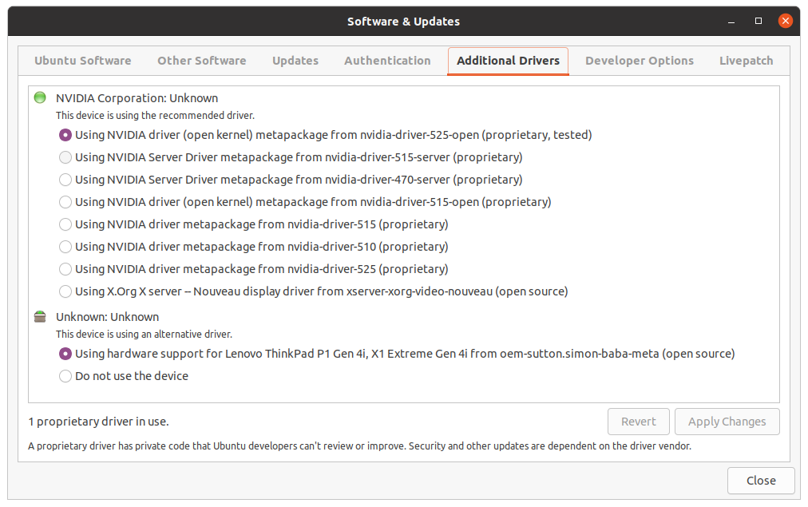
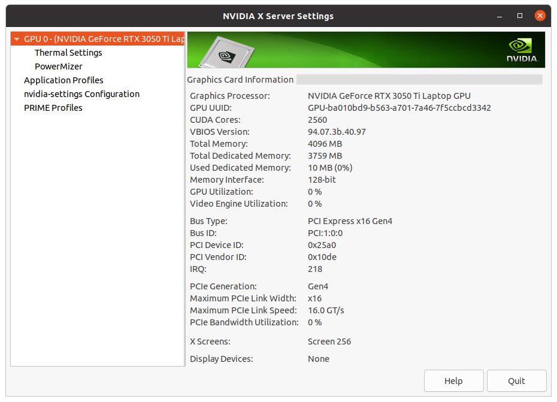
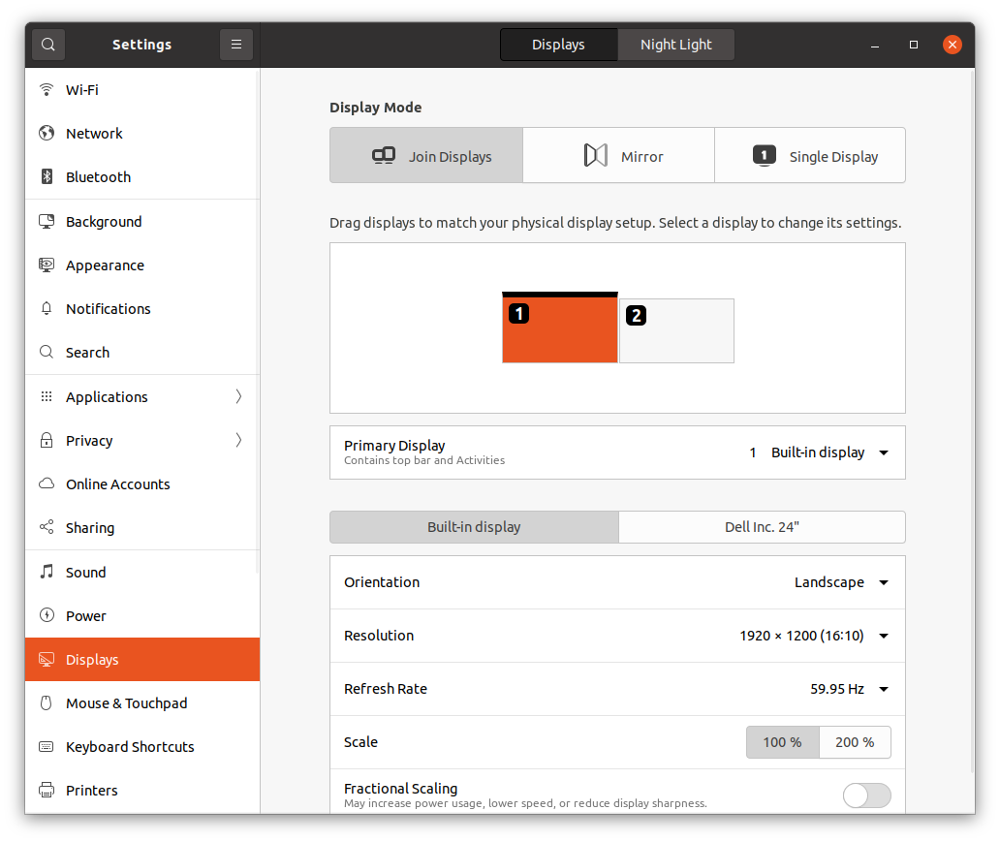

**You're running Ubuntu on a Thinkpad X1 Extreme (Gen 4). You wanna use HDMI, but the TV or monitor says something like "Check Device Power".**

## 1. Check the hardware details

### List Video Devices

The Thinkpad X1 Extreme Gen 4 has two video devices: nVidia GeForce RTX 3050 Ti Mobile and Intel TigerLake-H GT1 UHD Graphics.

If you need to reassure yourself, its a [Ubuntu Certified Laptop](https://ubuntu.com/certified/202107-29296/20.04%20LTS).

You can list video devices like this (no real need for sudo):

```sh
$ lshw -C video
  *-display            
       description: VGA compatible controller
       product: NVIDIA Corporation
       vendor: NVIDIA Corporation
       physical id: 0
       bus info: pci@0000:01:00.0
       version: a1
       width: 64 bits
       clock: 33MHz
       capabilities: vga_controller bus_master cap_list rom
       configuration: driver=nouveau latency=0
       resources: iomemory:600-5ff iomemory:610-60f irq:201 memory:9d000000-9dffffff memory:6000000000-60ffffffff memory:6100000000-6101ffffff ioport:3000(size=128) memory:9e080000-9e0fffff
  *-display
       description: VGA compatible controller
       product: Intel Corporation
       vendor: Intel Corporation
       physical id: 2
       bus info: pci@0000:00:02.0
       version: 01
       width: 64 bits
       clock: 33MHz
       capabilities: vga_controller bus_master cap_list rom
       configuration: driver=i915 latency=0
       resources: iomemory:610-60f iomemory:400-3ff irq:202 memory:614c000000-614cffffff memory:4000000000-400fffffff ioport:4000(size=64) memory:c0000-dffff memory:4010000000-4016ffffff memory:4020000000-40ffffffff
```

For the nVidia device, notice the `driver` in the `configuration:` section. The nVidia hardware connects to the HDMI port on the laptop and the driver and version makes a difference.

### List Monitors

`xrandr` can tell you which monitors (or TVs) are connected.

```sh
$ xrandr --listmonitors 
Monitors: 2
 0: +*eDP-1 1920/344x1200/215+0+0  eDP-1
 1: +DVI-I-2-1 1920/527x1080/296+1920+120  DVI-I-2-1
```

Here, I have an external monitor connected through a docking station. That uses the DisplayLink driver. That was another troubleshooting journey that deserves its own how to guide!

## 2. Check which Video Driver is Loaded

```sh
$ lsmod | grep vid
uvcvideo              106496  0
videobuf2_vmalloc      20480  1 uvcvideo
videobuf2_memops       20480  1 videobuf2_vmalloc
videobuf2_v4l2         32768  1 uvcvideo
videobuf2_common       61440  4 videobuf2_vmalloc,videobuf2_v4l2,uvcvideo,videobuf2_memops
videodev              237568  3 videobuf2_v4l2,uvcvideo,videobuf2_common
mc                     57344  5 videodev,snd_usb_audio,videobuf2_v4l2,uvcvideo,videobuf2_common
video                  53248  3 thinkpad_acpi,i915,nouveau
```

If `nouveau` is loaded, Ubuntu Settings -> Displays may detect the HDMI display, but its too laggy to use! I tried Join, Mirror and Single display, but I wasn't able to find a resolution that worked.

## 3. Check which Video Driver is Recommended

Following this excellent [nvidia drivers on Ubuntu guide](https://linuxconfig.org/how-to-install-the-nvidia-drivers-on-ubuntu-20-04-focal-fossa-linux), I found its simple to use the `ubuntu-drivers` utility.

```sh
$ ubuntu-drivers devices
== /sys/devices/pci0000:00/0000:00:01.0/0000:01:00.0 ==
modalias : pci:v000010DEd000025A0sv000017AAsd000022E4bc03sc00i00
vendor   : NVIDIA Corporation
driver   : nvidia-driver-525 - distro non-free
driver   : nvidia-driver-525-open - distro non-free recommended
driver   : nvidia-driver-515 - distro non-free
driver   : nvidia-driver-510 - distro non-free
driver   : nvidia-driver-470-server - distro non-free
driver   : nvidia-driver-515-server - distro non-free
driver   : nvidia-driver-515-open - distro non-free
driver   : xserver-xorg-video-nouveau - distro free builtin

== /sys/devices/virtual/dmi/id ==
modalias : dmi:bvnLENOVO:bvrN40ET33W(1.15):bd02/24/2022:br1.15:efr1.15:svnLENOVO:pn20Y5000PSG:pvrThinkPadX1ExtremeGen4i:rvnLENOVO:rn20Y5000PSG:rvrSDK0J40697WIN:cvnLENOVO:ct10:cvrNone:skuLENOVO_MT_20Y5_BU_Think_FM_ThinkPadX1ExtremeGen4i:
driver   : oem-sutton.simon-baba-meta - third-party free
```

It lists the compatible drivers and highlights the `recommended` driver.

## 4. Install the Recommended Driver

```sh
$ sudo ubuntu-drivers autoinstall
```


<details><summary>Output</summary>
<p>

```sh
[sudo] password for dough: 
Reading package lists... Done
Building dependency tree       
Reading state information... Done
The following packages were automatically installed and are no longer required:
  libcgi-fast-perl libcgi-pm-perl libfcgi-perl libhtml-tagcloud-perl libhttp-server-simple-perl libsass1
Use 'sudo apt autoremove' to remove them.
The following additional packages will be installed:
  nvidia-compute-utils-525 nvidia-kernel-common-525 nvidia-kernel-source-525-open nvidia-prime nvidia-settings nvidia-utils-525
Suggested packages:
  nvidia-driver-525
The following NEW packages will be installed:
  nvidia-compute-utils-525 nvidia-dkms-525-open nvidia-driver-525-open nvidia-kernel-common-525 nvidia-kernel-source-525-open nvidia-prime nvidia-settings nvidia-utils-525
0 upgraded, 8 newly installed, 0 to remove and 52 not upgraded.
Need to get 0 B/45.6 MB of archives.
After this operation, 84.4 MB of additional disk space will be used.
Selecting previously unselected package nvidia-compute-utils-525.
(Reading database ... 430983 files and directories currently installed.)
Preparing to unpack .../0-nvidia-compute-utils-525_525.60.11-0ubuntu0.20.04.2_amd64.deb ...
Unpacking nvidia-compute-utils-525 (525.60.11-0ubuntu0.20.04.2) ...
Selecting previously unselected package nvidia-kernel-source-525-open.
Preparing to unpack .../1-nvidia-kernel-source-525-open_525.60.11-0ubuntu0.20.04.2_amd64.deb ...
Unpacking nvidia-kernel-source-525-open (525.60.11-0ubuntu0.20.04.2) ...
Selecting previously unselected package nvidia-kernel-common-525.
Preparing to unpack .../2-nvidia-kernel-common-525_525.60.11-0ubuntu0.20.04.2_amd64.deb ...
Unpacking nvidia-kernel-common-525 (525.60.11-0ubuntu0.20.04.2) ...
Selecting previously unselected package nvidia-dkms-525-open.
Preparing to unpack .../3-nvidia-dkms-525-open_525.60.11-0ubuntu0.20.04.2_amd64.deb ...
Unpacking nvidia-dkms-525-open (525.60.11-0ubuntu0.20.04.2) ...
Selecting previously unselected package nvidia-utils-525.
Preparing to unpack .../4-nvidia-utils-525_525.60.11-0ubuntu0.20.04.2_amd64.deb ...
Unpacking nvidia-utils-525 (525.60.11-0ubuntu0.20.04.2) ...
Selecting previously unselected package nvidia-driver-525-open.
Preparing to unpack .../5-nvidia-driver-525-open_525.60.11-0ubuntu0.20.04.2_amd64.deb ...
Unpacking nvidia-driver-525-open (525.60.11-0ubuntu0.20.04.2) ...
Selecting previously unselected package nvidia-prime.
Preparing to unpack .../6-nvidia-prime_0.8.16~0.20.04.2_all.deb ...
Unpacking nvidia-prime (0.8.16~0.20.04.2) ...
Selecting previously unselected package nvidia-settings.
Preparing to unpack .../7-nvidia-settings_470.57.01-0ubuntu0.20.04.3_amd64.deb ...
Unpacking nvidia-settings (470.57.01-0ubuntu0.20.04.3) ...
Setting up nvidia-utils-525 (525.60.11-0ubuntu0.20.04.2) ...
Setting up nvidia-compute-utils-525 (525.60.11-0ubuntu0.20.04.2) ...
Warning: The home dir /nonexistent you specified can't be accessed: No such file or directory
Adding system user `nvidia-persistenced' (UID 127) ...
Adding new group `nvidia-persistenced' (GID 135) ...
Adding new user `nvidia-persistenced' (UID 127) with group `nvidia-persistenced' ...
Not creating home directory `/nonexistent'.
Setting up nvidia-prime (0.8.16~0.20.04.2) ...
Setting up nvidia-kernel-source-525-open (525.60.11-0ubuntu0.20.04.2) ...
Setting up nvidia-kernel-common-525 (525.60.11-0ubuntu0.20.04.2) ...
update-initramfs: deferring update (trigger activated)
update-initramfs: Generating /boot/initrd.img-5.14.0-1054-oem
I: The initramfs will attempt to resume from /dev/nvme1n1p8
I: (UUID=cebc6c38-5df2-49f4-96aa-2a186bcebe38)
I: Set the RESUME variable to override this.
Created symlink /etc/systemd/system/systemd-hibernate.service.wants/nvidia-hibernate.service → /lib/systemd/system/nvidia-hibernate.service.
Created symlink /etc/systemd/system/systemd-suspend.service.wants/nvidia-resume.service → /lib/systemd/system/nvidia-resume.service.
Created symlink /etc/systemd/system/systemd-hibernate.service.wants/nvidia-resume.service → /lib/systemd/system/nvidia-resume.service.
Created symlink /etc/systemd/system/systemd-suspend.service.wants/nvidia-suspend.service → /lib/systemd/system/nvidia-suspend.service.
Setting up nvidia-settings (470.57.01-0ubuntu0.20.04.3) ...
Setting up nvidia-dkms-525-open (525.60.11-0ubuntu0.20.04.2) ...
update-initramfs: deferring update (trigger activated)
update-initramfs: Generating /boot/initrd.img-5.14.0-1054-oem
I: The initramfs will attempt to resume from /dev/nvme1n1p8
I: (UUID=cebc6c38-5df2-49f4-96aa-2a186bcebe38)
I: Set the RESUME variable to override this.
INFO:Enable nvidia
DEBUG:Parsing /usr/share/ubuntu-drivers-common/quirks/dell_latitude
DEBUG:Parsing /usr/share/ubuntu-drivers-common/quirks/lenovo_thinkpad
DEBUG:Parsing /usr/share/ubuntu-drivers-common/quirks/put_your_quirks_here
Loading new nvidia-525.60.11 DKMS files...
Building for 5.14.0-1054-oem 5.15.0-56-generic
Building for architecture x86_64
Building initial module for 5.14.0-1054-oem
Secure Boot not enabled on this system.
Done.

nvidia.ko:
Running module version sanity check.
 - Original module
   - No original module exists within this kernel
 - Installation
   - Installing to /lib/modules/5.14.0-1054-oem/updates/dkms/

nvidia-modeset.ko:
Running module version sanity check.
 - Original module
   - No original module exists within this kernel
 - Installation
   - Installing to /lib/modules/5.14.0-1054-oem/updates/dkms/

nvidia-drm.ko:
Running module version sanity check.
 - Original module
   - No original module exists within this kernel
 - Installation
   - Installing to /lib/modules/5.14.0-1054-oem/updates/dkms/

nvidia-uvm.ko:
Running module version sanity check.
 - Original module
   - No original module exists within this kernel
 - Installation
   - Installing to /lib/modules/5.14.0-1054-oem/updates/dkms/

nvidia-peermem.ko:
Running module version sanity check.
 - Original module
   - No original module exists within this kernel
 - Installation
   - Installing to /lib/modules/5.14.0-1054-oem/updates/dkms/

depmod...

DKMS: install completed.
Building initial module for 5.15.0-56-generic
Secure Boot not enabled on this system.
Done.

nvidia.ko:
Running module version sanity check.
 - Original module
   - No original module exists within this kernel
 - Installation
   - Installing to /lib/modules/5.15.0-56-generic/updates/dkms/

nvidia-modeset.ko:
Running module version sanity check.
 - Original module
   - No original module exists within this kernel
 - Installation
   - Installing to /lib/modules/5.15.0-56-generic/updates/dkms/

nvidia-drm.ko:
Running module version sanity check.
 - Original module
   - No original module exists within this kernel
 - Installation
   - Installing to /lib/modules/5.15.0-56-generic/updates/dkms/

nvidia-uvm.ko:
Running module version sanity check.
 - Original module
   - No original module exists within this kernel
 - Installation
   - Installing to /lib/modules/5.15.0-56-generic/updates/dkms/

nvidia-peermem.ko:
Running module version sanity check.
 - Original module
   - No original module exists within this kernel
 - Installation
   - Installing to /lib/modules/5.15.0-56-generic/updates/dkms/

depmod...

DKMS: install completed.
Setting up nvidia-driver-525-open (525.60.11-0ubuntu0.20.04.2) ...
Processing triggers for mime-support (3.64ubuntu1) ...
Processing triggers for gnome-menus (3.36.0-1ubuntu1) ...
Processing triggers for libc-bin (2.31-0ubuntu9.9) ...
Processing triggers for man-db (2.9.1-1) ...
Processing triggers for desktop-file-utils (0.24-1ubuntu3) ...
Processing triggers for initramfs-tools (0.136ubuntu6.7) ...
update-initramfs: Generating /boot/initrd.img-5.15.0-56-generic
I: The initramfs will attempt to resume from /dev/nvme1n1p8
I: (UUID=cebc6c38-5df2-49f4-96aa-2a186bcebe38)
I: Set the RESUME variable to override this.
Trying to select the on-demand PRIME profile
Info: selecting the on-demand profile
Writing /lib/modprobe.d/nvidia-runtimepm.conf
Updating the initramfs. Please wait for the operation to complete:
Done
```

</p>
</details>

<br>


Note that the driver is installed into `/lib/modules` for one or more versions of the kernel and an initramfs image is updated.

You can check the kernel revision that's currently running with:

```sh
$ uname -r
5.14.0-1054-oem
```

And the initramfs images on the system with:

```sh
$ ll -lrt /boot/initrd.img*
-rw-r--r-- 1 root root 69290227 Aug 29 03:36 /boot/initrd.img-5.13.0-52-generic
-rw-r--r-- 1 root root 57521708 Aug 29 03:36 /boot/initrd.img-5.4.0-104-generic
-rw-r--r-- 1 root root 57521719 Aug 29 03:36 /boot/initrd.img-5.4.0-100-generic
-rw-r--r-- 1 root root 57519017 Aug 29 03:37 /boot/initrd.img-5.4.0-99-generic
lrwxrwxrwx 1 root root       28 Dec  4 06:30 /boot/initrd.img.old -> initrd.img-5.15.0-56-generic
lrwxrwxrwx 1 root root       28 Dec  4 06:30 /boot/initrd.img -> initrd.img-5.4.0-135-generic
-rw-r--r-- 1 root root 57506534 Dec  4 06:30 /boot/initrd.img-5.4.0-135-generic
-rw-r--r-- 1 root root 64417152 Dec  6 13:21 /boot/initrd.img-5.14.0-1054-oem
-rw-r--r-- 1 root root 74635959 Dec  6 13:22 /boot/initrd.img-5.15.0-56-generic
```

## 5. Reboot the System

After installing, reboot:
```sh
$ sudo reboot
```

## 6. Verify the nVidia Driver is Loaded

List the kernel modules that are loaded. For the `video` driver, `nouveau` should be absent. `nvidia` should be loaded instead. You can't have both loaded.
```sh
$ lsmod | grep vid
nvidia_uvm           1249280  0
nvidia_drm             61440  0
nvidia_modeset       1359872  1 nvidia_drm
uvcvideo              106496  0
videobuf2_vmalloc      20480  1 uvcvideo
videobuf2_memops       20480  1 videobuf2_vmalloc
videobuf2_v4l2         32768  1 uvcvideo
videobuf2_common       61440  4 videobuf2_vmalloc,videobuf2_v4l2,uvcvideo,videobuf2_memops
nvidia               5910528  8 nvidia_uvm,nvidia_modeset
videodev              237568  3 videobuf2_v4l2,uvcvideo,videobuf2_common
mc                     57344  5 videodev,snd_usb_audio,videobuf2_v4l2,uvcvideo,videobuf2_common
drm_kms_helper        258048  3 evdi,nvidia_drm,i915
drm                   557056  32 drm_kms_helper,evdi,nvidia,nvidia_drm,i915,ttm
video                  53248  2 thinkpad_acpi,i915
```

You can dig deeper on the module info with `modinfo`:

```sh
$ modinfo nvidia
filename:       /lib/modules/5.14.0-1054-oem/updates/dkms/nvidia.ko
firmware:       nvidia/525.60.11/gsp_tu10x.bin
firmware:       nvidia/525.60.11/gsp_ad10x.bin
import_ns:      DMA_BUF
alias:          char-major-195-*
version:        525.60.11
supported:      external
license:        Dual MIT/GPL
```

Here we can see the driver is the open source under MIT/GPL license and version 525.60.11. The Open GPU Kernel Modules source code can be found [here](https://github.com/NVIDIA/open-gpu-kernel-modules).

Alternatively, you can launch the Additional Drivers settings:



## 7. Verify the nVidia Driver is Working

The driver may be loaded, but is it working correctly?
Open the nvidia settings in read-only mode (i.e. non-sudo)

```sh
$ nvidia-settings 

ERROR: A query to find an object was unsuccessful


ERROR: Unable to load info from any available system


(nvidia-settings:9747): GLib-GObject-CRITICAL **: 13:54:16.126: g_object_unref: assertion 'G_IS_OBJECT (object)' failed
** Message: 13:54:16.128: PRIME: Requires offloading
** Message: 13:54:16.128: PRIME: is it supported? yes
** Message: 13:54:16.145: PRIME: Usage: /usr/bin/prime-select nvidia|intel|on-demand|query
** Message: 13:54:16.145: PRIME: on-demand mode: "1"
** Message: 13:54:16.145: PRIME: is "on-demand" mode supported? yes
```

The errors are a sign that the driver isn't working correctly with the system's nVidia chip.

Analysing `/var/log/syslog`, we can see the following error message:

```
Dec  6 13:40:49 k3yl0gger kernel: [    7.039628] NVRM: loading NVIDIA UNIX Open Kernel Module for x86_64  525.60.11  Release Build  (dvs-builder@U16-T01-9-2)  Wed Nov 23 23:04:11 UTC 2022
Dec  6 13:40:49 k3yl0gger kernel: [    7.101947] NVRM objClInitPcieChipset: *** Chipset Setup Function Error!
Dec  6 13:40:49 k3yl0gger kernel: [    9.062105] NVRM: Open nvidia.ko is only ready for use on Data Center GPUs.
Dec  6 13:40:49 k3yl0gger kernel: [    9.062106] NVRM: To force use of Open nvidia.ko on other GPUs, see the
Dec  6 13:40:49 k3yl0gger kernel: [    9.062107] NVRM: 'OpenRmEnableUnsupportedGpus' kernel module parameter described
Dec  6 13:40:49 k3yl0gger kernel: [    9.062107] NVRM: in the README.
```

The message is saying that the open nvidia.ko (v 525.60.11) only support data centre GPUs and other GPUs are unsupported. It also says you can enable unsupported GPUs and refers to the driver README.

For our case, `ubuntu-drivers` recommended it and the [Compatible GPUs](https://github.com/NVIDIA/open-gpu-kernel-modules/tree/525.60.11#compatible-gpus) section of the README says that
GeForce RTX 3050 Ti Mobile (PCI Device ID: 25a0) is indeed compatible.

## 8. Enable Unsupported GPUs

Change to root user and create the `nvidia.conf` modprobe configuration file:

```sh
$ sudo su
# echo 'options nvidia NVreg_OpenRmEnableUnsupportedGpus=1' > /etc/modprobe.d/nvidia.conf
```

Reboot

```sh
$ sudo reboot
```

Now open `nvidia-settings` (in read-only mode) from the command line:

```sh
$ nvidia-settings 

(nvidia-settings:82004): GLib-GObject-CRITICAL **: 14:58:55.302: g_object_unref: assertion 'G_IS_OBJECT (object)' failed

ERROR: nvidia-settings could not find the registry key file or the X server is not accessible. This file should have been installed along with this driver at
       /usr/share/nvidia/nvidia-application-profiles-key-documentation. The application profiles will continue to work, but values cannot be prepopulated or validated, and will not be listed in the help text.
       Please see the README for possible values and descriptions.
```
Or alternatively from the launcher "NVIDIA X Server Settings":



If you can see the "GPU 0" and stats, you're done.

Now connect your HDMI device and go to Settings -> Displays to configure the resolution and layout.




---

## Troubleshooting

### Blank screen after booting Ubuntu

This may happen if the wrong nvidia driver or version is installed.
1. Boot to recovery mode.
1. Enable networking. 
1. Drop to root shell.
1. Check if nvidia driver is loaded `lsmod | grep nvidia`
1. Uninstall purge nvidia packages.
1. Reboot
1. Plug hdmi cable
1. Mirror display 

Refer to steps from https://askubuntu.com/a/1245075/278849