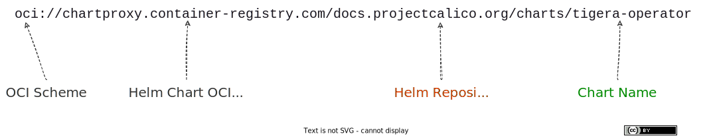

**When you wanna a pull public helm chart from an OCI registry and keep it fresh without toil!**

Some public charts aren't yet published as OCI artifacts.

For those, one elegant solution is to use the excellent open source [Helm Chart OCI Proxy](https://github.com/container-registry/helm-charts-oci-proxy).

It enables you to pull any public helm chart as an OCI Image.

You don't need to add a helm repo at the helm client. If you're using a central binary repository to aggregate helm repos, you don't need to add a helm repo there either!

The Helm Chart Proxy OCI Registry is publicly hosted at `chartproxy.container-registry.com` and free to use *.

Here's how to use it..!

> \* Helm Chart OCI Proxy is licensed under GNU Affero General Public License v3.0 - always read the license.

### Pre-Requisites

+ Helm >= v3.8
+ Cosign v2+

## 1. Check If The Chart Is Already Published As An OCI Artifact

For example, the [Prometheus Community Helm Charts](https://github.com/orgs/prometheus-community/packages?repo_name=helm-charts) are already published to GitHub Container Registry (GHCR).


If the chart is available as an OCI artifact, you can pull the chart from GHCR directly with:

```sh
helm pull \
  oci://ghcr.io/prometheus-community/charts/prometheus \
  --version 25.1.0
```

```sh
Pulled: ghcr.io/prometheus-community/charts/prometheus:25.1.0
Digest: sha256:6802170c564274eff6408f1bdc91705a395a027dae1e981504c776845ca1965f
```

That's it!

> AWS charts may be available on [ECR Public](https://gallery.ecr.aws/search?searchTerm=chart&verified=verified&page=2). For example, [Karpenter Helm Chart](https://gallery.ecr.aws/karpenter/karpenter) is there and can be pulled like:
>
> ```sh
> helm pull \
>    oci://public.ecr.aws/karpenter/karpenter \
>    --version v0.31.0
>  ```
> ```sh
>  Pulled: public.ecr.aws/karpenter/karpenter:v0.31.0
>  Digest: sha256:9d2c36fd663a8af894a191a5183aec385f75ed3584ac592d76d06ea3b99d9d36
>  ```

If the chart isn't already published as an OCI artifact, read on...

## 2. Construct The OCI Chart Reference

### 2.1 Copy The Helm Repository URL

For example, copy **docs.projectcalico.org/charts/** (omit the **https://**) from the [`tigera-operator` Install page on artifacthub.io](https://artifacthub.io/packages/helm/projectcalico/tigera-operator?modal=install).

 become one")

### 2.2 Append The Helm Repo URL To The Chart Proxy Registry URL

`oci://chartproxy.container-registry.com/`**docs.projectcalico.org/charts/**

### 2.3 Append The Chart Name

`oci://chartproxy.container-registry.com/docs.projectcalico.org/charts/`**tigera-operator**

Now you have an OCI chart ref that can be used in Helm v3.8 or greater without any special voodoo.



## 3. Pull From OCI Registry Using The OCI Chart Reference

For example, to pull the `tigera-operator` chart from `chartproxy.container-registry.com`:

```sh
helm pull \
  oci://chartproxy.container-registry.com/docs.projectcalico.org/charts/tigera-operator \
  --version 3.26.1
```

```sh
Pulled: chartproxy.container-registry.com/docs.projectcalico.org/charts/tigera-operator:3.26.1
Digest: sha256:1e72052d066b8bcf3adbc5de201e05728b3be75c55b83506f78fc6691a2ce9c2
```

Use `--version` to specify the chart version in the helm client (not OCI image tag).

## 3. Verify the signature (authentication + integrity)

use cosign
some charts dont have it
some charts are already available as OCI artifacts (check Github Packages/GHCR)

## Query Public Chart Manifest

You can query an OCI chart manifest like this:

```sh
curl chartproxy.container-registry.com/v2/charts.jetstack.io/cert-manager/manifests/1.11.2 \
  --silent \
  --location | \
  jq
```

```json
{
  "schemaVersion": 2,
  "mediaType": "application/vnd.oci.image.manifest.v1+json",
  "config": {
    "mediaType": "application/vnd.cncf.helm.config.v1+json",
    "digest": "sha256:44136fa355b3678a1146ad16f7e8649e94fb4fc21fe77e8310c060f61caaff8a",
    "size": 2
  },
  "layers": [
    {
      "mediaType": "application/vnd.cncf.helm.chart.content.v1.tar+gzip",
      "digest": "sha256:b772d8b487cf5b428ff65fb50f573ced917d836b69bcae8d2b2832a360e7075a",
      "size": 65472,
      "annotations": {
        "org.opencontainers.image.title": "cert-manager-v1.11.2.tgz"
      }
    }
  ],
  "annotations": {
    "org.opencontainers.image.created": "2023-09-17T08:35:38Z"
  }
}
```

## Self Host The Chart Proxy

Alternatively, consider self-hosting the proxy

### Pull The Standalone Image

Its *very* slow to pull

```sh
docker pull 8gears.container-registry.com/library/helm-charts-oci-proxy
Using default tag: latest
latest: Pulling from library/helm-charts-oci-proxy
a245e95e610b: Pull complete 
a573bd4f854c: Downloading [====>                                              ]  1.849MB/22.85MB
```

### Run It

```sh
docker run --rm -d -e DEBUG=TRUE -p 9000:9000 8gears.container-registry.com/library/helm-charts-oci-proxy 
ad62970204106b3367927dc6c771be64d43ccfd5ce88ab426e4d3e06ba20545b
```

### Test It

```sh
curl localhost:9000/v2/_catalog
{"repositories":null}
```

```sh
helm pull oci://localhost:9000/charts.bitnami.com/bitnami/airflow --version 14.0.11  
Pulled: localhost:9000/charts.bitnami.com/bitnami/airflow:14.0.11
Digest: sha256:dc70c0d46e730c2aca8c394eaa8c150ebf1ab415dbe2a5db1966bf5ce71499a3
```

## Pull A Public Chart From An Air-Gapped Environment

If you're in an air-gapped environment, you can put a private oci registry proxy in front of the public chart proxy.

That way, requests to the public chart proxy are de-duplicated and charts are cached logically closer to their point of use.

```sh
k3d registry create chartproxy-container-registry-com-mirror \
--image docker.io/library/registry:2 \
--port 0.0.0.0:5007 \
--proxy-remote-url https://chartproxy.container-registry.com \
--volume /tmp/reg:/var/lib/registry \
--volume $(pwd)/registry-config.yml:/etc/docker/registry/config.yml \
--no-help
```

```sh
INFO[0000] Creating node 'k3d-chartproxy-container-registry-com-mirror' 
INFO[0000] Successfully created registry 'k3d-chartproxy-container-registry-com-mirror' 
INFO[0000] Starting Node 'k3d-chartproxy-container-registry-com-mirror' 
INFO[0000] Successfully created registry 'k3d-chartproxy-container-registry-com-mirror'
```

### Install Argocd Chart Using Air-Gapped Chart Proxy

```sh
kubectl create ns argo
namespace/argo created
```

from push-based deployer machine

```sh
helm upgrade my-argo-cd \
oci://localhost:5007/argoproj.github.io/argo-helm/argo-cd \
--namespace argo \
--install \
--debug
```

TODO: consider also using a re-write rule to simplify the oci URL and make it consistent and intuitive

for example, if the request uses `chartproxy.container-registry.com`, then resolve to mirror `private-chartmetaproxy`