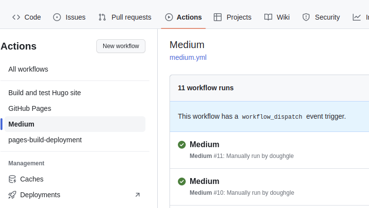
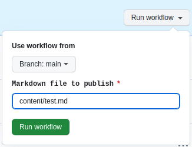
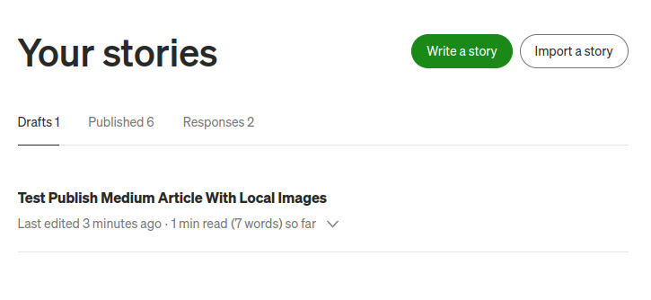

## **You've got a Markdown build pipeline and you wanna publish to Medium without the tedium !**

If you wanna publish a chosen article to Medium, not an entire static site, this how to is for you.

"Release is an explicit human decision!", you say? Then make it an explicit choice.

This approach uses a Github Deploy Workflow. Its triggered manually with one input param: the markdown `file` to publish.
The result is a new draft story in your Medium account.

## You'll need

1. a free Github account
1. a free Medium account
1. markdown content stored in a git repository

That's it!

> Tip:
> Check your markdown for spelling, style and broken links with a [docs as code build pipeline](../create-a-docs-as-code-build-pipeline/).

## 1. Get Your Medium Integration Token

Go to your [Medium Security Settings Page](https://medium.com/me/settings/security) -> Integration Tokens

In `Description`, put *"github post to medium action"*.

Click "Get token".

Copy the token.


## 2. Put The Medium Integration Token In Github Secrets

In the Github repository, go to Settings -> Secrets and variables -> Actions.

Click `New Repository Secret`.

Name the secret `MEDIUM_INTEGRATION_TOKEN`. We'll use this in the next step.

Paste the integration token you got from Medium.


## 3. Create A Docs As Code Deploy Workflow

Checkout the git repository containing your markdown content.

Create a new github workflow called `medium.yml` in a `.github/workflows` folder.

Paste the follow yaml and remember to read it!:

```yaml
name: Medium

on:
  workflow_dispatch:
    inputs:
      file:
        description: 'Markdown file to publish'
        required: true
        type: string
        default: 'content/blog/hello-world/index.md'

jobs:
  post-to-medium:
    name: Post to Medium
    runs-on: ubuntu-latest
    steps:
      - name: Check Out Source
        uses: actions/checkout@v3

      - name: Create Medium Post
        uses: philips-software/post-to-medium-action@v0.6.0
        with:
          integration_token: "${{ secrets.MEDIUM_INTEGRATION_TOKEN }}"
          file: "${{ inputs.file }}"
          content_format: "markdown"
          notify_followers: "false"
          license: "cc-40-by"
          publish_status: "draft"
          parse_frontmatter: "true"
```

> Note: here I'm using the [Post to Medium GitHub Action](https://github.com/philips-software/post-to-medium-action) which is a great open source Github Action,
It supports parsing markdown frontmatter to get title and tags automatically for your article. Special mention and thank you to creator and maintainer, [@Brend Smits](https://github.com/Brend-Smits).

## 4. Push The Medium Workflow To Github

Add, commit and push the workflow to Github.

Example:

```sh
$ git add .github/workflow/medium.yml

$ git commit -m 'add publish to medium workflow'
[.github/workflow/medium.yml 5b3a75c] add publish to medium workflow
 1 file changed, 4 insertions(+), 3 deletions(-)

$ git push
Enumerating objects: 17, done.
Counting objects: 100% (17/17), done.
Delta compression using up to 16 threads
Compressing objects: 100% (12/12), done.
Writing objects: 100% (12/12), 1.02 KiB | 1.02 MiB/s, done.
Total 12 (delta 10), reused 0 (delta 0), pack-reused 0
remote: Resolving deltas: 100% (10/10), completed with 5 local objects.
To github.com:doughgle/doughgle.github.io.git
   405e2b3..5b4633e  how-to-create-a-docs-as-code-deployment-pipeline -> how-to-create-a-docs-as-code-deployment-pipeline
```

To see it, navigate to the repo on github.com -> Actions -> left panel `Medium`



## 5. Test It

Here's `test.md`. Its stored in [this example docs as code repo](https://github.com/doughgle/ubiquitous-rotary-phone/blob/main/content/test.md) in the `content` folder:

```md
---
title: "Test Publish Medium Article With Local Images"
date: 2023-03-28T21:57:45+08:00
publishdate: 2023-02-20T21:57:45+08:00
tags: ['docs-as-code', 'deployment', 'medium']
---

Test Publish Medium Article With Local Images


```

It has a markdown frontmatter (between the dash delimiters) and references an image found locally in the same folder of the git repository.

Go to the Github repo -> Actions -> Medium Workflow.

Click `Run workflow` and specify the repository path of the markdown file you wanna publish.



For example, to publish `test.md` from the `contents` directory in the root of the repo, specify `content/test.md`.

")

## 7. Review Draft

When you're happy with the drafts, you can change `publish_status` to `public`.



## 8. Click Publish


You're done.

Kettle on, lean back on `<=2` chair legs, hands behind head `== 2` 😉️.
