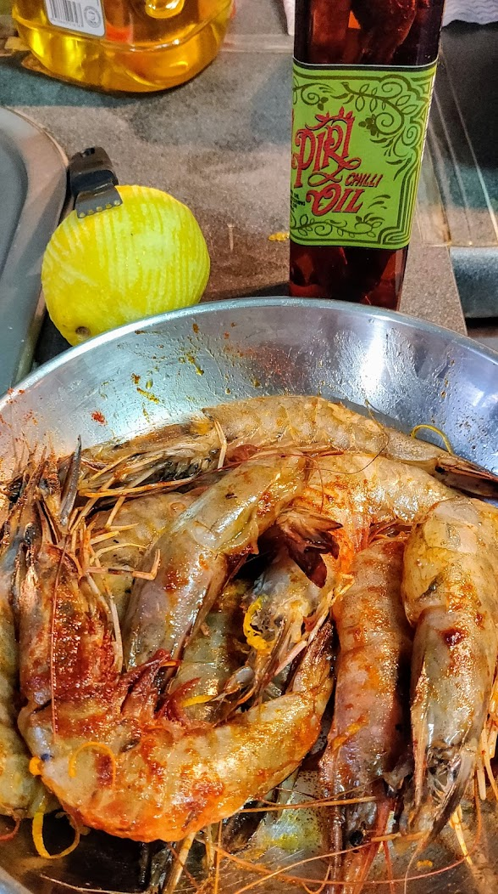
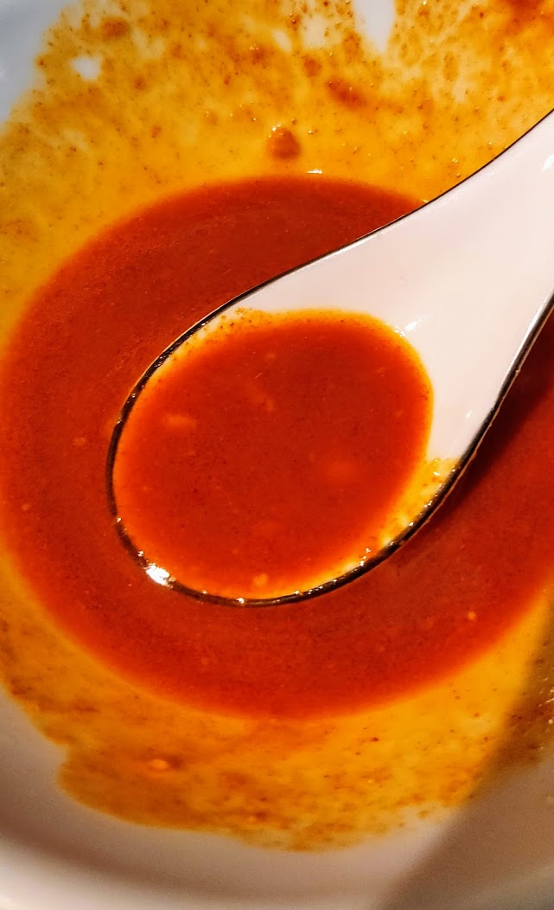
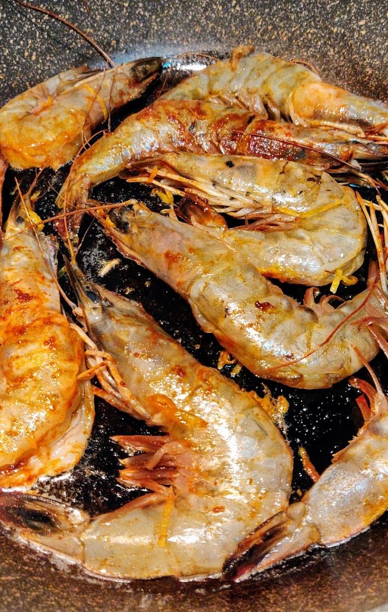
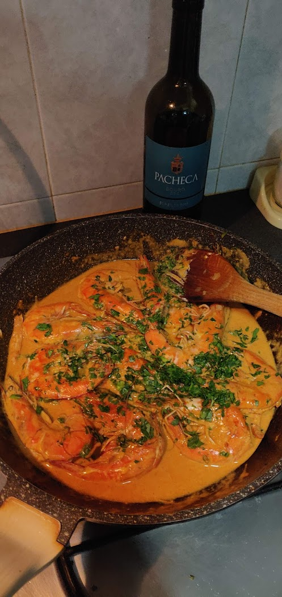
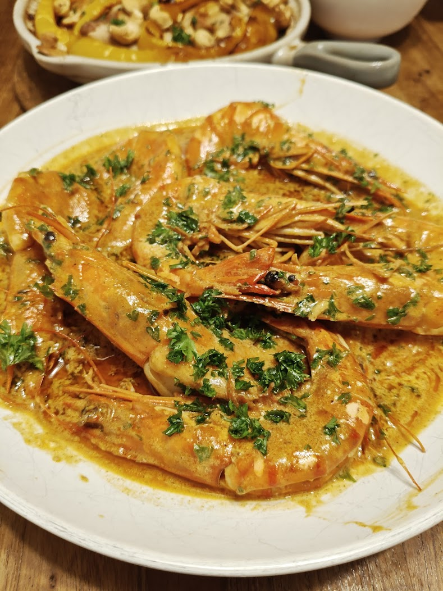
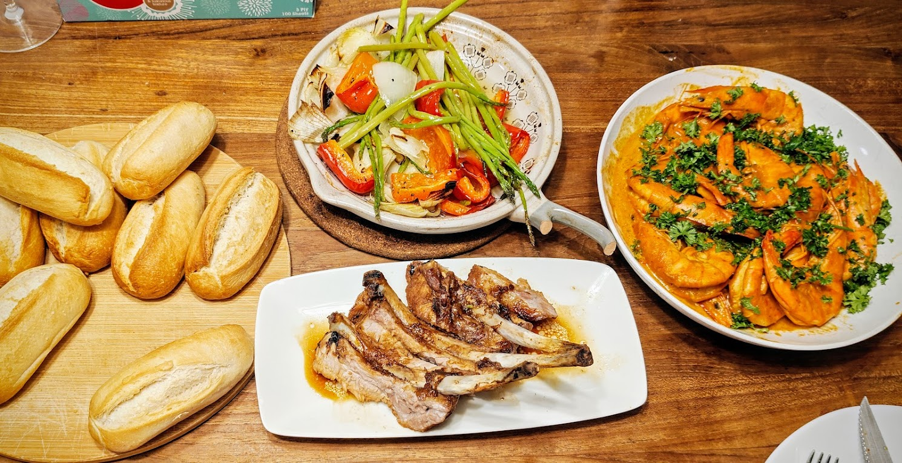

## Ingredients

1. 400g prawns (200g per person)
1. 2-3 lemons (zest and juice)
1. Piri piri chilli oil
1. Olive oil
1. Smoked paprika
1. Peanut butter
1. Butter
1. White wine
1. Creme fraise
1. English parsley

## Steps

1. Clean the prawns and dry them. Marinade with lemon zest, piri piri chilli oil and a generous seasoning of smoked paprika. Set aside.

1. In a small bowl, mix together olive oil, chilli oil, smoked paprika, peanut butter and lemon juice. Make a thin paste. Adjust to taste with a pinch of salt. It should be sour and spicy, smokey and nutty.

1. Heat butter and then sauté the prawns. Deglace the pan with white wine. Add creme fraise. Add the sauce.

1. Remove the heat. Taste. It should be sour and spicy, then creamy and smokey. Add finely-chopped english parsley.

1. Present in a white bowl. Garnish with chopped parsley and lemon wedges.

1. Serve with crusty bread or rice and green peas.

